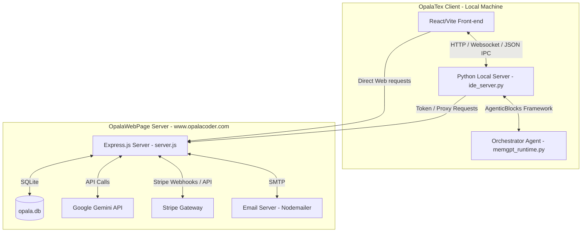
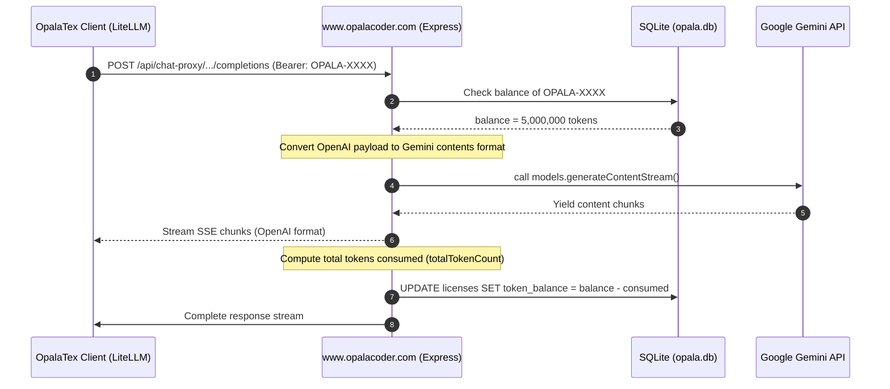

# OpalaTex & OpalaWebPage Software Architecture

This document describes the software architecture of **OpalaTex** (the client desktop application) and its connection to the web server **OpalaWebPage** (hosted at `https://www.opalacoder.com`), which handles proxy requests, token licensing, OTP verification, and Stripe billing.

---

## 1. High-Level Architectural Diagram

The diagram below outlines the communication between the OpalaTex React/Vite front-end, its local Python backend, and the remote Express.js server hosted on `opalacoder.com`.

---

## 2. OpalaTex Client Architecture (Desktop Application)

The client desktop application is a project-centric, AI-integrated LaTeX editor.

### 2.1 Backend / Core Components (`opalatex/` package)
- **Local HTTP/WS GUI Server (`opalatex/ide_server.py`)**: Runs an asynchronous HTTP server (default port `3000`). It serves the compiled React/Vite front-end and exposes local REST endpoints (`/api/*`) for workspace and IDE configuration.
- **Agent Orchestrator (`opalatex/memgpt_runtime.py`)**: Built on top of the **AgenticBlocks.IO** framework. It implements a MemGPT-like memory architecture where the primary agent manages short-term and long-term memory, and dispatches actions to modular "skills" (`opalatex/skills.py`).
- **JSON IPC Bridge (`opalatex/agent_stdin.py`)**: Allows standard stdin/stdout JSON-based communication. Used by the IDE to interact with active background agent tasks safely.
- **VCS & Compilation Managers**:
  - `opalatex/vcs.py`: Implements Git features (commit, status, staging, discarding).
  - `opalatex/latex_compiler.py`: Handles compiling LaTeX using standard tools (`pdflatex`, `latexmk`).
  - `opalatex/synctex_parser.py`: Maps PDF rendering view back to the corresponding LaTeX lines.

### 2.2 Client-Side Licensing & Anti-Tamper System (`opalatex/licensing.py`)
- **Storage**: User license keys are saved encrypted in `~/.opalatex/license.dat` using a lightweight XOR obfuscation.
- **Trial System**: Users receive a 14-day free trial.
- **Anti-Tamper Protection**: To prevent users from resetting the trial start date in `license.dat`, the code checks the creation timestamp of the oldest registered project in the local projects database (`sqlite3` DB). The effective trial start date is defined as `min(saved_trial_start, oldest_project_creation_timestamp)`.

---

## 3. Remote Server Architecture (OpalaWebPage)

The server-side component is an Express.js backend that handles Stripe transactions, manages active license balances, and proxies LLM requests to the Gemini API to safeguard API keys and monitor user token consumption.

### 3.1 Database Schema (`opala.db` - SQLite)

The database maintains two tables:

1. **`licenses`**:
   - `key` (TEXT, Primary Key): Unique license key (prefixed with `OPALA-`).
   - `token_balance` (INTEGER): Remainder of AI credits (number of available tokens).
   - `email` (TEXT): E-mail of the purchaser.
   - `created_at` (DATETIME): License creation timestamp.

2. **`otps`**:
   - `email` (TEXT, Primary Key): Email associated with the license.
   - `otp` (TEXT): A random 6-digit verification code.
   - `expires_at` (DATETIME): Code expiration timestamp (valid for 10 minutes).

### 3.2 Key Server Endpoints

| Method | Endpoint | Description | Auth Requirement |
| :--- | :--- | :--- | :--- |
| `POST` | `/api/webhook` | Handles Stripe checkout completed webhooks. Generates licenses or increases token balances. | Stripe signature check |
| `POST` | `/api/create-checkout-session` | Initiates a Stripe payment session for licenses or credits recharges. | None |
| `GET` | `/api/get-license` | Retrieves the generated license details after successful checkout. | None |
| `GET` | `/api/get-balance` | Retrieves the remaining token balance for a license. | `Authorization: Bearer <license_key>` |
| `POST` | `/api/create-recharge-session` | Initiates a temporary recharge token valid for 15 minutes. | None |
| `POST` | `/api/otp/request` | Requests a 6-digit OTP code to the registered license email. | None |
| `POST` | `/api/otp/verify` | Verifies the OTP code to recover/retrieve the license key. | None |
| `POST` | `/api/chat-proxy/chat/completions` | Proxies client LLM queries to the Gemini API while tracking token usage. | `Authorization: Bearer <license_key>` |

---

## 4. Client-to-Server Integration Flow

### 4.1 Cloud AI Proxy Flow (`POST /api/chat-proxy/chat/completions`)

When the user selects **OpalaTex Cloud** as their AI Provider:
1. **Request Interception**: `opalatex/config.py` overrides the standard LiteLLM config:
   - Sets `api_base = "https://opalacoder.com/api/chat-proxy"`
   - Sets `api_key = license_key`
   - Sets `custom_llm_provider = "openai"` (to trick LiteLLM into formatting requests as standard OpenAI payloads).
2. **Key & Balance Verification**: The server extracts the `license_key` from the `Bearer` token header, checks `opala.db`, and verifies that the `token_balance > 0`.
3. **Format Mapping**: The server translates the OpenAI schema payload (`messages` format) into the Google GenAI Contents format (handling `systemInstruction`, nested `contents` with user/model roles, and parsing tool definitions/calls).
4. **Google Gemini Call**: The server fires the converted payload to the Gemini API using the `@google/genai` SDK (typically using `gemini-3.1-flash-lite`).
5. **Streaming / Response Processing**: The response is piped back to the client as standard OpenAI-compatible chunks (`text/event-stream`).
6. **Token Deduction**: The server calculates the consumed tokens (using Gemini's `usageMetadata` or input/output text estimation) and updates `token_balance` in `opala.db`.

### 4.2 Stripe Payment & Webhook Integration

When a user purchases a license or credit recharge:
1. Client requests a session: `/api/create-checkout-session` (for `license_only`, `license_plus_credits`, or `credits_recharge`).
2. Server calls Stripe API and returns the checkout session URL.
3. User completes the payment on Stripe's hosted gateway.
4. Stripe fires `checkout.session.completed` hook to `/api/webhook`.
5. Server catches the event:
   - For **Licenses**: Generates an `OPALA-` key and creates a row in SQLite with standard tokens (5M for `license_plus_credits`, 0 for `license_only`).
   - For **Recharges**: Locates the target `licenseKey` from Stripe metadata and adds `+5,000,000` tokens to `token_balance` in SQLite.
