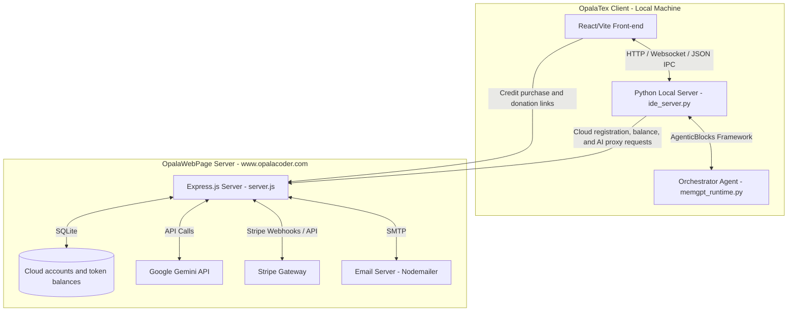
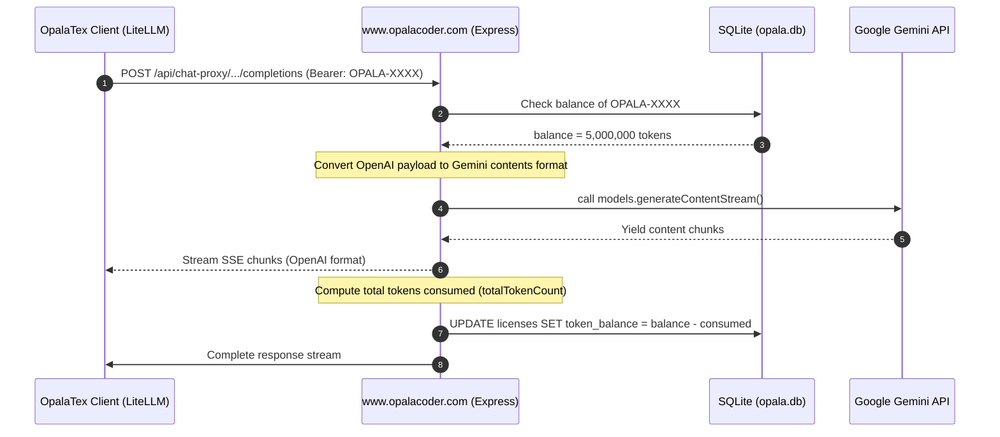

# OpalaTex & OpalaWebPage Software Architecture

This document describes the software architecture of **OpalaTex** (the MIT-licensed open-source client desktop application) and its connection to the optional **OpalaWebPage** service (hosted at `https://www.opalacoder.com`), which handles Cloud accounts, AI credits, proxy requests, OTP recovery, Stripe billing, and project donations.

---

## 1. High-Level Architectural Diagram

The diagram below outlines the communication between the OpalaTex React/Vite front-end, its local Python backend, and the remote Express.js server hosted on `opalacoder.com`.

---

## 2. OpalaTex Client Architecture (Desktop Application)

The client desktop application is a project-centric, AI-integrated LaTeX editor distributed under the MIT License. All local editor features remain available without registration, payment, or a Cloud account.

### 2.1 Backend / Core Components (`opalatex/` package)
- **Local HTTP/WS GUI Server (`opalatex/ide_server.py`)**: Runs an asynchronous HTTP server (default port `3000`). It serves the compiled React/Vite front-end and exposes local REST endpoints (`/api/*`) for workspace and IDE configuration.
- **Agent Orchestrator (`opalatex/memgpt_runtime.py`)**: Built on top of the **AgenticBlocks.IO** framework. It implements a MemGPT-like memory architecture where the primary agent manages short-term and long-term memory, and dispatches actions to modular "skills" (`opalatex/skills.py`).
- **JSON IPC Bridge (`opalatex/agent_stdin.py`)**: Allows standard stdin/stdout JSON-based communication. Used by the IDE to interact with active background agent tasks safely.
- **Cloud API Client (`opalatex/cloud_client.py`)**: Defines the public desktop-to-OpalaWebPage API contract. It centralizes registration validation, balance lookup, and the chat proxy URL. The remote service remains authoritative for credits, billing, and provider access.
- **VCS & Compilation Managers**:
  - `opalatex/vcs.py`: Implements Git features (commit, status, staging, discarding).
  - `opalatex/latex_compiler.py`: Handles compiling LaTeX using standard tools (`pdflatex`, `latexmk`).
  - `opalatex/synctex_parser.py`: Maps PDF rendering view back to the corresponding LaTeX lines.

### 2.2 Client-Side Cloud Registration (`opalatex/licensing.py`)
- **Storage**: Legacy-named Cloud registration keys are cached in `~/.opalatex/license.dat` using lightweight XOR obfuscation. This is compatibility storage, not a security boundary.
- **Registration only**: Registration identifies an OpalaWebPage account for cloud services. It never locks or authorizes local OpalaTex features.
- **Remote authority**: Registering a key requires a successful authenticated validation request to OpalaWebPage. The local file is only a cache; the server remains authoritative for credits, billing, and cloud access.
- **No trial or paid software license**: OpalaTex has no trial expiration, license sale, or local anti-tamper gate. Older trial metadata is ignored for application access.

### 2.3 Open-Source Support and Donations
- **License**: The repository includes the standard MIT License in `LICENSE`, matching `pyproject.toml` metadata.
- **Desktop donation UI**: Settings > About displays a PayPal donation button and the QR Code from `gui_src/public/qr-code.png`.
- **Compiled asset**: Vite copies the QR Code to `opalatex/gui/qr-code.png` for packaged desktop builds.
- **Separation from credits**: Donations support project maintenance and do not create Cloud accounts or add AI tokens.

---

## 3. Remote Server Architecture (OpalaWebPage)

The server-side component is an Express.js backend that handles Stripe credit purchases, manages Cloud registration keys and token balances, and proxies LLM requests to the Gemini API to safeguard provider keys and monitor consumption. The public website presents OpalaTex as free/open-source, offers optional Cloud credits, and links to PayPal donations.

### 3.1 Database Schema (`opala.db` - SQLite)

The database maintains two tables:

1. **`licenses`** (legacy table name; represents Cloud accounts):
   - `key` (TEXT, Primary Key): Unique Cloud registration key (prefixed with `OPALA-`).
   - `token_balance` (INTEGER): Remainder of AI credits (number of available tokens).
   - `email` (TEXT): E-mail of the purchaser.
   - `created_at` (DATETIME): Cloud account creation timestamp.

2. **`otps`**:
   - `email` (TEXT, Primary Key): Email associated with the Cloud account.
   - `otp` (TEXT): A random 6-digit verification code.
   - `expires_at` (DATETIME): Code expiration timestamp (valid for 10 minutes).

### 3.2 Key Server Endpoints

| Method | Endpoint | Description | Auth Requirement |
| :--- | :--- | :--- | :--- |
| `POST` | `/api/webhook` | Handles completed Stripe credit purchases and increases token balances. | Stripe signature check |
| `POST` | `/api/create-checkout-session` | Initiates a Stripe payment session for a credit purchase. | None |
| `GET` | `/api/get-license` | Retrieves the account registration key associated with a completed purchase. | None |
| `GET` | `/api/get-balance` | Retrieves the remaining token balance for a Cloud account. | `Authorization: Bearer <registration_key>` |
| `POST` | `/api/create-recharge-session` | Initiates a temporary recharge token valid for 15 minutes. | None |
| `POST` | `/api/otp/request` | Requests a 6-digit OTP code for the registered account email. | None |
| `POST` | `/api/otp/verify` | Verifies the OTP code to recover the Cloud registration key. | None |
| `POST` | `/api/chat-proxy/chat/completions` | Proxies client LLM queries to the Gemini API while tracking token usage. | `Authorization: Bearer <license_key>` |

---

## 4. Client-to-Server Integration Flow

### 4.1 Cloud AI Proxy Flow (`POST /api/chat-proxy/chat/completions`)

When the user selects **OpalaTex Cloud** as their AI Provider:
1. **Request Interception**: `opalatex/config.py` overrides the standard LiteLLM config:
   - Sets `api_base = "https://opalacoder.com/api/chat-proxy"`
   - Sets `api_key = license_key`
   - Sets `custom_llm_provider = "openai"` (to trick LiteLLM into formatting requests as standard OpenAI payloads).
2. **Account & Balance Verification**: The server extracts the registration key from the `Bearer` token header, checks `opala.db`, and verifies that `token_balance > 0`. Expiration/trial status is not used.
3. **Format Mapping**: The server translates the OpenAI schema payload (`messages` format) into the Google GenAI Contents format (handling `systemInstruction`, nested `contents` with user/model roles, and parsing tool definitions/calls).
4. **Google Gemini Call**: The server fires the converted payload to the Gemini API using the `@google/genai` SDK (typically using `gemini-3.1-flash-lite`).
5. **Streaming / Response Processing**: The response is piped back to the client as standard OpenAI-compatible chunks (`text/event-stream`).
6. **Token Deduction**: The server calculates the consumed tokens (using Gemini's `usageMetadata` or input/output text estimation) and updates `token_balance` in `opala.db`.

### 4.2 Stripe Credit Purchase Flow

OpalaTex is open-source and does not require a paid license. The commercial offer is an optional package of 5,000,000 Opala Cloud tokens for BRL 60.00 or USD 11.99.

When a user purchases Cloud credits:
1. Client requests a credit checkout session from `/api/create-checkout-session`.
2. Server calls Stripe API and returns the checkout session URL.
3. User completes the payment on Stripe's hosted gateway.
4. Stripe fires `checkout.session.completed` hook to `/api/webhook`.
5. The server creates an account registration key when needed, or locates the existing account, and adds `+5,000,000` tokens to `token_balance`.

### 4.3 Donation Flow

Donations are independent from Stripe credit purchases:
1. The website and Settings > About expose the official PayPal donation URL.
2. Both interfaces display the same QR Code asset supplied by the project owner.
3. PayPal processes the donation externally in BRL.
4. No Cloud key or token balance is created or changed by a donation.

---

## 5. Current Product and Licensing Decisions

- OpalaTex is free and open-source under the MIT License.
- There is no trial, paid editor license, subscription, or local feature lock.
- Local models and user-provided API keys do not require an Opala Cloud account.
- The only paid application service is an optional package of 5,000,000 Cloud tokens for BRL 60.00 or USD 11.99.
- Donations fund open-source maintenance and are not purchases of tokens or application features.
- The OpalaWebPage server and its commercial rules remain separate from the public desktop client.
