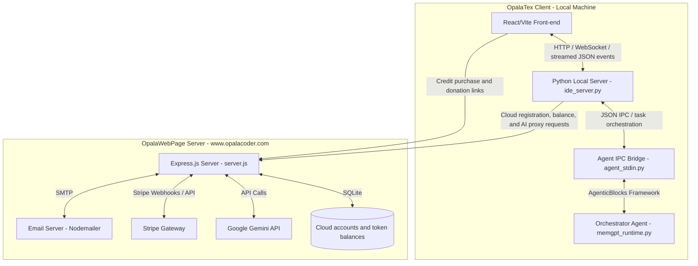
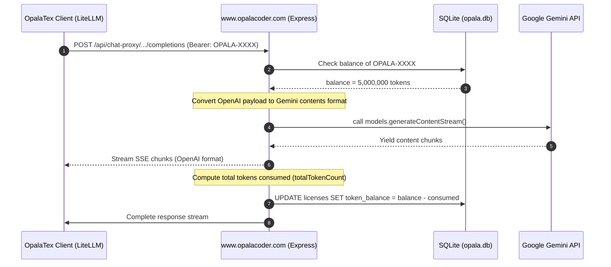

# OpalaTex & OpalaWebPage Project Design

This document describes the software architecture and project-level design decisions of **OpalaTex** (the MIT-licensed open-source client desktop application) and its connection to the optional **OpalaWebPage** service (hosted at `https://www.opalacoder.com`), which handles Cloud accounts, AI credits, proxy requests, OTP recovery, Stripe billing, and project donations.

---

## 1. High-Level Architectural Diagram

The diagram below outlines the communication between the OpalaTex React/Vite front-end, its local Python backend, and the remote Express.js server hosted on `opalacoder.com`.

---

## 2. OpalaTex Client Architecture (Desktop Application)

The client desktop application is a project-centric, AI-integrated LaTeX editor distributed under the MIT License. All local editor features remain available without registration, payment, or a Cloud account.

### 2.1 Backend / Core Components (`opalatex/` package)
- **Local HTTP/WS GUI Server (`opalatex/ide_server.py`)**: Runs an asynchronous HTTP server (default port `3000`). It serves the compiled React/Vite front-end and exposes local REST endpoints (`/api/*`) for workspace, IDE configuration, attachments, project chat storage, checkpoints, and agent execution.
- **Agent Orchestrator (`opalatex/memgpt_runtime.py`)**: Built on top of the **AgenticBlocks.IO** framework. It implements a MemGPT-like memory architecture where the primary agent manages short-term and long-term memory, dispatches actions to modular "skills" (`opalatex/skills.py`), and exposes editor/file/document tools to the model.
- **JSON IPC Bridge (`opalatex/agent_stdin.py`)**: Owns the streamed agent run lifecycle for the IDE. It receives `/api/opalatex/run` payloads, persists user-visible chat history, normalizes attachments, coordinates pending GUI input requests, records agent activity for interruption/resume, and emits structured events back to the front-end.
- **LiteLLM / Tool-Call Compatibility Layer (`opalatex/litellm_compat.py`)**: Wraps AgenticBlocks LLM calls at the OpalaTex boundary. It sanitizes provider kwargs, repairs transport/history issues such as orphan tool messages and concatenated JSON tool calls, and adds bounded loop breakers for repeated schema validation failures. It must not silently convert an invalid tool call into a different semantic action.
- **Cloud API Client (`opalatex/cloud_client.py`)**: Defines the public desktop-to-OpalaWebPage API contract. It centralizes registration validation, balance lookup, and the chat proxy URL. The remote service remains authoritative for credits, billing, and provider access.
- **Project Store and Attachments**:
  - `opalatex/project_store.py`: Persists project metadata, chat history, branches, message attachments, core memory snapshots, and agent activity needed for resume context.
  - `opalatex/attachments.py`: Converts uploaded images and supported documents into normalized descriptors, extracts document text when possible, preserves originals for supported formats, and avoids forwarding unsupported binary payloads to text-only models.
- **VCS & Compilation Managers**:
  - `opalatex/vcs.py`: Implements user-facing Git features and internal shadow checkpoints around agent turns. Mutating file tools do not create their own checkpoints; the agent run creates start/end checkpoints only when needed.
  - `opalatex/latex_compiler.py`: Handles compiling LaTeX using standard tools (`pdflatex`, `latexmk`).
  - `opalatex/synctex_parser.py`: Maps PDF rendering view back to the corresponding LaTeX lines.
- **Document Export Tools**:
  - `create_docx_file` and `create_pptx_file` are exposed through the agent tool registry for generated Word and PowerPoint artifacts. They should be used instead of asking an agent to write raw binary office files.

### 2.2 Client-Side Cloud Registration (`opalatex/licensing.py`)
- **Storage**: Legacy-named Cloud registration keys are cached in `~/.opalatex/license.dat` using lightweight XOR obfuscation. This is compatibility storage, not a security boundary.
- **Registration only**: Registration identifies an OpalaWebPage account for cloud services. It never locks or authorizes local OpalaTex features.
- **Remote authority**: Registering a key requires a successful authenticated validation request to OpalaWebPage. The local file is only a cache; the server remains authoritative for credits, billing, and cloud access.
- **No trial or paid software license**: OpalaTex has no trial expiration, license sale, or local anti-tamper gate. Older trial metadata is ignored for application access.

### 2.3 Open-Source Support and Donations
- **License**: The repository includes the standard MIT License in `LICENSE`, matching `pyproject.toml` metadata.
- **Desktop donation UI**: Settings > About displays a PayPal donation button and the QR Code from `gui_src/public/qr-code.png`.
- **Compiled asset**: Vite copies the QR Code to `opalatex/gui/qr-code.png` for packaged desktop builds.
- **Separation from credits**: Donations support project maintenance and do not create Cloud accounts or add AI tokens.

### 2.4 Rich Text Editor & Math Rendering (`gui_src/src/components/RichTextEditor.jsx`)
- **Overleaf-style Rich Text mode**: Parses LaTeX source into structured blocks; editable prose blocks (headings, paragraphs, lists, quotes) are rendered as `contentEditable` elements. Non-editable blocks (math, figures, tables, code, environments) are rendered as read-only previews with "jump to source" on click.
- **KaTeX rendering**: Inline and display math are rendered via KaTeX running in a **persistent Worker pool** (`katexRenderWorker.js`). Workers are reused across equations to avoid per-equation module re-initialization cost.
- **MathML output**: KaTeX uses `output: 'mathml'` for dramatically fewer DOM nodes vs. `output: 'html'` (which generates thousands of CSS-positioned spans for complex equations). The worker wraps MathML in `` / `` so `katex.min.css` font rules apply the correct KaTeX fonts.
- **Lazy block rendering**: An `IntersectionObserver`-based `LazyBlock` wrapper mounts block content only when near the viewport (`rootMargin: 800px`), preventing all equations from rendering simultaneously on mount.
- **Throttled scroll**: `handleScroll` uses `requestAnimationFrame` to batch scroll-driven layout reads.
- **Precomputed line offsets**: Line-start offsets are cached via `useMemo` and `sourceLineFromOffset` uses binary search (O(log n)) instead of string slicing (O(n)) per block.
- **KB article**: See `docs/kb/katex_equations_longtime.md` for the full diagnosis and resolution of the equation rendering freeze issue.

### 2.5 Agent Run, Streaming, and Human Approval Flow
- **Run entrypoint**: The React front-end posts to `/api/opalatex/run`. The local server streams structured JSON events back to the UI so chat messages, thoughts, tool calls, problems, cancellation, and final responses can update incrementally.
- **Common event types**: Agent runs may emit `agent_started`, `thought`, `reflection`, `tool_call`, `tool_result`, `problem`, `input_request`, `agent_response`, `cancelled`, and `agent_finished`. The front-end treats these as UI state transitions rather than opaque text.
- **Human input requests**: When an agent tool needs confirmation or user input, the backend emits `input_request` and stores a pending future keyed by request id. The confirmation modal answers through `/api/opalatex/input_response`; backend rejection must be surfaced in the UI and must not leave the modal pretending the request was accepted.
- **Plan approval**: In planning mode, `create_plan` asks the front-end for confirmation before execution. Approval switches the project run path toward execution; rejection or interruption should resolve the waiting future cleanly.
- **Interruption**: `/api/opalatex/interrupt` cancels the active agent task. Captured agent activity is retained as resume context, but internal resume prompts should not be shown to end users as raw JSON.
- **Resume display contract**: The front-end may send an internal resume prompt containing captured activity and attachments, plus a separate `display_prompt`. `agent_stdin.py` persists the display prompt in chat history while using the internal prompt only as model context.

### 2.6 Tool Calling Reliability and Error Recovery
- **Strict tool contracts**: Agent tools are backed by Pydantic schemas derived from the exposed tool signatures. Missing required fields, wrong field names, or wrong argument shapes are treated as model/tool-call errors.
- **No semantic fallback hacks**: OpalaTex should not make an invalid tool call "work" by silently converting it into a different action. For example, an incomplete range replacement must not be converted into a read operation. The correct behavior is a clear diagnostic, a bounded retry/loop-break strategy, or an explicit user-approved compatibility layer.
- **Repeated validation failures**: If the same tool validation failure repeats, the compatibility layer may force a clean `send_message` response that explains the issue instead of allowing the agent to spin indefinitely.
- **Provider compatibility boundary**: Provider-specific cleanup belongs in `litellm_compat.py` or the AgenticBlocks integration boundary. Direct LiteLLM calls should not be introduced in feature code when AgenticBlocks already owns the model runtime path.

### 2.7 Project Configuration Decisions
- **Thinking default**: Agent reasoning/thinking is enabled by default. The project-level default for model kwargs is `think=true`, including custom agent paths such as inline editing, unless the user explicitly configures a different value.
- **User authority over thinking**: The harness must respect an explicit user/project `think` setting. Do not silently convert a user-provided `think=false` back to `true`; defaulting applies only when the setting is absent.
- **Provider sanitization**: `sanitize_litellm_kwargs_for_model` may drop `think` for providers that do not accept the parameter. This is provider compatibility cleanup, not a project decision to disable reasoning.
- **Ollama thinking route**: When `think=true` and the selected model uses the `ollama/` prefix, `resolve_model_for_thinking` remaps it to `ollama_chat/` so LiteLLM can expose native streaming reasoning via `reasoning_content`.
- **Degenerate thinking streams**: Repetitive or excessively long reasoning streams may be bounded and surfaced as diagnostics to avoid UI/resume-context poisoning. This must not become a semantic fallback or hidden tool-call substitution.

### 2.8 Front-End Agent UI and Editor Panels
- **Chat surface (`gui_src/src/components/ChatPanel.jsx`)**: Renders user/assistant messages, attachment previews, pending upload state, retry/edit flows, interruption controls, and confirmation modals. It hides internal resume scaffolding behind user-friendly continuation labels.
- **Main app coordinator (`gui_src/src/App.jsx`)**: Coordinates project state, chat streaming, active agent status, checkpoints, compile/PDF state, document panels, and i18n strings.
- **Activity and problem reporting**: Thinking streams and captured problems are UI-level diagnostics for the user. Raw transport records should be hidden or summarized when they are only useful for debugging.
- **Document panels**: DOCX/PPTX generation and editing surfaces are part of the desktop client experience; generated artifacts should be surfaced through purpose-built tools and panels rather than raw binary editing.

### 2.9 UI Consistency, Dialogs, and Internationalization
- **Forbid Native Browser Dialogs**: Agents must never call native browser dialogs (`window.alert`, `window.confirm`, `window.prompt`, or their shorthand equivalents) anywhere in the frontend codebase. Doing so in webview environments exposes unsightly headers (like IP addresses or "JavaScript") and breaks visual styling.
- **Use Custom Dialog Provider**: Standard user notification and input interactions must be handled asynchronously via the `useCustomDialog` hook from [CustomDialogProvider.jsx](file:///c:/Users/gilza/projetos/OpalaTex/gui_src/src/components/modals/CustomDialogProvider.jsx).
- **Theme and Visual Contrast Consistency**: All components, overlays, and custom dialogs must utilize standard VSCode theme CSS variables (such as `--vscode-bg`, `--vscode-border`, `--vscode-text-fg`, and `--vscode-accent`) and custom diff variables (such as `--diff-text-added`, `--diff-text-removed`). Do not hardcode hex/rgba values for text or background colors as it degrades contrast in light mode.
- **Mandatory Internationalization (i18n)**: Every user-facing label, prompt, placeholder, or error message must support localization using the i18n framework (`t('key')`). Never hardcode Brazilian Portuguese or English text directly in HTML or JSX properties.

---

## 3. Remote Server Architecture (OpalaWebPage)

The server-side component is an Express.js backend that handles Stripe credit purchases, manages Cloud registration keys and token balances, and proxies LLM requests to the Gemini API to safeguard provider keys and monitor consumption. The public website presents OpalaTex as free/open-source, offers optional Cloud credits, and links to PayPal donations.

### 3.1 Database Schema (`opala.db` - SQLite)

The database maintains two tables:

1. **`licenses`** (legacy table name; represents Cloud accounts):
   - `key` (TEXT, Primary Key): Unique Cloud registration key (prefixed with `OPALA-`).
   - `token_balance` (INTEGER): Remainder of AI credits (number of available tokens).
   - `email` (TEXT): E-mail of the purchaser.
   - `created_at` (DATETIME): Cloud account creation timestamp.

2. **`otps`**:
   - `email` (TEXT, Primary Key): Email associated with the Cloud account.
   - `otp` (TEXT): A random 6-digit verification code.
   - `expires_at` (DATETIME): Code expiration timestamp (valid for 10 minutes).

### 3.2 Key Server Endpoints

| Method | Endpoint | Description | Auth Requirement |
| :--- | :--- | :--- | :--- |
| `POST` | `/api/webhook` | Handles completed Stripe credit purchases and increases token balances. | Stripe signature check |
| `POST` | `/api/create-checkout-session` | Initiates a Stripe payment session for a credit purchase. | None |
| `GET` | `/api/get-license` | Retrieves the account registration key associated with a completed purchase. | None |
| `GET` | `/api/get-balance` | Retrieves the remaining token balance for a Cloud account. | `Authorization: Bearer <registration_key>` |
| `POST` | `/api/create-recharge-session` | Initiates a temporary recharge token valid for 15 minutes. | None |
| `POST` | `/api/otp/request` | Requests a 6-digit OTP code for the registered account email. | None |
| `POST` | `/api/otp/verify` | Verifies the OTP code to recover the Cloud registration key. | None |
| `POST` | `/api/chat-proxy/chat/completions` | Proxies client LLM queries to the Gemini API while tracking token usage. | `Authorization: Bearer <license_key>` |

---

## 4. Client-to-Server Integration Flow

### 4.1 Cloud AI Proxy Flow (`POST /api/chat-proxy/chat/completions`)

When the user selects **OpalaTex Cloud** as their AI Provider:
1. **Request Interception**: `opalatex/config.py` overrides the standard LiteLLM config:
   - Sets `api_base = "https://opalacoder.com/api/chat-proxy"`
   - Sets `api_key = license_key`
   - Sets `custom_llm_provider = "openai"` (to trick LiteLLM into formatting requests as standard OpenAI payloads).
2. **Account & Balance Verification**: The server extracts the registration key from the `Bearer` token header, checks `opala.db`, and verifies that `token_balance > 0`. Expiration/trial status is not used.
3. **Format Mapping**: The server translates the OpenAI schema payload (`messages` format) into the Google GenAI Contents format (handling `systemInstruction`, nested `contents` with user/model roles, and parsing tool definitions/calls).
4. **Google Gemini Call**: The server fires the converted payload to the Gemini API using the `@google/genai` SDK. Opala Cloud only allows server-whitelisted models: `gemini-3.1-flash-lite` by default, or `gemini-3.5-flash` when selected by the user.
5. **Streaming / Response Processing**: The response is piped back to the client as standard OpenAI-compatible chunks (`text/event-stream`).
6. **Token Deduction**: The server calculates the consumed tokens (using Gemini's `usageMetadata` or input/output text estimation), applies the server-side credit multiplier for the selected model (`gemini-3.5-flash` bills 6x the lite model), and updates `token_balance` in `opala.db`.

### 4.2 Stripe Credit Purchase Flow

OpalaTex is open-source and does not require a paid license. The commercial offer is an optional package of 5,000,000 Opala Cloud tokens for BRL 60.00 or USD 11.99.

When a user purchases Cloud credits:
1. Client requests a credit checkout session from `/api/create-checkout-session`.
2. Server calls Stripe API and returns the checkout session URL.
3. User completes the payment on Stripe's hosted gateway.
4. Stripe fires `checkout.session.completed` hook to `/api/webhook`.
5. The server creates an account registration key when needed, or locates the existing account, and adds `+5,000,000` tokens to `token_balance`.

### 4.3 Donation Flow

Donations are independent from Stripe credit purchases:
1. The website and Settings > About expose the official PayPal donation URL.
2. Both interfaces display the same QR Code asset supplied by the project owner.
3. PayPal processes the donation externally in BRL.
4. No Cloud key or token balance is created or changed by a donation.

---

## 5. Current Product and Licensing Decisions

- OpalaTex is free and open-source under the MIT License.
- There is no trial, paid editor license, subscription, or local feature lock.
- Local models and user-provided API keys do not require an Opala Cloud account.
- The only paid application service is an optional package of 5,000,000 Cloud tokens for BRL 60.00 or USD 11.99.
- Donations fund open-source maintenance and are not purchases of tokens or application features.
- The OpalaWebPage server and its commercial rules remain separate from the public desktop client.
