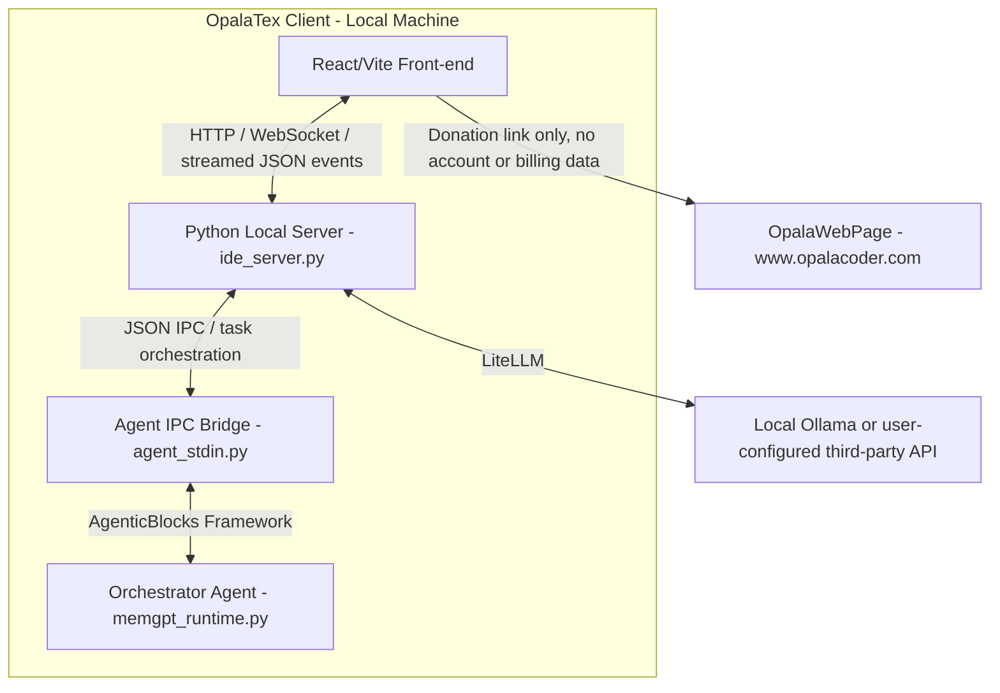

# OpalaTex & OpalaWebPage Project Design

This document describes the software architecture and project-level design decisions of **OpalaTex** (the MIT-licensed open-source client desktop application) and its connection to the optional **OpalaWebPage** static marketing site (hosted at `https://www.opalacoder.com`), which presents the project and links to a PayPal donation page. OpalaTex has no hosted Cloud AI service, no accounts, and no billing — the desktop app and the website are otherwise independent.

---

## 1. High-Level Architectural Diagram

The diagram below outlines the communication between the OpalaTex React/Vite front-end, its local Python backend, and the user's chosen AI provider (local Ollama or a third-party API).

---

## 2. OpalaTex Client Architecture (Desktop Application)

The client desktop application is a project-centric, AI-integrated LaTeX editor distributed under the MIT License. All local editor features remain available without registration, payment, or a Cloud account.

### 2.1 Backend / Core Components (`opalatex/` package)
- **Local HTTP/WS GUI Server (`opalatex/ide_server.py`)**: Runs an asynchronous HTTP server (default port `3000`). It serves the compiled React/Vite front-end and exposes local REST endpoints (`/api/*`) for workspace, IDE configuration, attachments, project chat storage, checkpoints, and agent execution.
- **Agent Orchestrator (`opalatex/memgpt_runtime.py`)**: Built on the vendored **AgenticBlocks** source package (`agenticblocks/`), which ships with OpalaTex rather than being installed as an external distribution. It implements a MemGPT-like memory architecture where the primary agent manages short-term and long-term memory, dispatches actions to modular "skills" (`opalatex/skills.py`), and exposes editor/file/document tools to the model.
- **JSON IPC Bridge (`opalatex/agent_stdin.py`)**: Owns the streamed agent run lifecycle for the IDE. It receives `/api/opalatex/run` payloads, persists user-visible chat history, normalizes attachments, coordinates pending GUI input requests, records agent activity for interruption/resume, and emits structured events back to the front-end.
- **LiteLLM / Tool-Call Compatibility Layer (`opalatex/litellm_compat.py`)**: Wraps AgenticBlocks LLM calls at the OpalaTex boundary. It sanitizes provider kwargs, repairs transport/history issues such as orphan tool messages and concatenated JSON tool calls, and adds bounded loop breakers for repeated schema validation failures. It must not silently convert an invalid tool call into a different semantic action.
- **Project Store and Attachments**:
  - `opalatex/project.py`: Persists project metadata, chat history, chat branches, message attachments, core memory snapshots, and diagnostic agent activity.
  - Diagnostic activity (`thought`, `reflection`, and `stream_chunk`) is stored in `project_activity`, scoped by project and chat. It is loaded by `/api/chat/history` to rehydrate the Thinking/Stream panel. `thought` activity is also associated back to the matching assistant turn in the chat UI as a collapsed "AI Thoughts" details block, while assistant chat message content remains limited to the visible final response.
  - `opalatex/attachments.py`: Converts uploaded images and supported documents into normalized descriptors, extracts document text when possible, preserves originals for supported formats, and avoids forwarding unsupported binary payloads to text-only models.
- **VCS & Compilation Managers**:
  - `opalatex/vcs.py`: Implements user-facing Git features and internal shadow checkpoints around agent turns. Mutating file tools do not create their own checkpoints; each participating agent run, including ephemeral `run_skill` workers, creates labeled start/end checkpoints only when needed.
  - `opalatex/latex_compiler.py`: Handles compiling LaTeX using Tectonic (`tectonic` CLI), supporting full, partial (chapter/file), and fast single-pass draft compilation (`tectonic -X compile` with `-r 0`).
  - `synctex_parser.py`: Maps PDF rendering view back to the corresponding LaTeX lines.
- **Document Export Tools**:
  - `create_docx_file` and `create_pptx_file` are exposed through the agent tool registry for generated Word and PowerPoint artifacts. They should be used instead of asking an agent to write raw binary office files.

### 2.2 100% Offline & Open-Source (MIT)
The OpalaTex repository contains no cloud proxy calls, no account tracking, and no credit-meter logic. All editing and AI features function via Ollama and user-configured third-party providers (API key + optional base URL). The previous private `OpalaTexCloud` overlay project and its `opalatex_cloud` extension package have been discontinued and are no longer built or referenced from this repository.

### 2.3 Open-Source Support and Donations
- **License**: The repository includes the standard MIT License in `LICENSE`, matching `pyproject.toml` metadata.
- **Desktop donation UI**: Settings > About displays a PayPal donation button and the QR Code from `gui_src/public/qr-code.png`.
- **Compiled asset**: Vite copies the QR Code to `opalatex/gui/qr-code.png` for packaged desktop builds.
- **Separation from features**: Donations support project maintenance and do not unlock any additional application features.

### 2.4 Rich Text Editor & Math Rendering (`gui_src/src/components/RichTextEditor.jsx`)
- **Overleaf-style Rich Text mode**: Parses LaTeX source into structured blocks; editable prose blocks (headings, paragraphs, lists, quotes) are rendered as `contentEditable` elements. Non-editable blocks (math, figures, tables, code, environments) are rendered as read-only previews with "jump to source" on click.
- **KaTeX rendering**: Inline and display math use KaTeX's MathML output consistently across Markdown chat content, confirmation dialogs, and the rich-text editor. The rich-text editor renders through a **persistent Worker pool** (`katexRenderWorker.js`), whose workers are reused across equations to avoid per-equation module re-initialization cost.
- **Uniform math output**: Every mathematical surface uses the same MathML representation. No expression-specific HTML/MathML routing is performed, and fenced `latex` or `tex` blocks are promoted to display math only after KaTeX validates them.
- **Lazy block rendering**: An `IntersectionObserver`-based `LazyBlock` wrapper mounts block content only when near the viewport (`rootMargin: 800px`), preventing all equations from rendering simultaneously on mount.
- **Throttled scroll**: `handleScroll` uses `requestAnimationFrame` to batch scroll-driven layout reads.
- **Precomputed line offsets**: Line-start offsets are cached via `useMemo` and `sourceLineFromOffset` uses binary search (O(log n)) instead of string slicing (O(n)) per block.
- **KB article**: See `docs/kb/katex_equations_longtime.md` for the full diagnosis and resolution of the equation rendering freeze issue.

### 2.5 Agent Run, Streaming, and Human Approval Flow
- **Run entrypoint**: The React front-end posts to `/api/opalatex/run`. The local server streams structured JSON events back to the UI so chat messages, thoughts, tool calls, problems, cancellation, and final responses can update incrementally.
- **Live-output rendering contract**: While an agent is running, visible response chunks are appended immediately as raw, pre-wrapped text in the chat and Output panels. Markdown and KaTeX are never parsed on partial output. When the final `agent_response` arrives, the temporary raw stream is replaced by the completed assistant message and only then rendered as Markdown/KaTeX, including bounded LaTeX-delimiter normalization for provider-specific final output. Model streaming defaults to enabled unless a project explicitly opts out.
- **Final-response and tool-call contract**: Only provider-native `tool_calls` execute actions. A non-empty assistant `content` ends the agent turn and is preserved verbatim as the final response, including JSON and Markdown examples. `send_message` remains supported for legacy heartbeat-controlled handoffs but is not required for final responses; plain-text JSON is never recovered or executed as a tool call.
- **Agent turn checkpoint contract**: Every participating agent run creates a shadow-git start checkpoint before execution and finalizes an end checkpoint in `finally`-style cleanup, regardless of normal completion, failure, or thrown error. If the start and end checkpoints have no net diff, both checkpoints are discarded. If there is a net diff, the Review UI groups the matching `Agent turn start checkpoint[: label]` and `Agent turn end checkpoint[: label]` commits as one agent checkpoint row, using matching labels such as `worker:command-line` for worker turns, and the row diff compares start-to-end.
- **Common event types**: Agent runs may emit `agent_started`, `thought`, `reflection`, `tool_call`, `tool_result`, `problem`, `input_request`, `user_message_saved`, `token_usage`, `agent_response`, `cancelled`, and `agent_finished`. The front-end treats these as UI state transitions rather than opaque text.
- **Context occupancy is measured, not estimated**: the chat context indicator and the attachment budget report `prompt_tokens` as charged by the provider. A character count over the rendered chat cannot see the system prompt, the tool JSON schemas, the tool calls, or the tool results, which are what actually fill the window; it reported a nearly empty context while MemGPT was already evicting. Both `LLMAgentBlock` and `MemGPTAgentBlock` emit a `TokenUsage` record through their `on_token_usage` callback after every LLM call; `opalatex/token_usage.py` subscribes via `attach_usage_tracking` at each agent construction site, so nothing on the request/response path is touched. Usage is emitted to the front-end as `token_usage` (`prompt_tokens`, `completion_tokens`, `total_tokens`, `context_window`) and only for the chat orchestrator: sub-agents (`worker`, `inline_editor`, `skill_*`) run independent histories and must not move the conversation's indicator. The measurement is scoped to one project/chat pair, dropped when either changes, and re-served by `/api/chat/history` so a browser reload does not fall back to guessing. The `len(json)/4` estimate survives only as the pre-measurement fallback, on the first request of a conversation, and is never mixed into a measured value.
- **Auxiliary LLM calls stay out of the context measurement**: `MemGPTAgentBlock._summarize` runs its own short, self-contained request during eviction. It deliberately does not emit `TokenUsage`, because its prompt describes the summarizer, not the conversation window — reporting it would collapse the indicator to a tiny value at exactly the moment the context is fullest.
- **The indicator updates before the provider answers**: waiting for `prompt_tokens` means the gauge does not move while tools are running, which is exactly when a large tool result blows the window. `on_iteration` fires immediately before each LLM call with the assembled request, so `agent_stdin.py` counts it there with the model's own tokenizer (`agenticblocks.blocks.llm.tokens.count_message_tokens`) and emits `token_usage` with `source: "local"`. The provider's own count follows with `source: "provider"` and supersedes it; both describe the same request, so the panel simply uses the most recent. The local count also updates the tool budget, so a second tool call in the same heartbeat batch sees what the first one added.
- **The number shown is consumption; the bar is what remains**: the gauge is a battery (draining left to right), but a bare remaining-percentage reads as its opposite — 5% was misread as "5% consumed" when it meant 95% consumed. The panel prints consumed percentage plus absolute `used/window`.
- **`num_ctx` is the real context cap, not the model's maximum**: a model advertising 128K still runs at whatever `num_ctx` the project sets, and that is the number the indicator, the eviction threshold, and the tool budget all measure against. The tooltip states the effective window explicitly so a full indicator on a "128K model" is not mistaken for a bug.

- **Clearing a chat is a server-side operation, never a UI reset**: the panel's "Clear chat" action and the `/clear_chat` command both call `opalatex/chat_ops.py: clear_chat`, which erases `project_history`, resets the chat's `agent_state` (so the orchestrator rebuilds with an empty `internal_history` instead of restoring the deleted conversation), clears that chat's archival entries, wipes core memory only when the chat is not sharing it, and drops the measured context occupancy. Hiding the bubbles while the agent still replays the history would misrepresent both the conversation and the context indicator, so the panel action goes through `/api/chat/clear` rather than resetting local state.

- **Tool results are bounded by the remaining window, and overflow fails loudly**: `read_file` refuses a whole-file read that cannot fit the free budget (`opalatex/tools.py: free_context_chars`), naming the file size, the remaining budget, and the `search_code` → `read_content_pos` paging path. An unbounded read is unrecoverable rather than merely wasteful: the result lands in history, `_get_safe_eviction_index` will not evict the current user turn to make room, and the provider then truncates the oversized request from the front — dropping the user's question, after which the agent answers a question it can no longer see. Refusing is required by §2.6: the tool must not silently return a partial file as if it were the whole one.
- **`read_content_pos` is a real paging tool, not an unguarded escape hatch**: `read_file`'s refusal points models at `search_code` → `read_content_pos` as the way to read a file too large for one call, so that path must not reproduce the same unbounded-read overflow. `read_content_pos` caps its returned line range to `free_context_chars()` and, whenever it returns less than the requested `start_pos`–`end_pos` range (budget-capped, EOF, or a single line too long to fit at all), appends a trailing note with the total line count, how many lines remain, and the exact `read_content_pos(path, next_start_pos, <end_pos>)` call to resume with. This is capping, not refusal — a paging tool is expected to return partial pages — but per §2.6 a capped page must always say so explicitly rather than silently looking like the full requested range. A page always makes forward progress (at least one line, hard-truncated if that one line alone exceeds the budget) so a model that keeps paging cannot get stuck retrying the same non-advancing range.
- **Chat storage split — `project_history` is the conversation, `project_activity` is everything else**: `project_history` stores only the visible conversation (`user`/`assistant`), which is exactly what is replayed to the model. Audit entries (`[MODE]` turn start and transient-mode restore, `[PLAN APPROVED]`/`[PLAN REJECTED]`, per-turn achievements) and UI-only content (agent `error` bubbles) are written to `project_activity` and rehydrated by `/api/chat/history`. This keeps audit noise out of the model's context window, stops it from injecting `system` messages in the middle of the history (see §2.7), and makes what the user sees survive a reload. Chats created before this split still contain `system` rows; the front-end keeps hiding them by prefix, and history seeding ignores every non-`user`/`assistant` role.
- **A chat id names a stored chat, or it is an error**: the default chat is stored as `main_<project>` (`opalatex/project.py: main_chat_id`); there is no chat whose id is the literal `"main"`. `ProjectStore.load(name, chat_id=None)` means "the project's default chat" and resolves to the main chat, while an explicit id that no chat carries raises `ChatNotFoundError` and is answered by `/api/chat/history` and `/api/chat/clear` with `404`. Substituting a different chat is what made the panel reopen with "Main Chat" selected over another conversation's messages: a stale sentinel persisted in `lastChat_<project>` was resolved server-side to the most recently created chat, so the selector and the transcript described different chats. `/api/chat/history` therefore echoes the `chat_id` it answered for, `/api/chat/list` publishes the real `main_chat_id` instead of letting the client guess it, and the front-end validates every restore candidate (`localStorage`, the project's `current_chat_id`, the main chat) against the loaded chat list before requesting history, rewriting the stored pointer when it no longer resolves. Per §2.6 this is a fail-fast contract, not a fallback: the main chat is also undeletable at the store level, since it is the id every restore lands on, and a project whose main chat an older build already deleted is protected by count instead — the last remaining chat cannot be deleted either, and `load` then resolves the default to the first chat. `_migrate_legacy_main_chat_rows` runs once at schema init to reattach rows still carrying the sentinel: `chat_id` was added to `project_history` and `project_activity` with `DEFAULT 'main'` and never backfilled, so pre-multi-chat conversations pointed at no chat and were unreachable from every read path. Only that sentinel is remapped — an unrecognised id is not evidence its rows belong to the main chat.
- **Stable message identity**: after persisting a user message, the backend emits `user_message_saved` with the stored `message_id` and the caller's `client_message_id`, so the front-end can stamp the id on the message it already rendered. Every operation that addresses a stored message (edit, retry, branch, supersede) uses that id — never a position in the rendered list, which does not line up with stored rows.
- **Activity panel contract**: `thought`, `reflection`, and `stream_chunk` are user-facing diagnostic events, not raw transport logs. They must contain useful execution/prose signals only. `reflection` is reserved for assistant prose/reasoning messages; tool-result payloads, user/system retry alerts, and plain JSON tool-call text must not be emitted as reflections. `stream_chunk` must not display raw tool-call JSON emitted as text by local models; suppressing that visible stream is allowed only as a display filter and must not execute, repair, or reinterpret the tool call.
- **Human input requests and clarifying questions**: When an agent tool needs confirmation or user input, the backend emits `input_request` and stores a pending future keyed by request id. The `ask_question` tool allows the orchestrator and skill workers to pause execution mid-turn to ask clarifying questions or request preferences/choices (e.g. column selections, formats, seed filters) from the user; the front-end displays `AskModal` and answers through `/api/opalatex/input_response`. Unsafe tools and plan confirmation use `ConfirmModal` (`type: "confirm"`). Backend rejection or cancellation is surfaced cleanly to the agent.
- **Plan approval**: In planning mode, `create_plan` asks the front-end for confirmation before execution. Approval switches the project run path toward execution; rejection or interruption should resolve the waiting future cleanly.
- **Interruption**: `/api/opalatex/interrupt` cancels the active agent task. Captured agent activity is retained as resume context, but internal resume prompts should not be shown to end users as raw JSON.
- **Resume display contract**: The front-end may send an internal resume prompt containing captured activity and attachments, plus a separate `display_prompt`. `agent_stdin.py` persists the display prompt in chat history while using the internal prompt only as model context.

### 2.6 Tool Calling Reliability and Error Recovery
- **Strict tool contracts**: Agent tools are backed by Pydantic schemas derived from the exposed tool signatures. Missing required fields, wrong field names, or wrong argument shapes are treated as model/tool-call errors.
- **No semantic fallback hacks**: OpalaTex should not make an invalid tool call "work" by silently converting it into a different action. For example, an incomplete range replacement must not be converted into a read operation. The correct behavior is a clear diagnostic, a bounded retry/loop-break strategy, or an explicit user-approved compatibility layer.
- **LiteLLM transport fields are not model parameters**: `tools`, `tool_choice`, `parallel_tool_calls`, and `stream` are transport/runtime fields. Provider/model-parameter sanitization must preserve them unless a provider contract explicitly says the field is unsupported and the caller intentionally disables the feature. Tool-calling regressions must not be worked around by silently disabling streaming for Ollama or any other provider.
- **Native tool-message protocol**: Tool results always retain the `tool` role and their matching `tool_call_id` when sent to every provider, including Ollama. OpalaTex does not rewrite tool results as `user` or `assistant` messages and exposes no project setting for that behavior. A tool result that genuinely lost its assistant tool call (aborted turn, eviction, provider parse failure) cannot keep the `tool` role without a `tool_call_id`; it is re-roled to `system`, never to `user`, because it is runtime output and not something the person said.
- **The only enforced turn invariant is provider adjacency**: `sanitize_tool_call_messages` downgrades an assistant `tool_calls` message to plain text only when one of its call ids has no matching `tool` result. What precedes the assistant message is not inspected: `assistant` → `assistant` is valid for every provider, and the agent loop legitimately produces it (an empty-response correction inserts a `system` alert between two assistant turns). Rejecting those sequences destroyed valid tool history and — because the repair is written back into `internal_history` in place — made the model repeat calls it had already executed. A `system` alert found inside an otherwise complete tool block is re-emitted after the block: role and content are preserved and only the position changes, which is transport-shape repair, not semantic substitution.
- **Corrective alerts are raised after the tool block, not inside it**: when the agent loop needs to alert the model about one call in a batch (an empty legacy `send_message`, for example), the alert is buffered and appended once every tool result of that batch has been recorded, so the `assistant → tool → tool` adjacency is never split at the source.
- **No raw LLM debug events in the app UI**: Temporary transport diagnostics must not be emitted through the structured agent event stream, persisted in `project_activity`, or shown in the Output/Thinking panels. If transport debugging is needed again, keep it outside the app event protocol or gate it behind an explicit developer-only mechanism that cannot affect normal panel rendering.
- **Repeated validation failures**: If the same tool validation failure repeats, the compatibility layer disables further tool calls for that turn and asks the model for a concise normal-text explanation instead of allowing the agent to spin indefinitely.
- **Worker delegation loop breakers**: `run_skill` tracks consecutive failed runs of the same skill. After repeated worker crashes or no-tool completions, it returns a system alert instructing the orchestrator to stop redelegating the same task, use direct tools when possible, or report a clear blocker.
- **Identical tool-call loop detection (single owner: the agent blocks)**: `LLMAgentBlock` and `MemGPTAgentBlock` count a stable `(tool name, normalized arguments)` signature per run. Past `loop_detection_limit` (default 3), the repeat is blocked *before execution* and answered with a corrective tool result telling the model to change arguments, change tool, or stop. Arguments are normalized through JSON so key order and spacing do not create false distinctions, and malformed JSON still yields a comparable signature instead of raising. `send_message` is exempt because it is a communication pseudo-tool, not an action. This replaces two broken halves: the `loop_detection` / `loop_detection_limit` project settings were exposed in the UI and forwarded to the worker block, but Pydantic silently discarded them because the fields did not exist; meanwhile the only working breaker lived in `wrap_tool`, which the orchestrator's tools pass through but **worker tools never do** — so a worker could retry one broken command until its tool budget was gone. `wrap_tool` no longer duplicates this check, and the orchestrator now forwards the project setting to the block, so one mechanism covers both agent kinds. The removed copy also kept its window in a module-global list that was never reset between turns, letting a new turn begin already counted as looping.
- **Recovery advice must match the caller's real toolset**: `read_file`'s large data/log refusal tells the orchestrator to delegate via `run_skill`, but skill workers are never given `run_skill`. `tools.set_worker_context()` marks the worker window around `sub_agent.run()` so the worker gets the reachable instruction (use the skill's own processor script through `run_command`) instead of being sent after a tool it cannot call. Guidance that names an unavailable tool is a dead end that pushes small models into improvising.
- **Surgical edit tools on the orchestrator**: The chat-orchestrator directly exposes `search_code`, `read_content_pos`, `replace_content_range`, and `write_content_pos` for precise text inspection and line-based edits. `search_code` is implemented in Python so section, label, and marker lookup remains portable across operating systems before line-based reads. This avoids spawning a tool-fragile worker for simple one-line changes and lets the orchestrator verify worker edits before reporting success.
- **Sanitized worker attempt history**: Previous worker attempts are compacted before being injected into a new worker prompt. Raw crash payloads and malformed JSON snippets are not replayed verbatim, preventing failure history from poisoning local tool-call generation.
- **Runtime correction role isolation**: Framework/runtime retry prompts for malformed native tool arguments and empty assistant responses are internal system feedback, not user messages. Plain-text JSON is preserved as content and never produces a retry prompt. AgenticBlocks injects the remaining diagnostics with the `system` role so local models do not treat them as user-authored content. This extends to the entry point: `AgentInput` carries an optional `role` (`"user"` by default), and `agent_stdin.py`'s empty-response correction re-runs the orchestrator with `role="system"`. Blocks that keep no conversation history (`LLMAgentBlock`, i.e. every worker) reject any role other than `"user"` instead of silently demoting it to a user turn.
- **Provider compatibility boundary**: Provider-specific cleanup belongs in `litellm_compat.py` or the AgenticBlocks integration boundary. Direct LiteLLM calls should not be introduced in feature code when AgenticBlocks already owns the model runtime path.

### 2.7 Project Configuration Decisions
- **Global model store as the source of truth, split into provider connections and models**: Registering a model is a two-step catalog: a **provider connection** (`provider_connections` table: label, LiteLLM provider slug, API key, API base URL) is registered once, and a **model** (`global_models` table: name, `connection_id` reference, `supports_thinking`) is registered against an existing connection instead of retyping its credentials. A model's id (`<provider>/<name>`, optionally suffixed `#<connection_id>` when two connections register the same provider/name pair) never changes when its connection is edited, so projects referencing that id are unaffected by credential edits. `opalatex/models_store.py`'s read path (`load_models`/`get_model`) always returns the same flattened dict shape (`id, provider, name, api_key, api_base, supports_thinking`) regardless of this internal split, joining in the connection's credentials — `config.py` and the front-end model pickers consume that flattened shape unchanged. Deleting a connection that still has models referencing it is rejected (fail-fast, no cascade), so a project can never end up pointing at a model with no resolvable credentials. Rows saved before this split (flat `provider`/`api_key`/`api_base` columns directly on `global_models`, no `connection_id`) are migrated automatically and idempotently the first time the store is opened after upgrading: rows are grouped by their `(provider, api_key, api_base)` triple into one connection per unique triple, with the model's original id preserved exactly, so existing projects keep resolving to the same credentials with no manual re-entry. The legacy `~/.opalatex/models.json` file is treated only as an import source when the database table is empty. Projects store selected model ids and per-role runtime parameters (`model_params` and `worker_model_params`); project property dialogs must not duplicate global model credentials or capabilities.
- **A project starts with no model configured**: Project creation never injects an implicit model. `/api/opalatex/create-project`, `/api/opalatex/import-project`, and `handle_create_project` persist exactly the model the caller supplied — an empty string when none was chosen — and must not fall back to `DEFAULT_MODEL`. The onboarding flow does not pre-select a provider, and the New Project dialog opens with an empty model field. `DEFAULT_MODEL` remains a CLI default only; it is not a GUI project default.
  - **Selecting no model is a valid state, and clearing is allowed**: `update-project` treats an explicitly supplied empty `model`/`worker_model` as a request to clear the selection, so a project can return to the unconfigured state. A missing key still leaves the stored value untouched.
  - **Running without a model fails fast**: When a project has no orchestrator model, `handle_run` emits a translated `error` event telling the user to select one and ends the turn. `build_chat_orchestrator` keeps the empty model instead of substituting `DEFAULT_MODEL`, so the agent is still constructible (the project can be opened and configured) but never runs against a model the user did not choose. This is an instance of the no-hidden-fallback rule in §2.6.
- **One front-end catalog, no private copies**: The React side reads and writes the model catalog exclusively through `ModelCatalogProvider` (`gui_src/src/contexts/ModelCatalogProvider.jsx`) and its `useModelCatalog()` hook, which owns the only `/api/settings/models` calls (list, save, delete, local-Ollama import) and refreshes the shared list after every mutation. Components must not fetch that endpoint or cache their own list: a private snapshot goes stale as soon as another screen registers a model, which is how a model registered during onboarding could exist in the store and in the project while the chat toolbar's model pickers stayed empty. A registration rejected by the backend must be surfaced, never swallowed.
- **A project's model id must reference a global model store entry**: Model pickers offer only ids that exist in `global_models`; no provider/model suggestions are hardcoded in the New Project or Project Settings dialogs. Any flow that assigns a model to a project — including onboarding — registers that model in the global store first. The New Project and Project Settings dialogs use the shared `ModelSelect` picker rather than free-text fields, so a project cannot be pointed at an id the catalog does not contain.
  - **Model selectors must never display a model the project is not using**: A `<select>` whose value matches no `<option>` makes React select the first option in the list, which both misreports the active model and suppresses the `change` event when the user picks the displayed entry — so the choice is never persisted and the chat toolbar and Project Settings silently disagree. The shared `ModelSelect` component (`gui_src/src/components/ModelSelect.jsx`, used by `ChatPanel` and `TopBar`) guarantees the selected value always has a matching option: an empty placeholder for the unconfigured state, and an explicit "not in the model catalog" entry for a stored id the catalog does not know about.
- **Thinking default — gated by model capability and asymmetric by agent role**: `think=True` is the role-level default **only** for the `memgpt` (chat-orchestrator) and `orchestrator` agents. All worker sub-agents (`worker`, `landscape_planner`, `refinement_agent`) default to `think=False`. Before any LiteLLM call, OpalaTex checks the selected model's global model-store entry. `think` is sent only when that model explicitly has `supports_thinking=true`; the capability defaults to `false` for all models and should be enabled only when the model documentation confirms support for thinking/reasoning parameters.
  - **Rationale**: Local reasoning models (Ollama) can enter unbounded cognitive loops when given complex inputs with `think=True`. The orchestrator is user-facing and its reasoning traces are valuable; sub-agents run inside tool calls and must terminate promptly. An incident in July 2026 where a worker got stuck for >50 minutes processing a long document confirmed this policy.
  - **User override is still respected**: If a project's `agents.yaml` or the UI explicitly sets `think=true` for a worker agent, that setting prevails. The default only applies when the setting is absent.
- **Provider sanitization**: `sanitize_litellm_kwargs_for_model` may drop `think` for providers that do not accept the parameter. This is provider compatibility cleanup, not a project decision to disable reasoning.
- **Ollama thinking route**: When `think=true`, `supports_thinking=true`, and the selected model uses the `ollama/` prefix, `resolve_model_for_thinking` remaps it to `ollama_chat/` so LiteLLM can expose native streaming reasoning via `reasoning_content`. If the capability is not enabled, `think` is removed and the model id is not remapped. This prevents models such as Ollama Cloud models without documented thinking support from failing behind misleading connection errors.
- **Editing a message never deletes rows**: the chat is append-only with soft delete. Editing the last user message marks that message and everything after it with `deleted_at`/`superseded_by` (`supersede_chat_history_from_message`); editing an earlier one branches the conversation into a new chat and leaves the source untouched (`branch_chat_before_message`). Reads (`load`, `list_activity`, `search_chat_content`, branch copies) filter out marked rows, so the user sees the answer disappear while the history stays auditable and recoverable. Physical `DELETE` is reserved for explicit user actions (clear chat, delete project). Both operations require a stable anchor — `message_id` or `client_message_id` — and `/api/chat/truncate` and `/api/chat/branch-edit` answer `400` when neither is supplied rather than falling back to a positional index.
- **Per-chat orchestrator working memory**: the chat-orchestrator is rebuilt on every turn (its system prompt depends on mode, core memory and the active skills), so its MemGPT state is persisted per chat in `project_chats.agent_state` via `dump_state()`/`load_state()`. Without it, FIFO eviction and the recursive summary restarted from zero each turn and only a raw 10-message slice of the chat survived. The state is saved in the turn's `finally` block (a partial context is what a resume needs) and dropped whenever the conversation it describes stops being true: clearing the chat history, or superseding a message. When no state is stored, the working context is seeded from the visible conversation only, replayed verbatim — `system`/`tool` rows are skipped, and no timestamp prefix is added to the content, which would otherwise teach the model to echo that prefix in its own answers.
- **Eviction never drops the turn in progress**: `_get_safe_eviction_index` clamps eviction to the last `user` message, and the caller leaves the history untouched when nothing can be safely evicted, instead of forcing the first message out. The OpalaTex-side `eviction_threshold` default is `0.85` rather than `1.0`, so eviction starts before the window is completely full.
- **Degenerate thinking streams**: `_record_turn_thought` in `agent_stdin.py` stops **logging** a thought stream once it exceeds `MAX_THOUGHT_CHARS_PER_TURN` (24 000 chars) or is detected as repetitive. This bounds UI/resume-context poisoning but does **not** cancel the model's generation — it is a logging safeguard, not a circuit breaker. For actual cancellation, the user must interrupt the run explicitly.
- **Thinking Isolation From Chat History**: For user-facing orchestrator turns (`orchestrator`, `chat_orchestrator`), persisted assistant chat messages must contain only the visible final response. Thinking streams, auxiliary tool traces, reflections, and `<think>` snapshots are diagnostic activity events, not chat-message content. The chat UI may rehydrate persisted `thought` activity as a collapsed details block attached to the corresponding assistant response, but it must not mix that content into the assistant response text itself. This prevents internal execution traces such as tool decisions or retry context from leaking into the user-visible final answer on live updates or chat reload.
- **Per-model system-message-ordering capability, not a hardcoded model/provider rule**: Some provider chat templates (observed with an Ollama-served qwen3.8) reject a request outright — `{"error":"system message must be at the beginning"}` — as soon as more than one `system`-role message is present, even when consecutive at the very start. The chat-orchestrator's loop always sends at least two leading `system` messages (system prompt + recursive summary) and separately injects mid-turn corrective alerts with the `system` role (see §2.6). Rather than hardcoding a model name or family, `global_models` carries a `requires_single_system_message` boolean capability (same shape/plumbing as `supports_thinking`, editable per model in the Edit Models UI, i18n'd via `modelForm.requiresSingleSystemMessageLabel`/`Hint`). `opalatex/litellm_compat.py`'s `wrap_agent_litellm_compat` only merges every `system` message into one leading message (`consolidate_leading_system_messages`) for `ollama/`/`ollama_chat/` models whose catalog entry sets this flag; every other model's request shape is unaffected. `agent_stdin.py`'s `_friendly_llm_error` also detects this exact Ollama error text and returns a specific diagnostic instead of the generic connection-failure message, telling the user to enable the flag (or, if it is already enabled and the error persists, to report a bug in message assembly).

### 2.8 Front-End Agent UI and Editor Panels
- **Chat surface (`gui_src/src/components/ChatPanel.jsx`)**: Renders user/assistant messages, attachment previews, pending upload state, retry/edit flows, interruption controls, and confirmation modals. It hides internal resume scaffolding behind user-friendly continuation labels.
- **Main app coordinator (`gui_src/src/App.jsx`)**: Coordinates project state, chat streaming, active agent status, checkpoints, compile/PDF state, document panels, and i18n strings.
- **Activity and problem reporting**: Thinking streams and captured problems are UI-level diagnostics for the user. Raw transport records should be hidden or summarized when they are only useful for debugging.
- **Document panels & File Routing**:
  - Text and source code files (`.tex`, `.py`, `.js`, `.json`, `.md`, `.txt`, etc.) open in the Monaco editor / RichText / Markdown preview.
  - `.html`/`.htm` files open in the Monaco editor with an optional rendered preview (`HtmlPreview.jsx`), toggled by the same Eye/EyeOff button used for Markdown preview. The raw source is rendered inside a sandboxed `srcdoc` iframe (`sandbox="allow-scripts allow-forms allow-modals allow-popups"`, deliberately without `allow-same-origin` so the document gets an opaque origin isolated from the app window/cookies/local storage). Relative asset references (`img[src]`, `link[href]`, `script[src]`, etc.) are rewritten client-side to `/api/file/raw` URLs resolved against the HTML file's own directory. Note: the local API currently sends `Access-Control-Allow-Origin: *` on file endpoints, so scripts running in the preview can still reach `/api/*` cross-origin despite the opaque origin — previewing untrusted `.html` files carries that residual risk.
  - Native document formats (`.pdf`, `.docx`, `.pptx`) open in dedicated viewer/editor panels (`PdfPreview`, `DocxEditorPanel`, `PptxEditorPanel`).
  - Unsupported binary/media formats (`.png`, `.jpg`, `.mp4`, `.zip`, `.xlsx`, `.exe`, etc.) automatically open in the operating system's default application via `/api/file/open-explorer` rather than attempting to open as raw text in the editor.

### 2.9 UI Consistency, Dialogs, and Internationalization
- **Forbid Native Browser Dialogs**: Agents must never call native browser dialogs (`window.alert`, `window.confirm`, `window.prompt`, or their shorthand equivalents) anywhere in the frontend codebase. Doing so in webview environments exposes unsightly headers (like IP addresses or "JavaScript") and breaks visual styling.
- **Use Custom Dialog Provider**: Standard user notification and input interactions must be handled asynchronously via the `useCustomDialog` hook from [CustomDialogProvider.jsx](file:///c:/Users/gilza/projetos/OpalaTex/gui_src/src/components/modals/CustomDialogProvider.jsx).
- **Theme and Visual Contrast Consistency**: All components, overlays, and custom dialogs must utilize standard VSCode theme CSS variables (such as `--vscode-bg`, `--vscode-border`, `--vscode-text-fg`, and `--vscode-accent`) and custom diff variables (such as `--diff-text-added`, `--diff-text-removed`). Do not hardcode hex/rgba values for text or background colors as it degrades contrast in light mode.
- **Mandatory Internationalization (i18n)**: Every user-facing label, prompt, placeholder, or error message must support localization using the i18n framework (`t('key')`). Never hardcode Brazilian Portuguese or English text directly in HTML or JSX properties.

### 2.10 Built-in Tutorial Chat

OpalaTex teaches itself through a **chat**, not a step-by-step tour: the `GraduationCap` button in the ActivityBar opens a reserved conversation that already knows the application, opens with a welcome message, and offers a menu of clickable questions.

- **The guide files are the single source of truth**: `opalatex/guides/tutorial.en.md` and `tutorial.pt.md`. The intro shown as the chat's first message, the pre-written answer behind every menu entry, the block injected into the orchestrator's system prompt, and the pilot-project instructor skill are **all** parsed from them by `opalatex/tutorial.py`. No tutorial prose is duplicated into Python constants or into the front-end translation bundles — only UI chrome (`tutorial.*` in `en.json`/`pt-BR.json`) is translated there. The previous arrangement is exactly why this matters: `onboarding.py` carried two hardcoded instructor blobs that had drifted into advertising `/goal` and `/grill-me`, commands the chat orchestrator does not implement, and that reached only projects whose name happened to contain "pilot". `pilot_skill_content(lang)` now generates that skill from the same guide, so the two surfaces cannot disagree. Guide format: free Markdown up to the first topic heading (the intro), then `## <topic-id> :: <question>` per topic. Both languages must carry the same topic ids in the same order; a test enforces that parity.
- **A reserved chat id, resolved through a helper**: the tutorial lives in `tutorial_<project>` (`opalatex/project.py: tutorial_chat_id`), alongside `main_<project>`. The button therefore always reopens the same conversation instead of stacking a new chat per click, and the orchestrator can tell that chat apart. It is otherwise an ordinary chat — renamable and deletable — and reopening the tutorial recreates it.
- **The guide is injected into the system prompt, not into core memory or agent state**: `build_chat_orchestrator` appends `tutorial_system_block(lang)` only when `project.current_chat_id` is the tutorial chat. Per-chat core memory was rejected because it is read only when `project.use_shared_memory` is false while the DB column defaults to `1`, so seeding it would silently do nothing for most projects; a seeded `internal_history` was rejected because it would be evicted and summarized away exactly while the user is still asking questions, and because `restore_chat_orchestrator_state` takes priority over `seed_chat_orchestrator_history`, which would stop the real conversation from seeding. A system-prompt block is rebuilt every turn, is never evicted, and is scoped to one chat — no other conversation pays context for it.
- **Menu answers are served by the server and require no model**: `POST /api/tutorial/open` creates the chat when absent and seeds the intro **only when the history is empty** (reopening must not restack a welcome); `POST /api/tutorial/answer` takes a `topic_id` and appends exactly two rows — `user` = the topic question, `assistant` = the guide's answer — through `store.append_message`. No LLM call is involved, which is the point: the tutorial has to work at first launch, before any provider connection or model has been registered, which is precisely when the user needs it. Because the rows are persisted rather than injected into the UI only, the exchange survives a reload and becomes real context for follow-up questions asked normally in the same chat.
- **The client does not reconstruct the reserved id**: `/api/chat/list` publishes `tutorial_chat_id`, and only once that chat actually exists, exactly as it already publishes `main_chat_id` (§2.7). That is what lets the question menu reappear when the tutorial is reopened from the chat sidebar after a reload instead of from the ActivityBar button; `GET /api/tutorial/topics` then serves the menu alone, because reusing `/api/tutorial/open` there would also return the history and overwrite what the panel had already rendered.
- **The front-end never supplies tutorial text**: it opens the chat and names a topic. This keeps the guide authoritative and leaves no surface for fabricated assistant messages. An unknown `topic_id` answers `404` rather than the nearest match — answering a question the user did not ask is the kind of silent semantic substitution §2.6 forbids.

---

## 3. OpalaWebPage (Marketing Site)

`OpalaWebPage` (`www.opalacoder.com`) is now a static-content Express server: it serves the built React/Vite site and public assets (installer one-liners mirroring the README, the donation QR code, privacy policy). It holds no database, no user accounts, and makes no calls to any LLM provider. Its only integration with a third party is the PayPal donation link.

### 3.1 Donation Flow

1. The website and the desktop app's Settings > About expose the same official PayPal donation URL.
2. Both interfaces display the same QR Code asset supplied by the project owner.
3. PayPal processes the donation externally.
4. No account, key, or application state is created or changed by a donation — it is purely external to OpalaTex.

---

## 4. Current Product and Licensing Decisions

- OpalaTex is free and open-source under the MIT License.
- There is no trial, paid editor license, subscription, account, or local feature lock.
- AI features run through local Ollama models or through third-party providers (Gemini, OpenAI, Anthropic, etc.) configured with the user's own API key.
- The previously offered Opala Cloud AI proxy and paid token packages have been discontinued; OpalaTex has no paid application service.
- Donations fund open-source maintenance and are not purchases of any token, credit, or application feature.
