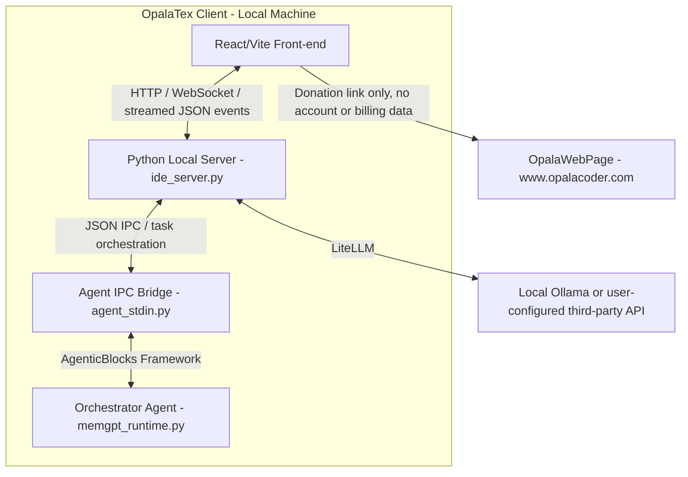

# OpalaTex & OpalaWebPage Project Design

This document describes the software architecture and project-level design decisions of **OpalaTex** (the MIT-licensed open-source client desktop application) and its connection to the optional **OpalaWebPage** static marketing site (hosted at `https://www.opalacoder.com`), which presents the project and links to a PayPal donation page. OpalaTex has no hosted Cloud AI service, no accounts, and no billing — the desktop app and the website are otherwise independent.

---

## 1. High-Level Architectural Diagram

The diagram below outlines the communication between the OpalaTex React/Vite front-end, its local Python backend, and the user's chosen AI provider (local Ollama or a third-party API).

---

## 2. OpalaTex Client Architecture (Desktop Application)

The client desktop application is a project-centric, AI-integrated LaTeX editor distributed under the MIT License. All local editor features remain available without registration, payment, or a Cloud account.

### 2.1 Backend / Core Components (`opalatex/` package)
- **Local HTTP/WS GUI Server (`opalatex/ide_server.py`)**: Runs an asynchronous HTTP server (default port `3000`). It serves the compiled React/Vite front-end and exposes local REST endpoints (`/api/*`) for workspace, IDE configuration, attachments, project chat storage, checkpoints, and agent execution.
- **Agent Orchestrator (`opalatex/memgpt_runtime.py`)**: Built on the vendored **AgenticBlocks** source package (`agenticblocks/`), which ships with OpalaTex rather than being installed as an external distribution. It implements a MemGPT-like memory architecture where the primary agent manages short-term and long-term memory, dispatches actions to modular "skills" (`opalatex/skills.py`), and exposes editor/file/document tools to the model.
- **JSON IPC Bridge (`opalatex/agent_stdin.py`)**: Owns the streamed agent run lifecycle for the IDE. It receives `/api/opalatex/run` payloads, persists user-visible chat history, normalizes attachments, coordinates pending GUI input requests, records agent activity for interruption/resume, and emits structured events back to the front-end.
- **LiteLLM / Tool-Call Compatibility Layer (`opalatex/litellm_compat.py`)**: Wraps AgenticBlocks LLM calls at the OpalaTex boundary. It sanitizes provider kwargs, repairs transport/history issues such as orphan tool messages and concatenated JSON tool calls, and adds bounded loop breakers for repeated schema validation failures. It must not silently convert an invalid tool call into a different semantic action.
- **Project Store and Attachments**:
  - `opalatex/project.py`: Persists project metadata, chat history, chat branches, message attachments, core memory snapshots, and diagnostic agent activity.
  - Diagnostic activity (`thought`, `reflection`, and `stream_chunk`) is stored in `project_activity`, scoped by project and chat. It is loaded by `/api/chat/history` to rehydrate the Thinking/Stream panel. `thought` activity is also associated back to the matching assistant turn in the chat UI as a collapsed "AI Thoughts" details block, while assistant chat message content remains limited to the visible final response.
  - `opalatex/attachments.py`: Converts uploaded images and supported documents into normalized descriptors, extracts document text when possible, caches the original of a supported document on disk (`<opalatex home>/attachment_cache`, addressed by content hash) so the descriptor carries a `raw_path` instead of the base64 original, and avoids forwarding unsupported binary payloads to text-only models.
- **VCS & Compilation Managers**:
  - `opalatex/vcs.py`: Implements user-facing Git features and internal shadow checkpoints around agent turns. Mutating file tools do not create their own checkpoints; each participating agent run, including ephemeral `run_skill` workers, creates labeled start/end checkpoints only when needed.
  - `opalatex/latex_compiler.py`: Handles compiling LaTeX using Tectonic (`tectonic` CLI), supporting full, partial (chapter/file), and fast single-pass draft compilation (`tectonic -X compile` with `-r 0`).
  - `synctex_parser.py`: Maps PDF rendering view back to the corresponding LaTeX lines.
- **Snippet Translation (`opalatex/translation.py`)**: A provider-neutral, structured-output translation of a text excerpt (detected language + translated text), used by the PDF viewer's *Translate selection* action. See §2.13.
- **Image Generation (`opalatex/image_gen_config.py`)**: Global settings (enabled, model, size, output folder) for the `generate_image` tool, which produces project files through the provider-neutral `ImageGenerationBlock` of the vendored AgenticBlocks. See §2.12.
- **Document Export Tools**:
  - `create_docx_file` and `create_pptx_file` are exposed through the agent tool registry for generated Word and PowerPoint artifacts. They should be used instead of asking an agent to write raw binary office files.
- **Cloud Project Mirroring (`opalatex/cloud/`)**: An opt-in, per-project mirror of a project to cloud storage, behind a provider-neutral facade (`CloudStorageProvider`). Disabled by default; nothing leaves the machine until a user turns it on for a specific project. See §2.15.

### 2.2 Offline by Default & Open-Source (MIT)
The OpalaTex repository contains no cloud proxy calls, no account tracking, and no credit-meter logic. All editing and AI features function via Ollama and user-configured third-party providers (API key + optional base URL). The previous private `OpalaTexCloud` overlay project and its `opalatex_cloud` extension package have been discontinued and are no longer built or referenced from this repository.

Project mirroring to cloud storage (§2.15) is the one network path the application itself can open, and it is **opt-in per project**: it transfers nothing until a user selects a provider, authorizes it, and enables it for that project. There is still no OpalaTex account, no hosted service, and no telemetry — the credentials are the user's own and the files go to the user's own storage.

### 2.3 Open-Source Support and Donations
- **License**: The repository includes the standard MIT License in `LICENSE`, matching `pyproject.toml` metadata.
- **Desktop donation UI**: Settings > About displays a PayPal donation button and the QR Code from `gui_src/public/qr-code.png`.
- **Compiled asset**: Vite copies the QR Code to `opalatex/gui/qr-code.png` for packaged desktop builds.
- **Separation from features**: Donations support project maintenance and do not unlock any additional application features.

### 2.4 Rich Text Editor & Math Rendering (`gui_src/src/components/RichTextEditor.jsx`)
- **Overleaf-style Rich Text mode**: Parses LaTeX source into structured blocks; editable prose blocks (headings, paragraphs, lists, quotes) are rendered as `contentEditable` elements. Non-editable blocks (math, figures, tables, code) are rendered as read-only previews with "jump to source" on click.
- **Environment recursion is the default, with a named blacklist** (`latexBlockParser.js: OPAQUE_ENV_NAMES`): an environment's body is parsed as a sub-document unless it is listed as one that is not — the verbatim family, cell/plot grammars (`array`, `tabbing`, matrices, pgfplots `axis`), or content for another consumer (`filecontents`). It used to be the other way round: only `frame` and the beamer titled boxes recursed, and every other wrapper became one opaque read-only blob. That made the loss **compound** — a `columns`, `minipage` or `theorem` swallowed the `itemize`s, figures and TikZ pictures inside it, all of which the parser handles perfectly well on their own, so one unrecognized wrapper cost every supported construct nested within it. Unrecognized environments now become an `envblock` container whose arguments are consumed into its header (`\begin{minipage}[t]{0.5\textwidth}`) so they never leak into the body as stray text. Argument scanning deliberately does not skip whitespace, so a brace group on the next line stays body content; when the guess is wrong the source is still safe, because both editors preserve the header verbatim — only the header/body split shifts.
- **Font declarations render their effect, not their markup** (`gui_src/src/utils/latexFontDeclarations.js`, shared by both editors so a declaration never renders one way in one mode and another in the other): `\Huge`, `\small`, `\bfseries`, `\itshape` and the rest of the standard set take no argument and apply to the end of their enclosing scope, so they are not found by the argument-taking `\textbf{x}` path and used to leak into the preview as literal text — a slide title read `{\Huge\bfseries Bem-vindos}` instead of large bold text. Both spellings are handled: a scoping group (`{\Huge\bfseries ...}`) and a bare declaration running to the end of its scope (`\footnotesize Referência: ...`). The whitespace terminating a declaration belongs to it, since TeX consumes it as the control word's terminator. Sizes are emitted as `em`, which compounds when nested where LaTeX's are absolute relative to `\normalsize` — accepted, as nesting two sizes is rare. A brace group that does *not* open with a declaration is handled by the rule below.
- **Command arguments are matched by counting braces** (`gui_src/src/utils/latexInlineCommands.js`, shared): the `\cmd{arg}` → `arg` reduction used a `\{([^}]*)\}` regex, which ends the argument at the first `}` and therefore cannot handle an argument containing markup of its own. On `\footnote{o termo \textit{modelo} ...}` that left a stray `\textit{` mid-sentence and an orphaned `}` at the end — corrupted output rather than merely unrendered markup, and it affected every command with nested braces (`\caption`, `\alert`, ...). All scanning now counts braces.
- **Notes render as a marker, not as body text**: `\footnote` (with `\footnotetext`, `\thanks`, `\marginpar`) compiles to a marker in the text and a note at the foot of the page, so reducing it to its argument the way `\alert{x}` reduces to `x` would splice the note into the middle of the sentence. Both editors show a superscript `†` carrying the note's text on hover. The marker is deliberately not a number: LaTeX assigns those at compile time from a document-wide counter, and inventing one could be mistaken for the real numbering. The whole command is kept verbatim, so an optional argument (`\footnote[3]{...}`) survives; editing the note text means going to the source.
- **Braces that only group render away but are never written away** (`gui_src/src/utils/latexBraceGroups.js`, also shared): a brace group whose content holds no control sequence and no comment does nothing but group, so `1{,}5` — the standard decimal comma, braced so it is an ordinary symbol rather than punctuation — reads as `1,5`. The braces are kept in the source, because they can carry meaning the rendering does not show: `sha{f}{f}le` is how an "ff" ligature is broken. A group containing a command is preserved whole, rendering included, since what it means depends on the command. The unwrap uses a lookbehind to skip command arguments, so `\ref{x}` is safe regardless of where the rule sits among the other substitutions, and it must run *before* `\{`/`\}` are unescaped or a literal brace pair would be stripped as if it were a group.
- **Beamer `columns` are laid out as columns**: `columns` splits on `\column{width}` markers and on nested `column` environments (both spellings occur in the wild and are recognized in the same pass), producing `columns`/`column` blocks that render side by side with the declared width fractions. A width in absolute units has no fraction to honour and shares the remaining space evenly; the row wraps to a stack in a narrow pane. `latexBlockSerializer.js: RESPLICED_BLOCK_TYPES` lists every container type that must be re-spliced rather than emitted from its captured `source` — omitting one silently drops edits made inside it.
- **KaTeX rendering**: Inline and display math use KaTeX's MathML output consistently across Markdown chat content, confirmation dialogs, and the rich-text editor. The rich-text editor renders through a **persistent Worker pool** (`katexRenderWorker.js`), whose workers are reused across equations to avoid per-equation module re-initialization cost.
- **Uniform math output**: Every mathematical surface uses the same MathML representation. No expression-specific HTML/MathML routing is performed, and fenced `latex` or `tex` blocks are promoted to display math only after KaTeX validates them.
- **Lazy block rendering**: An `IntersectionObserver`-based `LazyBlock` wrapper mounts block content only when near the viewport (`rootMargin: 800px`), preventing all equations from rendering simultaneously on mount.
- **Throttled scroll**: `handleScroll` uses `requestAnimationFrame` to batch scroll-driven layout reads.
- **Precomputed line offsets**: Line-start offsets are cached via `useMemo` and `sourceLineFromOffset` uses binary search (O(log n)) instead of string slicing (O(n)) per block.
- **KB article**: See `docs/kb/katex_equations_longtime.md` for the full diagnosis and resolution of the equation rendering freeze issue.

### 2.5 LaTeX WYSIWYG Mode (`gui_src/src/wysiwyg/`)
A second, model-based document editor for `.tex` files, offered alongside Rich Text mode as a per-file toggle in the editor toolbar (the two are mutually exclusive — they are different editors over the same file). It is lazy-loaded, since it pulls in the ProseMirror stack.

Where Rich Text mode renders blocks and lets the user edit the LaTeX text inside prose blocks, this mode maintains a **real document model** (a ProseMirror schema for a bounded LaTeX subset) and edits *that*: bold is a mark rather than a typed `\textbf{}`, Enter creates an `\item`, Tab nests a sublist, and undo/redo belong to the editor.

- **The `.tex` file remains the single source of truth.** The model is derived from it and serialized back on every change; nothing else persists.
- **Untouched blocks are written back byte-for-byte.** Every node records the source slice it came from (`raw`), the text separating it from its next sibling (`tail`), and the whitespace surrounding its inline content (`head`/`foot`). Together these cover every byte of the file. Before rebuilding a node from the model, `toLatex.js` compares it against a *pristine* snapshot taken at parse time; identical nodes emit their original bytes and the model is never consulted. This is the invariant that makes the mode safe on version-controlled LaTeX — editing one word touches one paragraph, instead of reformatting the whole file on first save.
- **Nothing is dropped.** Any construct outside the modelled subset — unknown environments, user macros, `\cite`/`\ref`, figures, tables, TikZ, the preamble — becomes a `latex_raw` block atom or an `inline_raw` inline atom carrying its source, preserved verbatim and rendered read-only. Verbatim blocks reuse the preview components exported from `RichTextEditor.jsx`, so a figure looks the same in both modes.
- **Whitespace is the one deliberate normalization.** The model has no concept of source line wrapping, so runs of whitespace inside a paragraph collapse to a single space. Hard wrapping survives until the user edits a given paragraph, and is lost on that paragraph when they do.
- **Module layout**: `schema.js` (the node/mark schema and the command↔mark tables), `inline.js` (inline LaTeX ↔ marks/atoms, with a bijective escape and ligature table), `fromLatex.js` (blocks from `latexBlockParser.js` → model), `toLatex.js` (model → source, verbatim-preserving), `commands.js` (editing commands; the list algorithms are reproduced from `prosemirror-schema-list`, which is not a project dependency), `nodeViews.jsx` (verbatim previews and editable math), `LatexWysiwygEditor.jsx` (the surface).
- **Conformance suite** (`gui_src/src/wysiwyg/__tests__`, run with `npm run test:wysiwyg` — `node --test`, no added dependencies): byte-exact round-trips over a corpus including the real SIBGRAPI paper template read straight from `templates/`, edit-locality properties (typing in a paragraph, editing a frame title, deleting a block, splitting a paragraph), and the LaTeX produced by each editing command. Round-trip exactness is tested before anything else: an editor that normalizes the file on open is unusable for LaTeX regardless of what else it does.
- **Inline scopes are marks** (`scope`), covering the three shapes that occur: braces carrying font declarations (`{\Huge\bfseries x}`), a bare declaration running to the end of its scope (`\small x`), and braces that only group (`1{,}5`). The mark carries the declaration run verbatim in `prefix` (empty for a grouping-only pair) plus whether the source braced it and how deeply it was nested. A `key` attribute distinguishes one braced group from the next, so adjacent groups are never merged — `sha{f}{f}le` must not become `sha{ff}le`. The mark sets `excludes: ''`, since a mark type excludes itself by default and a nested declaration would otherwise replace its enclosing one. Two constraints shape how it is written back: ProseMirror keeps same-type marks in insertion order rather than source order, so the serializer restores nesting by comparing `depth`; and a declaration that came from inside another mark's scope is always braced, because ProseMirror's rank ordering brings it back out ahead of that mark, where writing it bare would extend it over the rest of the paragraph. `\textbf{\small x}` therefore returns as `{\small \textbf{x}}` — the same scope, not the same bytes. Like every other re-serialization this reaches only a paragraph the user edited.
- **Wrappers**: the same recursion policy as §2.4 applies, since both modes share `latexBlockParser.js`. Unrecognized environments become `env_block` nodes and beamer columns become `columns_block`/`column_block`, all three keeping their opening and closing text verbatim in `headerRaw`/`footerRaw` — the uniform way to preserve `\begin{minipage}[t]{0.5\textwidth}` and a marker-style `\column{0.55\textwidth}`, which has no closing text at all.
- **Known gaps**: tables and figures are preserved but not yet editable in the model (`prosemirror-tables` is available for a follow-up); `\newcommand` is not expanded for display; cross-references and citations are not resolved against the `.aux` file, so they render as source chips rather than numbers.

### 2.6 Agent Run, Streaming, and Human Approval Flow
- **Run entrypoint**: The React front-end posts to `/api/opalatex/run`. The local server streams structured JSON events back to the UI so chat messages, thoughts, tool calls, problems, cancellation, and final responses can update incrementally.
- **Live-output rendering contract**: While an agent is running, visible response chunks are appended immediately as raw, pre-wrapped text in the chat and Output panels. Markdown and KaTeX are never parsed on partial output. When the final `agent_response` arrives, the temporary raw stream is replaced by the completed assistant message and only then rendered as Markdown/KaTeX, including bounded LaTeX-delimiter normalization for provider-specific final output. Model streaming defaults to enabled unless a project explicitly opts out.
- **Final-response and tool-call contract**: Only provider-native `tool_calls` execute actions, and a final response is preserved verbatim, including JSON and Markdown examples; plain-text JSON is never recovered or executed as a tool call. **What ends the turn depends on who is in control** (`MemGPTAgentBlock.model_controlled_turn_end`): by default a non-empty assistant `content` ends the run, and `send_message` is a legacy handoff nobody needs. The chat orchestrator runs with the model in control instead, where plain text is narration and the turn ends only through `send_message` with `request_heartbeat=false` — see the entry below.
- **An attached image must not cost the agent its ability to act** (`agenticblocks/blocks/llm/memgpt_agent.py: _acompletion`): a multimodal request used to be rewritten from `ollama_chat/<model>` to `ollama/<model>`, because Ollama's native `/api/chat` did not accept OpenAI-style `image_url` parts while the OpenAI-compatible route did. **That reroute became the more expensive bug.** On the `ollama/` route a streamed tool call never arrives as `tool_calls` at all: the provider emits it as plain text, one token at a time (`{"`, `name`, `":"`, …), so `stream_chunk_builder` has nothing to assemble and the model's action reaches the caller as prose. Measured against `ollama_chat/kimi-k3:cloud`: 93 chunks, **zero** carrying `delta.tool_calls`, the whole call rebuilt as the string `{"name":"get_editor_state","arguments":{}}`. So an agent that was sent a screenshot could not act for the entire turn — it could only announce what it would have done, which is exactly what the user saw and reported. **The condition was one variable, and it took a controlled pair to find it**: the same model, prompt and toolset issued five native tool calls with streaming and no image, and none with an image; the earlier suspects (the model's tool-calling ability, thinking, the size of the prompt, the number of tools) each survived a test and were wrong. LiteLLM converts image parts for the native route now — verified against 1.97, where the image is described correctly *and* the tool call arrives native while streaming — so the reroute buys nothing and costs tool calling, and requests go to the model's own route. `tests/test_multimodal_route.py` is the guard against reintroducing it; `requirements.txt` was carrying a stale `litellm>=1.40.0` against `pyproject.toml`'s `>=1.95.0`, and this behaviour is the reason the floor matters.
- **The model decides when its turn ends, because the runtime could not tell an answer from an announcement** (`agenticblocks/blocks/llm/memgpt_agent.py`, `model_controlled_turn_end` / `max_narration_steps`): the orchestrator kept ending plan-mode turns by saying it was *about to* act — "I will now read the file and draft the plan" — with nothing done. **This was not the model hallucinating that a message continues the work; the runtime was terminating on a preamble.** Any response carrying visible text and no tool call ended the run, and that rule cannot distinguish a final answer from a model narrating its next step, so the model was cut off mid-thought and its announcement delivered as the answer. The MemGPT decision point (`request_heartbeat`) already existed but was unreachable: it is read only inside `send_message`, whose own description told the model to prefer plain text, while every real tool call set the continuation flag automatically — so the model decided neither when to continue nor when to stop. **The fix is both halves together, and either alone is inert**: plain text stops ending the run (it is recorded, streamed and kept in history as narration, then the model is called again so it can take the step it announced), *and* ending the turn becomes an explicit act. The prompt rules change with the mechanism, because the old ones did not merely fail to help — they taught the failure, instructing the model that plain text is how a turn ends. `max_heartbeats` stops being a budget the model rations and becomes a runaway guardrail (default 30, `_CORE_AGENT_DEFAULTS`), which is why a narration step consumes one exactly like a tool-call step: the guardrail bounds model calls, and narration is a model call. **The worst case is bounded by `max_narration_steps` (default 2), not by the guardrail**, and spending that allowance must not deliver the failure it exists to stop: the first version accepted the last narration as the final answer, which hands the user "I will now read the file" as the result — an announcement of work nobody did, the reported bug exactly. The allowance now ends in an explicit request for the answer instead (`force_final_answer`: `tool_choice="none"` plus an instruction to state what was actually established and, failing that, to say plainly that it could not act), so the last call cannot be answered with one more intention. The count resets on every tool call, since narrate-act-narrate-act is normal work rather than a model going in circles. **A response that is all reasoning and no action spends the same allowance**: it is the same model-did-not-act step, and it was bounded only by the whole guardrail — the branch that handles it drops the message, so the model never reads its own attempt back and writes the identical thought again. One observed trace (`ollama_chat/kimi-k3:cloud`, a model that issued no native tool call at all) burned 27 calls that way before ending on an announcement; it now costs three and ends with no answer rather than a false one, which is what tells the user the model is the problem. Off by default in the framework (it changes what ends a run, which every existing caller's prompts are written against), on for the chat orchestrator, per-project in `model_params`. Skill workers are `LLMAgentBlock` and are untouched. **A prior attempt is worth recording as a dead end**: a plan-mode lock that detected the missing `create_plan` at the end of the turn and re-ran the agent could not fix anything, because every retry hit the same premature termination — it was fighting the symptom with the weapon that caused it — and it was removed when this landed. `AgentOutput.termination_reason` now reports why a run stopped (it was computed and thrown away, printed only under `debug`), which is the only thing that tells a turn the model chose to end from one the runtime cut short.
- **Agent turn checkpoint contract**: Every participating agent run creates a shadow-git start checkpoint before execution and finalizes an end checkpoint in `finally`-style cleanup, regardless of normal completion, failure, or thrown error. If the start and end checkpoints have no net diff, both checkpoints are discarded. If there is a net diff, the Review UI groups the matching `Agent turn start checkpoint[: label]` and `Agent turn end checkpoint[: label]` commits as one agent checkpoint row, using matching labels such as `worker:command-line` for worker turns, and the row diff compares start-to-end. **The contract has one blind spot, and it is reported rather than left silent**: a sub-directory of the project that carries its own `.git` is recorded by the shadow repository as a gitlink (mode `160000`), never as a tree of files — `git add .` stages a new commit id only when that repository's HEAD moves, and edits to the files inside it stage nothing at all. A turn that only touches those files therefore has no net diff, both checkpoints are discarded, and the Review UI shows nothing for work that really happened. `vcs.find_nested_git_repos` scans the project (bounded depth, skipping `node_modules`/virtualenvs/`.opalatex`) and `/api/git/nested-repos` serves the result: `App.jsx` logs a warning once per project when it is opened, and the Git sidebar shows a banner listing the folders whenever the agent history is the selected source. The fix is the user's to make — open the inner folder as the project, or remove its inner `.git` — so the app states the gap instead of working around it.
- **Common event types**: Agent runs may emit `agent_started`, `thought`, `reflection`, `stream_chunk`, `stream_retract`, `tool_call`, `tool_result`, `problem`, `input_request`, `user_message_saved`, `token_usage`, `agent_response`, `cancelled`, and `agent_finished`. The front-end treats these as UI state transitions rather than opaque text.
- **`think` is the provider's parsing switch, never a display switch** (`config.resolve_think_request`): Ollama's `think: false` does not stop a reasoning model from reasoning — it stops Ollama from separating the reasoning into its own `thinking` field. Probed against `ollama_chat/glm-5.3:cloud`: with `think: false` the answer came back as `"17*23 = 17*20 + 17*3 = 340 + 51 = 391"` followed by `"391"` in `content`, `reasoning_content` empty; with `think: true`, `content` was `"391"` and the working went to `reasoning_content`. In the off case the reasoning arrives **undelimited** — no `<think>` tags at all in a 143k-character stream, nothing any text splitter can key on — and was published as the assistant's answer. So a model whose catalog entry declares `supports_thinking` is **always** sent `think: true`, and that same resolved flag is what gates `on_thinking`: the reasoning is published exactly when the provider was asked to isolate it. There is no second switch — see *Thinking is a model capability, and only a model capability* below. This is the same separation `resolve_model_route` makes for transport — a preference must not silently degrade the wire format. Inline `<think>` handling below stays as the second line of defence for models that do tag their reasoning in the content channel.
- **Reasoning written into the content channel is classified, never published** (`opalatex/think_stream.py: InlineReasoningStreamSplitter`, `agenticblocks.utils.parsers.split_inline_reasoning_parts`): a model whose catalog entry does not declare `supports_thinking` still reasons, and with the provider's reasoning channel unused that reasoning arrives inline in `delta.content`. It comes in two shapes, and only the balanced `<think>` … `</think>` one used to be recognised. The other is an **orphan close**: chat templates for several reasoning models seed the opening `<think>` at the end of the prompt, so the model generates only the closing tag and its whole reasoning prefix was published as the answer — in the chat, in the persisted message, and in the history the model reads back. Both shapes are now split at every layer: the streaming splitter (one implementation, shared by the orchestrator, the skill workers, and `agent_stdin`), the response sanitizers that decide what enters `project_history`, and the AgenticBlocks loops, which file it under `reasoning_content` — the field already stripped from every outgoing request. A `</think>` that follows an opening tag is ordinary text: a model writing well-formed pairs is not producing orphans.
- **An orphan close retracts what it disproves, and the diagnostics keep the raw stream**: in the orphan shape the reasoning has already been streamed as visible text by the time the closing tag arrives, so the splitter emits `stream_retract` with the exact text to drop from the tail of the live response, then re-publishes it as a `thought`. The retraction window is bounded by `begin_response()` (called from `on_iteration`, i.e. before each LLM request), so an orphan close in one heartbeat can never take back an answer streamed by an earlier one. The Output/Thinking panel and `project_activity` deliberately keep the raw `stream_chunk` record: that panel documents what the provider actually sent, while the chat shows the classified result.
- **Nothing on the per-token path may block the event loop**: `ide_server.py` is a single-event-loop server (`asyncio.start_server`, no thread-per-request), so every `async` handler shares one thread. Any synchronous disk, subprocess, or database call made while an agent streams stalls *all* other requests — including `/api/file/read`, which is why opening a `.tex` file appeared frozen during a run regardless of whether the provider was local or a cloud API. Two call sites on that path were fixed and must stay non-blocking. (1) `ProjectStore.append_activity` runs once per streamed token (`print_event` → `_persist_activity_event` persists `thought`/`reflection`/`stream_chunk`/`error`); opening a fresh connection per call measured **~9.4 ms** — the PRAGMAs plus the WAL index every new connection re-opens before it can commit, which WAL alone does not remove — for ~7.5 s of blocked loop on an 800-chunk response. It now reuses a thread-local connection (**~0.05 ms**, measured), released at end of turn via `close_activity_connection()`; this is the only call site allowed to keep a connection, because it is a single-statement INSERT that never nests inside another `_conn()` transaction and so cannot commit an enclosing one early. (2) The shadow-git turn checkpoints (`begin_agent_turn_checkpoint`/`finalize_agent_turn_checkpoint`, spawning several `git` processes over the whole work tree) are dispatched through `asyncio.to_thread` in `agent_stdin.py` and `memgpt_runtime.py`; `_SHADOW_GIT_LOCK` already serialized them, so concurrent worker checkpoints keep the same one-at-a-time ordering and the start/end diff contract above is unchanged. LLM calls (`litellm.acompletion`) and agent tool calls (`FunctionBlock.run` → `asyncio.to_thread`) were already offloaded and must remain so.
- **Context occupancy is measured, not estimated**: the chat context indicator and the attachment budget report `prompt_tokens` as charged by the provider. A character count over the rendered chat cannot see the system prompt, the tool JSON schemas, the tool calls, or the tool results, which are what actually fill the window; it reported a nearly empty context while MemGPT was already evicting. Both `LLMAgentBlock` and `MemGPTAgentBlock` emit a `TokenUsage` record through their `on_token_usage` callback after every LLM call; `opalatex/token_usage.py` subscribes via `attach_usage_tracking` at each agent construction site, so nothing on the request/response path is touched. Usage is emitted to the front-end as `token_usage` (`prompt_tokens`, `completion_tokens`, `total_tokens`, `context_window`) and only for the chat orchestrator: sub-agents (`worker`, `inline_editor`, `skill_*`) run independent histories and must not move the conversation's indicator. The measurement is scoped to one project/chat pair, dropped when either changes, and re-served by `/api/chat/history` so a browser reload does not fall back to guessing. The `len(json)/4` estimate survives only as the pre-measurement fallback, on the first request of a conversation, and is never mixed into a measured value.
- **One attachment budget per turn, and the original travels as a path**: the truncation slice (`pdf_truncate_pct` of the free window) is computed once for the whole turn and divided between the documents attached to it (`agent_stdin._apply_document_budget`), with a short document's unused share rolling over to the next. It used to be recomputed inside the per-attachment loop, so N documents each claimed the full percentage and any N > 1 overflowed the very window the budget exists to protect — invisible while attaching happened one file at a time, unavoidable once pasting and multi-select made a batch the normal case. A non-positive budget still forwards the attachments untouched: the window is already full, the request fails either way, and blanking the documents would hide the real cause. For the same reason the original bytes of a document left the descriptor: `read_file(alias)` re-extracts the attached file on demand, so the original must survive, but carrying it as base64 meant every turn re-uploaded it and every history row stored it again. It is written once to the content-addressed cache and referenced by `raw_path`; `read_file` prefers that path, falls back to the inline `raw_data` of history written before this change, and finally to the extracted text when neither is reachable.
- **The measurement is persisted with the working state it describes, not only in memory**: the in-process slot holds exactly one scope, so sending a message in any other chat rebinds it and a server restart empties it — after which reopening the first conversation was answered `context_usage: null` and the panel fell back to the character estimate, drawing a nearly full battery for a window the orchestrator was about to restore in full from `agent_state`. `project_chats.context_usage` stores the last measured record (including the `context_window` it was measured against) next to that state; `agent_stdin.py` writes it in the turn's `finally` block, beside `save_chat_orchestrator_state`, so an interrupted or failed turn still records the window it consumed. A turn that produced no measurement writes nothing rather than erasing the previous number — replacing a measurement with a guess is what the indicator exists to avoid. Every endpoint that replaces the panel's transcript (`/api/chat/history`, `/api/tutorial/open`) reports it through `_chat_context_usage`. The stored copy dies with the state it describes: `clear_project_history` and `supersede_chat_history_from_message` reset `context_usage` in the same statement that resets `agent_state`, and a branched chat starts unmeasured.
- **Three ranked sources, each labelled, none averaged**: `_chat_context_usage` reports (1) the in-process measurement when it belongs to the chat being opened — the freshest, since it also moves during the turn; (2) the provider measurement persisted for that chat; (3) `memgpt_runtime.derive_context_usage_from_state`, a count of the restored working state, for a conversation whose last turn predates the persisted measurement. (3) is not the char/4 estimate wearing a new name: it rebuilds the exact message list `MemGPTAgentBlock.build_request_messages()` sends (system prompt + recursive summary + `internal_history`) and counts it with the model's own tokenizer, which is the same quantity the `source: "local"` count reports before each call. Measured against the live database of an existing project it returned 35 017 tokens for a chat the provider had last reported at ~35 000. It reads slightly low — tool JSON schemas travel outside `messages`, and the probe block carries no tools — so it is tagged `source: "state"` and the panel gives it its own tooltip (`chatPanel.contextDerived`) instead of presenting it as the provider's number; the next turn replaces it with a real measurement. Two constraints shape the implementation: the count runs through `asyncio.to_thread` (tokenizing a multi-megabyte state measured 224 ms, and this server shares one thread across every request), and it renders the prompt through `chat_orchestrator_system_prompt`, extracted from `build_chat_orchestrator` precisely because the builder calls `set_project_context` — a read-only chat open must never rescope the global file tools while another project's turn is running.
- **`MemGPTAgentBlock` owns its request shape (`build_request_messages` / `count_context_tokens`)**: the assembly was inlined twice in `run`, so any outside caller wanting to know how full the window is had to re-derive it and drift from it. `run` now builds its request from the same method, which is what makes the derived count above faithful rather than an approximation of the block's behaviour.
- **Auxiliary LLM calls stay out of the context measurement**: `MemGPTAgentBlock._summarize` runs its own short, self-contained request during eviction. It deliberately does not emit `TokenUsage`, because its prompt describes the summarizer, not the conversation window — reporting it would collapse the indicator to a tiny value at exactly the moment the context is fullest.
- **The indicator updates before the provider answers**: waiting for `prompt_tokens` means the gauge does not move while tools are running, which is exactly when a large tool result blows the window. `on_iteration` fires immediately before each LLM call with the assembled request, so `agent_stdin.py` counts it there with the model's own tokenizer (`agenticblocks.blocks.llm.tokens.count_message_tokens`) and emits `token_usage` with `source: "local"`. The provider's own count follows with `source: "provider"` and supersedes it; both describe the same request, so the panel simply uses the most recent. The local count also updates the tool budget, so a second tool call in the same heartbeat batch sees what the first one added.
- **The number shown is consumption; the bar is what remains**: the gauge is a battery (draining left to right), but a bare remaining-percentage reads as its opposite — 5% was misread as "5% consumed" when it meant 95% consumed. The panel prints consumed percentage plus absolute `used/window`.
- **`num_ctx` is the real context cap, not the model's maximum**: a model advertising 128K still runs at whatever `num_ctx` the project sets, and that is the number the indicator, the eviction threshold, and the tool budget all measure against. The tooltip states the effective window explicitly so a full indicator on a "128K model" is not mistaken for a bug.

- **Clearing a chat is a server-side operation, never a UI reset**: the panel's "Clear chat" action and the `/clear_chat` command both call `opalatex/chat_ops.py: clear_chat`, which erases `project_history`, resets the chat's `agent_state` (so the orchestrator rebuilds with an empty `internal_history` instead of restoring the deleted conversation), clears that chat's archival entries, wipes core memory only when the chat is not sharing it, and drops the measured context occupancy. Hiding the bubbles while the agent still replays the history would misrepresent both the conversation and the context indicator, so the panel action goes through `/api/chat/clear` rather than resetting local state.

- **Tool results are bounded by the remaining window, and overflow fails loudly**: `read_file` refuses a whole-file read that cannot fit the free budget (`opalatex/tools.py: free_context_chars`), naming the file size, the remaining budget, and the `search_code` → `read_content_pos` paging path. An unbounded read is unrecoverable rather than merely wasteful: the result lands in history, `_get_safe_eviction_index` will not evict the current user turn to make room, and the provider then truncates the oversized request from the front — dropping the user's question, after which the agent answers a question it can no longer see. Refusing is required by §2.7: the tool must not silently return a partial file as if it were the whole one.
- **`read_content_pos` is a real paging tool, not an unguarded escape hatch**: `read_file`'s refusal points models at `search_code` → `read_content_pos` as the way to read a file too large for one call, so that path must not reproduce the same unbounded-read overflow. `read_content_pos` caps its returned line range to `free_context_chars()` and, whenever it returns less than the requested `start_pos`–`end_pos` range (budget-capped, EOF, or a single line too long to fit at all), appends a trailing note with the total line count, how many lines remain, and the exact `read_content_pos(path, next_start_pos, <end_pos>)` call to resume with. This is capping, not refusal — a paging tool is expected to return partial pages — but per §2.7 a capped page must always say so explicitly rather than silently looking like the full requested range. A page always makes forward progress (at least one line, hard-truncated if that one line alone exceeds the budget) so a model that keeps paging cannot get stuck retrying the same non-advancing range.
- **Chat storage split — `project_history` is the conversation, `project_activity` is everything else**: `project_history` stores only the visible conversation (`user`/`assistant`), which is exactly what is replayed to the model. Audit entries (`[MODE]` turn start and transient-mode restore, `[PLAN APPROVED]`/`[PLAN REJECTED]`, per-turn achievements) and UI-only content (agent `error` bubbles) are written to `project_activity` and rehydrated by `/api/chat/history`. This keeps audit noise out of the model's context window, stops it from injecting `system` messages in the middle of the history (see §2.8), and makes what the user sees survive a reload. Chats created before this split still contain `system` rows; the front-end keeps hiding them by prefix, and history seeding ignores every non-`user`/`assistant` role.
- **A chat id names a stored chat, or it is an error**: the default chat is stored as `main_<project>` (`opalatex/project.py: main_chat_id`); there is no chat whose id is the literal `"main"`. `ProjectStore.load(name, chat_id=None)` means "the project's default chat" and resolves to the main chat, while an explicit id that no chat carries raises `ChatNotFoundError` and is answered by `/api/chat/history` and `/api/chat/clear` with `404`. Substituting a different chat is what made the panel reopen with "Main Chat" selected over another conversation's messages: a stale sentinel persisted in `lastChat_<project>` was resolved server-side to the most recently created chat, so the selector and the transcript described different chats. `/api/chat/history` therefore echoes the `chat_id` it answered for, `/api/chat/list` publishes the real `main_chat_id` instead of letting the client guess it, and the front-end validates every restore candidate (`localStorage`, the project's `current_chat_id`, the main chat) against the loaded chat list before requesting history, rewriting the stored pointer when it no longer resolves. Per §2.7 this is a fail-fast contract, not a fallback: the main chat is also undeletable at the store level, since it is the id every restore lands on, and a project whose main chat an older build already deleted is protected by count instead — the last remaining chat cannot be deleted either, and `load` then resolves the default to the first chat. `_migrate_legacy_main_chat_rows` runs once at schema init to reattach rows still carrying the sentinel: `chat_id` was added to `project_history` and `project_activity` with `DEFAULT 'main'` and never backfilled, so pre-multi-chat conversations pointed at no chat and were unreachable from every read path. Only that sentinel is remapped — an unrecognised id is not evidence its rows belong to the main chat.
- **Stable message identity**: after persisting a user message, the backend emits `user_message_saved` with the stored `message_id` and the caller's `client_message_id`, so the front-end can stamp the id on the message it already rendered. Every operation that addresses a stored message (edit, retry, branch, supersede) uses that id — never a position in the rendered list, which does not line up with stored rows.
- **Activity panel contract**: `thought`, `reflection`, and `stream_chunk` are user-facing diagnostic events, not raw transport logs. They must contain useful execution/prose signals only. `reflection` is reserved for assistant prose/reasoning messages; tool-result payloads, user/system retry alerts, and plain JSON tool-call text must not be emitted as reflections. `stream_chunk` must not display raw tool-call JSON emitted as text by local models; suppressing that visible stream is allowed only as a display filter and must not execute, repair, or reinterpret the tool call.
- **Human input requests and clarifying questions**: When an agent tool needs confirmation or user input, the backend emits `input_request` and stores a pending future keyed by request id. The `ask_question` tool allows the orchestrator and skill workers to pause execution mid-turn to ask clarifying questions or request preferences/choices (e.g. column selections, formats, seed filters) from the user; the front-end displays `AskModal` and answers through `/api/opalatex/input_response`. Unsafe tools use `ConfirmModal` (`type: "confirm"`); plan confirmation carries `markdown_content` and is routed to `PlanReviewWindow` instead (see *Plan approval*). Backend rejection or cancellation is surfaced cleanly to the agent.
- **Messages sent while the agent is working are delivered mid-turn, at a safe boundary** (`agenticblocks/blocks/llm/inbox.py: MessageInbox`, `agent_stdin.py: _open_turn_inbox` / `_deliver_inbox_message`, `POST /api/opalatex/message`): the composer stays live for the whole turn, and a message typed during one joins the turn in flight instead of waiting for it to end. It is **not** concurrency — `agent_stdin` keeps the project, store and orchestrator in module globals and `ide_server` keeps one `active_agent_task`, so a second simultaneous run would overwrite the first's state; it is a queue the running loop drains. The drain happens at the top of each heartbeat, before the request is assembled, because that is the only point where `internal_history` is guaranteed not to sit between an assistant `tool_calls` message and its `tool` results — inserting there produces a request no provider accepts, and `history_accepts_user_message` makes the loop keep the item queued rather than deliver it into one. Delivery is therefore *eventual*: an agent parked on an `ask_question` future can hold a message for as long as the user takes to answer, so the UI reports **three** states and never implies one by the absence of another — `sending` while the POST is in flight, `queued` once the backend accepted it (with its position when more than one is waiting), and `delivered` once `user_message_delivered` says the agent read it. "Read by the agent" is the answer the user is actually waiting for, so it is a badge of its own rather than the waiting badge disappearing; it is also reported on the status strip above the composer, because when the user presses Enter their eyes are there and the bubble may already have scrolled behind the agent's streaming output. `user_message_delivered` must leave the backend from inside the turn, before the `agent_response` that took the message into account — the front-end has no other way to learn that a message stopped waiting. Two properties follow for free from draining into `internal_history`: the message is saved by `dump_state` like any other part of the conversation, so it survives an interrupted turn, and it becomes the newest `user` turn, which is the one `_get_safe_eviction_index` already refuses to evict.
- **A message is stored when the agent reads it, not when the user sends it**: `_deliver_inbox_message` writes to `project_history` at delivery, so the stored conversation keeps the order the model actually saw (`[user A][user B][assistant]`). It emits `user_message_delivered` for the delivery and `user_message_saved` for the stored identity, which is the same `message_id`/`client_message_id` pair every other message operation anchors on (see *Stable message identity*). Its attachments go through `_prepare_turn_attachments` — the same vision gate, document budget and alias registration as the message that opened the turn, budgeted against the context measured so far in this turn — and register additively (`tools.add_recent_file_attachments`), because replacing the alias map mid-turn would unregister aliases the model was already given. A queued message is a full message, not a text-only lesser kind.
- **Nothing queued is dropped in silence**: the loop breaks as soon as the model returns its final text, so a message submitted during that last response misses the boundary. `_close_turn_inbox` closes the inbox in the turn's cleanup, hands back whatever was never delivered as `user_message_backlog`, and the front-end resends those through the ordinary `handleSendMessage` path — same attachments, same turn checkpoint, same stored identity. Submitting when no turn is running, when the running turn belongs to another project/chat, or when the queue is full is refused with `409`/`429` and a reason rather than accepted into a turn that cannot deliver it; the front-end then falls back to starting a normal turn. The chat orchestrator block outlives the turn, so the inbox is detached on close — a closed one left attached would reject every message of the next turn.
- **The message channel is not the `input_request` channel**: `/api/opalatex/input_response` resolves a future for a question the agent asked (`ask_question`, confirms); `/api/opalatex/message` carries a message the agent never asked for. Routing chat text into a pending `ask_question` would answer one thing with another, which §2.7 forbids, so the two stay separate endpoints with separate state.
- **Plan approval**: In planning mode, `create_plan` asks the front-end for confirmation before execution. Approval switches the project run path toward execution; rejection or interruption should resolve the waiting future cleanly.
- **The plan review is a floating window, not a modal — only the agent has to wait** (`components/PlanReviewWindow.jsx`, `utils/floatingWindow.js`): `create_plan` parks on a future for up to 24h, and while it was answered through `ConfirmModal` that wait was drawn over `.vscode-modal-overlay`, a full-screen backdrop. **That made the agent's wait the whole application's wait**, and it fell hardest on the one confirmation that genuinely needs the workbench: a plan is judged against the files, the outline and the compile log it talks about, so the backdrop forced the user to approve or reject on the strength of the text alone — exactly the files the plan names being the ones they could not open. The plan now floats over a live IDE with no backdrop, so it captures no click meant for the editor, the explorer, the terminal or the chat, and it can be dragged, resized and collapsed to its title bar. **What it cannot be is dismissed**: a closable window would strand the backend's future with no way left to answer it, so there is no close button and the only exits are Approve and Reject. The routing key is `markdown_content`, which `create_plan` is the sole emitter of; an ordinary tool confirmation is a one-line yes/no raised mid-run and stays modal on purpose, because letting the user edit files underneath it would change the very thing being approved. **The plan needs a state slot of its own** (`planRequest`, separate from `confirmRequest`): the front-end raises its own prompts through `confirmRequest` — new file, new folder, delete, unsaved changes on a project switch — and a non-blocking plan is exactly what puts those within reach while one is pending. Sharing the slot would let a *New File* prompt overwrite the plan, dropping its request id and stranding the future — which `create_plan` resolves by **approving** when its 24h timeout expires, so a window lost that way would eventually execute a plan nobody accepted. For the same reason the answer clears the slot only once the backend has taken it: a failed POST leaves the window standing with the user's edits to the plan intact, and the window disables its own buttons meanwhile so the decision cannot be sent twice. Both agent-owned slots are cleared together on interrupt and on `execution_cancelled`, where the future is gone. Geometry lives in a pure module because reachability is the invariant that keeps this safe — every move, resize, viewport change and value restored from storage is clamped, so the window cannot be put where it can no longer be answered, at any UI scale (the app renders inside a CSS `zoom`, so pointer deltas and `innerWidth`/`innerHeight` are converted through `utils/uiScale.js` first) or with any corrupted stored rectangle. Its z-index ties with `.vscode-modal-overlay` and with react-split's gutters, and App.jsx renders it at the head of the overlay group so DOM order resolves the tie the right way in both directions: above the workbench, below every modal — a modal raised while a plan is pending is a real interruption and still has to be answered first. An earlier attempt docked the plan into a layout mode of its own; that spent a workbench layout and an activity-bar entry on a transient prompt, and was reverted before this.
- **Interruption**: `/api/opalatex/interrupt` cancels the active agent task. Captured agent activity is retained as resume context, but internal resume prompts should not be shown to end users as raw JSON.
- **Resume display contract**: The front-end may send an internal resume prompt containing captured activity and attachments, plus a separate `display_prompt`. `agent_stdin.py` persists the display prompt in chat history while using the internal prompt only as model context.

### 2.7 Tool Calling Reliability and Error Recovery
- **`model_params` has one allow-list and one sanitizer, shared by every write path**: `config._MODEL_PARAMS_SCHEMA` / `config.sanitize_model_params` (moved out of `ide_server.py` so the agent subprocess can use them without importing the web server) decide what a project may store in `model_params`/`worker_model_params`. A key absent from the schema is dropped on save, which makes the allow-list a **user-facing contract**: `empty_response_reasoning_fallback` shipped as a checkbox in both project modals while missing from the schema, so ticking it never persisted and the feature looked broken. `tests/test_project_model_configuration.py` now asserts that every setting the UI offers survives sanitizing, so the schema cannot drift behind the UI again. The IPC handlers in `agent_stdin.py` (`handle_load_project`, `handle_update_project`) sanitize too, not just the `ide_server` settings route: they are a second door into the same stored dict, and leaving one unguarded is how a long-dead `tool_role_workaround` key survived in seven projects' stored params.
- **Strict tool contracts**: Agent tools are backed by Pydantic schemas derived from the exposed tool signatures. Missing required fields, wrong field names, or wrong argument shapes are treated as model/tool-call errors.
- **No semantic fallback hacks**: OpalaTex should not make an invalid tool call "work" by silently converting it into a different action. For example, an incomplete range replacement must not be converted into a read operation. The correct behavior is a clear diagnostic, a bounded retry/loop-break strategy, or an explicit user-approved compatibility layer.
- **LiteLLM transport fields are not model parameters**: `tools`, `tool_choice`, `parallel_tool_calls`, and `stream` are transport/runtime fields. Provider/model-parameter sanitization must preserve them unless a provider contract explicitly says the field is unsupported and the caller intentionally disables the feature. Tool-calling regressions must not be worked around by silently disabling streaming for Ollama or any other provider.
- **Native tool-message protocol**: Tool results always retain the `tool` role and their matching `tool_call_id` when sent to every provider, including Ollama. OpalaTex does not rewrite tool results as `user` or `assistant` messages and exposes no project setting for that behavior. A tool result that genuinely lost its assistant tool call (aborted turn, eviction, provider parse failure) cannot keep the `tool` role without a `tool_call_id`; it is re-roled to `system`, never to `user`, because it is runtime output and not something the person said.
- **The only enforced turn invariant is provider adjacency**: `sanitize_tool_call_messages` downgrades an assistant `tool_calls` message to plain text only when one of its call ids has no matching `tool` result. What precedes the assistant message is not inspected: `assistant` → `assistant` is valid for every provider, and the agent loop legitimately produces it (a `system` alert raised mid-turn can sit between two assistant turns). Rejecting those sequences destroyed valid tool history and — because the repair is written back into `internal_history` in place — made the model repeat calls it had already executed. A `system` alert found inside an otherwise complete tool block is re-emitted after the block: role and content are preserved and only the position changes, which is transport-shape repair, not semantic substitution.
- **Corrective alerts are raised after the tool block, not inside it**: when the agent loop needs to alert the model about one call in a batch (an empty legacy `send_message`, for example), the alert is buffered and appended once every tool result of that batch has been recorded, so the `assistant → tool → tool` adjacency is never split at the source.
- **No raw LLM debug events in the app UI**: Temporary transport diagnostics must not be emitted through the structured agent event stream, persisted in `project_activity`, or shown in the Output/Thinking panels. If transport debugging is needed again, keep it outside the app event protocol or gate it behind an explicit developer-only mechanism that cannot affect normal panel rendering.
- **Repeated validation failures**: If the same tool validation failure repeats, the compatibility layer disables further tool calls for that turn and asks the model for a concise normal-text explanation instead of allowing the agent to spin indefinitely.
- **Worker delegation loop breakers**: `run_skill` tracks consecutive failed runs of the same skill. After repeated worker crashes or no-tool completions, it returns a system alert instructing the orchestrator to stop redelegating the same task, use direct tools when possible, or report a clear blocker. This counter is keyed by skill name only, never by `context`, because it exists precisely for the case the identical-call loop detection below cannot see: the orchestrator rewording the delegation on every attempt. A second counter ignores the skill name as well: the per-skill scan stops at the first history entry belonging to another skill, so alternating between two specialists held it at zero indefinitely (observed: five consecutive delegations, none with a report, because one `command-line` call sat between the repeats). An orchestrator that cannot obtain a usable report is in the same dead end whether it changed wording or changed specialist, so `MAX_FAILED_DELEGATIONS` trailing failures across *any* skill stop delegation for the task and point at direct tools, `ask_question`, or a plain-text blocker. A run counts as failed whenever it comes back without a summary — a crash, zero tool calls, an empty report, a serialized tool call, or a structured payload the model never closed — since a report that carries no summary is not evidence that anything was accomplished and must not reset the counter.
- **Identical tool-call loop detection (single owner: the agent blocks)**: `LLMAgentBlock` and `MemGPTAgentBlock` count a stable `(tool name, normalized arguments)` signature per run. Past `loop_detection_limit` (default 3), the repeat is blocked *before execution* and answered with a corrective tool result telling the model to change arguments, change tool, or stop. Arguments are normalized through JSON so key order and spacing do not create false distinctions, and malformed JSON still yields a comparable signature instead of raising. `send_message` is exempt because it is a communication pseudo-tool, not an action. This replaces two broken halves: the `loop_detection` / `loop_detection_limit` project settings were exposed in the UI and forwarded to the worker block, but Pydantic silently discarded them because the fields did not exist; meanwhile the only working breaker lived in `wrap_tool`, which the orchestrator's tools pass through but **worker tools never do** — so a worker could retry one broken command until its tool budget was gone. `wrap_tool` no longer duplicates this check, and the orchestrator now forwards the project setting to the block, so one mechanism covers both agent kinds. The removed copy also kept its window in a module-global list that was never reset between turns, letting a new turn begin already counted as looping.
- **Recovery advice must match the caller's real toolset**: `read_file`'s large data/log refusal tells the orchestrator to delegate via `run_skill`, but skill workers are never given `run_skill`. `tools.set_worker_context()` marks the worker window around `sub_agent.run()` so the worker gets the reachable instruction (use the skill's own processor script through `run_command`) instead of being sent after a tool it cannot call. Guidance that names an unavailable tool is a dead end that pushes small models into improvising.
- **The skill catalog lists exactly what `run_skill` accepts, and the orchestrator is not in it** (`memgpt_runtime.chat_orchestrator_system_prompt`): the `## Available skills` block was rendered from every *active* skill, which includes `chat-orchestrator` — the orchestrator itself, and never a delegation target (the same prompt already excluded it when deciding whether a `delegate`-policy orchestrator has anywhere to send work, so the two notions of "skills I can delegate to" disagreed). Worse, `skills/chat-orchestrator/SKILL.md` carries no frontmatter, so the entry rendered as a bare `- chat-orchestrator:` with an empty description. **A blank slot in a list of what is available is an invitation to fill it in**: a model enumerated its own toolset (`create_plan`, `search_code`, `read_file`, `get_editor_state`, …) as if those were skills, which is precisely the invented-skill-name failure the run_skill guardrails exist to stop. The catalog is now built from the delegation targets, an empty catalog says so in words instead of trailing off after the heading, `run_skill` refuses its own name with a diagnostic that names the real targets rather than spawning a sub-agent carrying the orchestrator's own body, and the not-found error states that tools are not skill names. `command-line` stays in `MANDATORY_SKILLS`, so every project always has at least one real delegation target.
- **One model resolution for every ephemeral agent** (`config.resolve_agent_model`): `get_agent_model(name, default)` returns `default if default is not None else <agents.yaml default>`, so passing `""` as the default does not mean "no preference" — an empty string is not None, so it **wins** the fallback chain and resolves to a model of `""`, which reaches litellm as `LLM Provider NOT provided. You passed model=`. An ephemeral agent added here hit exactly that (it was later removed, but the footgun and the duplicated resolution it exposed were real). The resolution an ephemeral agent needs (session `worker_model` for the worker role, else the session model, else the agents.yaml override/default) already existed inline inside `get_agent_llm_kwargs`, where it picks provider credentials but never returns the model itself; it is now `resolve_agent_model`, called by both, so the credentials and the model can never be resolved from different answers. **No caller passes a model**: the chat-orchestrator asked to read a file, not to choose an LLM, and the same is true of the editor's `_execute_prompt_evolution`. Any future ephemeral agent must call it rather than passing a default of its own.
- **A document in the workspace is read, not refused; only genuinely unreadable binary fails fast** (`tools._binary_read_error`, `attachments.extract_document_text_from_path`): `_read_text_file` falls back to `latin-1`, which decodes *any* byte sequence without raising, so a `.xlsx` or `.pdf` read by path used to return decoded binary that looked like content. The first fix was a fail-fast diagnostic; the trace that followed showed the diagnostic was not enough, because the orchestrator still had nowhere to go. **Extraction already existed but was reachable only through the attachment pipeline** (`build_attachment_descriptor` → `extract_document_text`, fed by chat uploads), so a PDF sitting in the project was unreadable while the identical PDF dragged into the chat was not. `extract_document_text_from_path` bridges that, `extract_xlsx_text` adds spreadsheets via openpyxl (`read_only` streaming, `data_only` so a formula yields its cached value, and dates rendered as ISO because openpyxl returns datetimes whose `str()` is a column of midnight timestamps), and `read_file` extracts before anything else — so the extracted text then flows through the ordinary path, context budget included. When the extracted text does not fit that budget the refusal does **not** point at `read_content_pos`: paging a `.xlsx` by line would read the raw bytes of a zip container. It points at landing the extraction in the project as a text file (`command-line` for the orchestrator, `run_command` for a worker) and searching that. What still fails fast is what genuinely cannot be read: images (routed to `analyze_image`), legacy spreadsheets (`.xls`/`.ods`/`.numbers`), and anything caught by the NUL sniff of the first 8 KB (UTF-16/32 BOMs excluded, since that text is legitimately full of NULs). A document that extracts to nothing is reported as image-only/empty rather than as a blank file. **The refusal names a route the caller can actually take, and which route that is depends on the caller's real toolset** (§2.7): a skill worker has `run_command` and is told to convert the file itself, and so is a `direct` orchestrator now that the policy grants the same execution tools; only a `delegate` orchestrator, which has no terminal tool at all, is told to delegate to `command-line` — plus that `run_skill` is blocked in plan mode, where asking the user is its only remaining move. The branch is `tools.caller_has_terminal()`, not the role: `set_orchestrator_terminal_access()` records the policy decision at the moment `build_chat_orchestrator` composes the tool list, so the advice cannot contradict what the caller actually holds (the role stopped implying the answer once `direct` started granting execution). Telling the orchestrator to "convert it to text first" was exactly the dead end this principle warns about: it burned a thirteen-minute rumination loop hunting for a conversion tool it does not have.
- **Full coverage of an oversized text file is a loop of delegations, driven by the worker's cursor** (`skills/staged-reader/`): a targeted `search_code` → `read_content_pos` read answers *"what is on line 402"*, but *"extract every date"* needs the whole file. **An in-tool alternative was tried and removed**: a `read_file(path, question=...)` that walked the file with one ephemeral agent per window put the loop in code (where a cursor cannot drift) and worked in plan mode, but it cost one model call per window — an open-ended token bill on a local-first, offline product, which is not a trade this project wants inside a tool the model calls freely. The skill route keeps the cost visible as delegations the user can see and stop. The worker reads one window per `run_skill` call, persists notes to `<project>/.opalatex/staged_reads/<stem>/win_<start>-<end>.md`, and returns a report whose `READ`/`NEXT_START`/`EOF` fields the orchestrator uses as the loop variable, with `staged_reader.py collect` as the reduce pass (it prints `GAPS`, so partial coverage cannot be reported as complete). `NEXT_START` must come from the report rather than from `start + window`, since `read_content_pos` caps a window that exceeds the free-context budget. All four orchestrator prompt variants describe the loop. `run_skill` is blocked in plan mode, so the route does not exist there at all: the orchestrator gathers what it can with `search_code`/`read_content_pos` and asks the user for the rest before proposing a plan.
- **Style editing is measured, not judged by taste** (`skills/humanize/`, store asset `humanize`): the skill rewrites generated prose so it stops reading as generated, and the obvious shape for it — a prompt full of "avoid these words" — fails twice over. It gives the worker no way to find the tics in a long document, and no way to tell whether its own rewrite helped. `humanize_scan.py` supplies both: `scan` reports weighted hits by category with **original** line numbers, and `diff` compares the draft against the rewrite and prints two warnings the worker cannot argue with — words down more than 10% (content was deleted along with the tics) and density up (the rewrite added more than it removed). **The thresholds are measured against this repository's own prose, not assumed**: hand-written files here span 0.0–6.0 weighted tics per 1000 words while lightly generated prose lands above 100, so the clean/moderate/heavy bands sit outside the observed human range. The same measurement killed the em-dash rule that every style guide recommends — these docs use 10–13 em dashes per 1000 words deliberately, so flagging at 4 would have trained the worker to strip the author's own voice; the count is reported and flagged only past 15. Stripping is line-by-line and markup-aware, because a hit inside `$…$`, a `lstlisting`, a `%` comment or a `\cite{robusto2024}` key would send the worker editing markup it must never touch, and a hit reported against a stripped copy's line numbers is unusable for the edit. Two limits are stated rather than hidden: the scanner cannot separate use from mention (a style guide scores `heavy` for naming tics — this skill's own manifest does), and the skill is explicitly **not** a detector-evasion tool, since a rewrite that optimizes against a classifier instead of against writing has no defensible acceptance criterion. It runs on the project's main model (`model: default`), not the worker one: changing every word while changing no meaning is exactly the task a smaller model degrades.
- **Surgical edit tools on the orchestrator**: The chat-orchestrator directly exposes `search_code`, `read_content_pos`, `replace_content_range`, and `write_content_pos` for precise text inspection and line-based edits. `search_code` is implemented in Python so section, label, and marker lookup remains portable across operating systems before line-based reads. This avoids spawning a tool-fragile worker for simple one-line changes and lets the orchestrator verify worker edits before reporting success.
- **A tool call written as text never reaches the user, and is never executed either**: `_strip_serialized_tool_calls` has always scrubbed serialized calls out of *worker reports* before they enter a prompt, but the chat-orchestrator's own final response was never inspected — so an orchestrator that printed `{"name": "web_search", "arguments": {…}}` instead of issuing it delivered that JSON straight to the chat, and the turn ended looking answered while nothing had run (observed with `ollama/glm-5.2:cloud`). `agent_stdin.py: _correct_serialized_tool_calls` now inspects the orchestrator's final text, pushes a localized diagnostic back with the `system` role (per the role-isolation bullet below), and lets the model issue the call properly; the breaker is bounded by `SERIALIZED_TOOL_CALL_MAX_CORRECTION_ATTEMPTS`, mirroring the empty-response loop, because a model that cannot issue native calls on the current route will not learn to mid-turn. When the breaker is spent the turn **fails loudly** rather than delivering the payload: showing raw JSON would imply work nobody did. The payload is deliberately *not* parsed into a real call — that would invent an action the model never issued, exactly the semantic substitution the second bullet of this section forbids. Detection scans only text **outside fenced code blocks** (`_has_unfenced_tool_call_payload`): the payload matcher keys on `name` plus `arguments`, a shape that legitimately occurs in data and in answers that *show* a tool call, and fencing is what separates demonstrating a call from failing to emit one. A tool call is serialized in **two** encodings and both must be caught: the JSON payload above, and the chat-template markup (`<tool_call>`, `<function=name>`/`<parameter=key>`) that Qwen-family models fall back to once their native calls keep being rejected. The markup carries no JSON object at all, so the balanced-span scanner is structurally blind to it — observed with the `openai/nvidia/Qwen3.6-35B-A3B-NVFP4` vLLM/NIM server of the bullet on system-message ordering below, which printed a whole `<tool_call><function=ask_question>…` block to the chat after its native `ask_question` calls were rejected for an argument type. An unterminated block counts too, since a truncated `<tool_call>` is a call the model failed to issue rather than prose. As with JSON, the markup is **never** parsed back into a real call.
- **The native-tool-call reminder belongs to every self-hosted agent, not just workers**: the instruction *"Use the provider-native tool-calling protocol… Never write a tool call as text"* was rendered only into skill-worker prompts, leaving the orchestrator — the one agent whose serialized output is user-visible — without it. `memgpt_runtime.py: _needs_native_tool_call_reminder` is now the single owner of that rule and both roles render `_NATIVE_TOOL_CALL_REMINDER` from it, so the two cannot drift. The gate is on **who serves the model**, not on one provider prefix: it was written for `ollama/`, where the failure was first seen, but the same failure belongs to any model the user runs themselves, including the vLLM/NIM/LM Studio servers reached through the plain `openai/` route rather than a dedicated one — those got no reminder at all. Besides `ollama`/`ollama_chat` and the self-hosted route prefixes, an `openai/<vendor>/<model>` id counts as self-hosted: a genuine OpenAI model id carries no second path segment, so an extra one means the OpenAI-compatible route is aimed at a private server naming models after their source repository. Providers that legitimately use a vendor path (`openrouter/`, `together_ai/`) have their own prefix and are untouched.
- **Ollama transport is decided independently of the reasoning preference**: `config.resolve_model_route` (formerly `resolve_model_for_thinking`) does two separate jobs — it drops `think`/`reasoning_effort` for a model whose catalog entry does not declare thinking support, and it rewrites `ollama/` to `ollama_chat/`. The rewrite is now **unconditional**. It used to fire only when thinking was actually requested, which coupled a *reasoning preference* to a *transport choice*: a project that unchecked thinking dropped its orchestrator onto LiteLLM's OpenAI-compatible endpoint, where reasoning only appears as `<think>` text in `delta.content` and tool calls are markedly less reliable. Observed end to end with `ollama/glm-5.2:cloud`: with thinking off the orchestrator printed `{"name": "web_search", "arguments": {…}}` as its answer and nothing executed; enabling thinking — and therefore reaching `ollama_chat/` — fixed it immediately. Turning reasoning off must never cost an agent its ability to call tools, so the endpoint no longer depends on it. `ollama_chat/` is Ollama's native `/api/chat`: it carries tool calls in the native `tool_calls` field and streams reasoning as a dedicated `thinking` field (mapped to `delta.reasoning_content`, which drives per-chunk `on_thinking`). `normalize_ollama_api_base_for_litellm` already strips a trailing `/v1` for both prefixes, so the api_base handling is unchanged. The function was renamed because the old name described only one of its two jobs, and that framing is what hid the coupling.
- **Sanitized worker attempt history**: Previous worker attempts are compacted before being injected into a new worker prompt. Raw crash payloads and malformed JSON snippets are not replayed verbatim, preventing failure history from poisoning local tool-call generation. Tool-call payloads a worker printed as text instead of issuing are neutralised at the source — inside `run_skill`, before the summary reaches the orchestrator's context, the stored run history, or the next worker prompt — because every one of those consumers otherwise reads a serialized tool call as an example to imitate. Detection is structural, not by string match: balanced JSON spans are parsed and replaced only when their shape is a tool call (`function.name`, `tool_calls`, `tool_name`, or `name` plus `arguments`/`parameters`), so a worker legitimately reporting JSON data keeps its report intact; chat-template markup (`<tool_call>`, `<function=name>`) is matched as its own shape, since it contains no JSON to parse. Overlapping and nested spans are merged before excision — a `<tool_call>` wrapping a JSON payload is reported by both scanners — so no region is cut twice. Surrounding prose is preserved; only the payload becomes a marker.
- **A silent assistant turn is dropped, never described in the assistant's own voice**: when the model returns no visible text and no native tool call, `MemGPTAgentBlock` removes that turn from `internal_history` and from the request, then appends the `system` alert asking for a visible final response. It previously *replaced* the turn with the text `(removed: empty response)`, which the model read back as its own last utterance and echoed on the next call — a non-empty response, so every downstream correction (`agent_stdin.py`'s two retries, then the hard failure) was skipped and the marker was published to the user as the answer. Observed with a local Qwen3-class model that wrote a whole report into the reasoning channel and left the visible channel empty. Two defences, because the string still exists in chats and agent states saved before the change: the loop treats a final response that *is* the marker (`is_empty_response_placeholder`, exact match after case/whitespace normalization — a reply merely quoting it is a real answer) as the empty response it describes, and both history entry points — `MemGPTAgentBlock.load_state` and `seed_chat_orchestrator_history` — drop assistant turns holding only the marker, so it stops being fed back as an example. Runtime scaffolding is never a user-facing answer: an honest empty response routes into the existing correction path, a plausible-looking stand-in does not.
- **Publishing the reasoning channel is an opt-in project setting**: `empty_response_reasoning_fallback` (`model_params`, Project Settings → *Use Thinking When the Response Is Empty*, default off) ends the run with the model's reasoning as the final response when the visible channel came back empty, instead of spending a heartbeat asking for the answer again. It is off by default and exposed as a choice rather than applied automatically because the reasoning channel is a draft space — promoting it to the user-facing answer is a semantic substitution (§2.7), and only the user can decide their model's reasoning is clean enough to publish. The guard above still applies: the marker is not republished from the reasoning channel either.
- **Runtime correction role isolation**: Framework/runtime retry prompts for malformed native tool arguments and empty assistant responses are internal system feedback, not user messages. Plain-text JSON is preserved as content and never produces a retry prompt. AgenticBlocks injects the remaining diagnostics with the `system` role so local models do not treat them as user-authored content. This extends to the entry point: `AgentInput` carries an optional `role` (`"user"` by default), and `agent_stdin.py`'s empty-response correction re-runs the orchestrator with `role="system"`. Blocks that keep no conversation history (`LLMAgentBlock`, i.e. every worker) reject any role other than `"user"` instead of silently demoting it to a user turn.
- **Provider compatibility boundary**: Provider-specific cleanup belongs in `litellm_compat.py` or the AgenticBlocks integration boundary. Direct LiteLLM calls should not be introduced in feature code when AgenticBlocks already owns the model runtime path.

### 2.8 Project Configuration Decisions
- **Global model store as the source of truth, split into provider connections and models**: Registering a model is a two-step catalog: a **provider connection** (`provider_connections` table: label, LiteLLM provider slug, API key, API base URL) is registered once, and a **model** (`global_models` table: name, `connection_id` reference, `supports_thinking`) is registered against an existing connection instead of retyping its credentials. A model's id (`<provider>/<name>`, optionally suffixed `#<connection_id>` when two connections register the same provider/name pair) never changes when its connection is edited, so projects referencing that id are unaffected by credential edits. `opalatex/models_store.py`'s read path (`load_models`/`get_model`) always returns the same flattened dict shape (`id, provider, name, api_key, api_base, supports_thinking`) regardless of this internal split, joining in the connection's credentials — `config.py` and the front-end model pickers consume that flattened shape unchanged. Deleting a connection that still has models referencing it is rejected (fail-fast, no cascade), so a project can never end up pointing at a model with no resolvable credentials. Rows saved before this split (flat `provider`/`api_key`/`api_base` columns directly on `global_models`, no `connection_id`) are migrated automatically and idempotently the first time the store is opened after upgrading: rows are grouped by their `(provider, api_key, api_base)` triple into one connection per unique triple, with the model's original id preserved exactly, so existing projects keep resolving to the same credentials with no manual re-entry. The legacy `~/.opalatex/models.json` file is treated only as an import source when the database table is empty. Projects store selected model ids and per-role runtime parameters (`model_params` and `worker_model_params`); project property dialogs must not duplicate global model credentials or capabilities.
- **A project starts with no model configured**: Project creation never injects an implicit model. `/api/opalatex/create-project`, `/api/opalatex/import-project`, and `handle_create_project` persist exactly the model the caller supplied — an empty string when none was chosen — and must not fall back to `DEFAULT_MODEL`. The onboarding flow does not pre-select a provider, and the New Project dialog opens with an empty model field. `DEFAULT_MODEL` remains a CLI default only; it is not a GUI project default.
  - **Selecting no model is a valid state, and clearing is allowed**: `update-project` treats an explicitly supplied empty `model`/`worker_model` as a request to clear the selection, so a project can return to the unconfigured state. A missing key still leaves the stored value untouched.
  - **Running without a model fails fast**: When a project has no orchestrator model, `handle_run` emits a translated `error` event telling the user to select one and ends the turn. `build_chat_orchestrator` keeps the empty model instead of substituting `DEFAULT_MODEL`, so the agent is still constructible (the project can be opened and configured) but never runs against a model the user did not choose. This is an instance of the no-hidden-fallback rule in §2.7.
- **Local Ollama models are pre-fetched only on an actual model change**: selecting a local `ollama/` model for a project starts `ollama pull` in a background thread (`opalatex/ollama_manager.py: pull_model_in_background`), so the first message does not fail on a model that was never downloaded — the state `err_ollama_model_not_found` describes. The trigger is a *change* in the selection: `create-project` fires it for the model it persists, and `update-project` compares the patched value against the stored one and fires only when they differ. Gating on `"model" in data` is not enough, because the Project Settings dialog and several unrelated flows (set main file, set git root, saving a global model entry) re-send the whole project payload; the endpoint used to pull on *every* call, silently downloading gigabytes for edits that had nothing to do with the model. The helper is also idempotent by construction: it skips models already served by `/api/tags` (matching the implicit `:latest` tag both ways, so `ollama/gemma4` and a reported `gemma4:latest` are one model), refuses a second concurrent pull of the same tag, and reports start, completion, and failure to the server console instead of discarding output to `DEVNULL` — a multi-gigabyte download must be visible, and a failed one must not look like success. An unreachable Ollama yields `None` rather than an empty catalog, so "unknown" is never mistaken for "already installed". Cloud (`:cloud`) and remote-`api_base` Ollama ids are never pre-fetched, since there is nothing local to download.
- **One front-end catalog, no private copies**: The React side reads and writes the model catalog exclusively through `ModelCatalogProvider` (`gui_src/src/contexts/ModelCatalogProvider.jsx`) and its `useModelCatalog()` hook, which owns the only `/api/settings/models` calls (list, save, delete, local-Ollama import) and refreshes the shared list after every mutation. Components must not fetch that endpoint or cache their own list: a private snapshot goes stale as soon as another screen registers a model, which is how a model registered during onboarding could exist in the store and in the project while the chat toolbar's model pickers stayed empty. A registration rejected by the backend must be surfaced, never swallowed.
- **A project's model id must reference a global model store entry**: Model pickers offer only ids that exist in `global_models`; no provider/model suggestions are hardcoded in the New Project or Project Settings dialogs. Any flow that assigns a model to a project — including onboarding — registers that model in the global store first. The New Project and Project Settings dialogs use the shared `ModelSelect` picker rather than free-text fields, so a project cannot be pointed at an id the catalog does not contain.
  - **Model selectors must never display a model the project is not using**: A `<select>` whose value matches no `<option>` makes React select the first option in the list, which both misreports the active model and suppresses the `change` event when the user picks the displayed entry — so the choice is never persisted and the chat toolbar and Project Settings silently disagree. The shared `ModelSelect` component (`gui_src/src/components/ModelSelect.jsx`, used by `ChatPanel` and `TopBar`) guarantees the selected value always has a matching option: an empty placeholder for the unconfigured state, and an explicit "not in the model catalog" entry for a stored id the catalog does not know about.
- **Thinking is a model capability, and only a model capability**: `supports_thinking` on the model's `global_models` entry — set once when the model is registered, in Edit Models — is the *single source of truth* for reasoning. It decides both halves of the behaviour: whether the provider is asked to isolate the reasoning channel (`config.resolve_think_request`, consulted by `get_agent_llm_kwargs` before every LiteLLM call) and whether that reasoning is published to the chat and the Thinking panel (`agent_stdin.publish_reasoning` and `memgpt_runtime`'s `on_thinking` wiring both read the *resolved* `think` kwarg, never a stored preference). The capability defaults to `false` and should be enabled only when the model documentation confirms support for thinking/reasoning parameters. Selecting a thinking-capable model **is** the request for thinking; there is nothing further to configure.
  - **No second switch anywhere**: `think` is deliberately absent from the `model_params` allow-list (`config._MODEL_PARAMS_SCHEMA`), so a project cannot store it — `sanitize_model_params` drops it, `ProjectStore` strips a value left by an older row on every read path (`_without_legacy_think`), `/set-model-param think …` is refused with a diagnostic naming the catalog, and it is not an accepted `@key=value@` chat meta-parameter. Role defaults in `agents.yaml`/`_CORE_AGENT_DEFAULTS` are ignored for this key too. Nothing merges into the decision; one lookup answers it.
  - **Why the project-level setting was removed**: it created two switches for one behaviour that could not agree. The wire flag had already been consolidated onto the capability (a display preference must never degrade the wire format — see the `think` bullet in §2.5), which left the project checkbox controlling *display only* while still being labelled "Thinking". A project could therefore have its provider reasoning on every turn with the panel empty, and the reverse: the checkbox appeared to reset itself, because three separate stores fed the same decision — `model_params.think`, `worker_model_params.think`, and a `think` entry in the browser-local `ephemeralParams` that some run paths sent instead of the project's. Hiding the reasoning is a *view* concern and stays where a view control belongs: the chat's **Hide `<think>`** toggle, plus the Output/Thinking panel tab.
  - **Bounding runaway reasoning is a code concern, not a checkbox**: local reasoning models can enter unbounded cognitive loops (an incident in July 2026 had a worker stuck for >50 minutes on a long document). That is contained by `_record_turn_thought`'s `MAX_THOUGHT_CHARS_PER_TURN` cap, loop detection, and explicit interruption — not by asking the user to untick a box whose real effect was to hide the evidence while the model kept reasoning.
- **Provider sanitization**: `sanitize_litellm_kwargs_for_model` may drop `think` for providers that do not accept the parameter. This is provider compatibility cleanup, not a decision to disable reasoning.
- **Ollama thinking route**: `resolve_model_route` remaps every `ollama/` model to `ollama_chat/` so LiteLLM can expose native streaming reasoning via `reasoning_content` and native `tool_calls`. The remap is unconditional — see *Ollama transport is decided independently of the reasoning preference* below — while `think`/`reasoning_effort` are dropped for a model whose catalog entry does not declare `supports_thinking`. That keeps models such as Ollama Cloud models without documented thinking support from failing behind misleading connection errors, without costing them the better endpoint.
- **Model capabilities resolve from the runtime model id, not only the catalog id**: a stored catalog entry's ID and the identifier finally handed to LiteLLM are not always the same string — entries configured against several connections carry a `#<connection_id>` suffix (stripped by `resolve_runtime_model_id`), and the thinking route above rewrites `ollama/<name>` to `ollama_chat/<name>`. Every per-model capability lookup in `opalatex/config.py` (`model_supports_thinking`, `model_requires_single_system_message`, `model_num_ctx`, `model_prompt_profile`) therefore goes through `models_store.get_model_by_runtime_id`, which matches the exact entry ID first, then the entry whose `provider/name` equals the runtime id, then the pre-rewrite `ollama/` form. Without this, a thinking-enabled model silently loses every capability the user configured the moment it is remapped (observed as an Ollama-served qwen3.8 still failing with `system message must be at the beginning` although the flag below was enabled).
- **Editing a message never deletes rows**: the chat is append-only with soft delete. Editing the last user message marks that message and everything after it with `deleted_at`/`superseded_by` (`supersede_chat_history_from_message`); editing an earlier one branches the conversation into a new chat and leaves the source untouched (`branch_chat_before_message`). Reads (`load`, `list_activity`, `search_chat_content`, branch copies) filter out marked rows, so the user sees the answer disappear while the history stays auditable and recoverable. Physical `DELETE` is reserved for explicit user actions (clear chat, delete project). Both operations require a stable anchor — `message_id` or `client_message_id` — and `/api/chat/truncate` and `/api/chat/branch-edit` answer `400` when neither is supplied rather than falling back to a positional index.
- **Per-chat orchestrator working memory**: the chat-orchestrator is rebuilt on every turn (its system prompt depends on mode, core memory and the active skills), so its MemGPT state is persisted per chat in `project_chats.agent_state` via `dump_state()`/`load_state()`. Without it, FIFO eviction and the recursive summary restarted from zero each turn and only a raw 10-message slice of the chat survived. The state is saved in the turn's `finally` block (a partial context is what a resume needs) and dropped whenever the conversation it describes stops being true: clearing the chat history, or superseding a message. When no state is stored, the working context is seeded from the visible conversation only, replayed verbatim — `system`/`tool` rows are skipped, and no timestamp prefix is added to the content, which would otherwise teach the model to echo that prefix in its own answers.
- **Eviction never drops the turn in progress**: `_get_safe_eviction_index` clamps eviction to the last `user` message, and the caller leaves the history untouched when nothing can be safely evicted, instead of forcing the first message out. The OpalaTex-side `eviction_threshold` default is `0.85` rather than `1.0`, so eviction starts before the window is completely full.
- **Degenerate thinking streams**: `_record_turn_thought` in `agent_stdin.py` stops **logging** a thought stream once it exceeds `MAX_THOUGHT_CHARS_PER_TURN` (24 000 chars) or is detected as repetitive. This bounds UI/resume-context poisoning but does **not** cancel the model's generation — it is a logging safeguard, not a circuit breaker. For actual cancellation, the user must interrupt the run explicitly.
- **Thinking Isolation From Chat History**: For user-facing orchestrator turns (`orchestrator`, `chat_orchestrator`), persisted assistant chat messages must contain only the visible final response. Thinking streams, auxiliary tool traces, reflections, and `<think>` snapshots are diagnostic activity events, not chat-message content. The chat UI may rehydrate persisted `thought` activity as a collapsed details block attached to the corresponding assistant response, but it must not mix that content into the assistant response text itself. This prevents internal execution traces such as tool decisions or retry context from leaking into the user-visible final answer on live updates or chat reload.
- **Per-model system-message-ordering capability, not a hardcoded model/provider rule**: Some provider chat templates (observed with an Ollama-served qwen3.8) reject a request outright — `{"error":"system message must be at the beginning"}` — as soon as more than one `system`-role message is present, even when consecutive at the very start. The chat-orchestrator's loop always sends at least two leading `system` messages (system prompt + recursive summary) and separately injects mid-turn corrective alerts with the `system` role (see §2.7). Rather than hardcoding a model name or family, `global_models` carries a `requires_single_system_message` boolean capability (same shape/plumbing as `supports_thinking`, editable per model in the Edit Models UI, i18n'd via `modelForm.requiresSingleSystemMessageLabel`/`Hint`). `opalatex/litellm_compat.py`'s `wrap_agent_litellm_compat` merges every `system` message into one leading message (`consolidate_leading_system_messages`) for any model whose catalog entry sets this flag, regardless of provider prefix; every other model's request shape is unaffected. The gate is deliberately **not** conditioned on `ollama/`/`ollama_chat/`: the restriction comes from the model's chat template, not the transport, so the same families rejected the request over an OpenAI-compatible endpoint (observed as `litellm.BadRequestError: OpenAIException - could not encode request: System message must be at the beginning.` from an `openai/nvidia/Qwen3.6-35B-A3B-NVFP4` vLLM/NIM server) while the flag was enabled and silently ignored. `agent_stdin.py`'s `_friendly_llm_error` also detects this error text (provider-agnostic, since OpenAI-compatible servers word it `System message must be at the beginning.`) and returns a specific diagnostic instead of the generic connection-failure message, telling the user to enable the flag (or, if it is already enabled and the error persists, to report a bug in message assembly). That branch is ordered **before** the generic `invalid value for`/`invalid_request_error`/`badrequest` branch, because OpenAI-compatible providers raise this as a `BadRequestError` that the generic branch would otherwise swallow into the useless "The model rejected a parameter value" text.

- **Server-side prompt budget is a distinct failure from a context-window overflow and from a connection failure**: OpenAI-compatible local runtimes cap a request at their *runtime* KV-cache budget, which can be far below the model's advertised `max_model_len` (observed: a host advertising `context_length: 262144` refusing at `prompt is too long: 13557 tokens > 8221 maximum (prompt + generation); shorten the prompt or increase the KV cache budget`). LiteLLM wraps that plain-text refusal in an `APIConnectionError`, so `agent_stdin.py: _friendly_llm_error` would blame an unreachable server for a server that answered, and the context-window branch cannot catch it either because the wording never contains the word "context". `_prompt_budget_from_error` parses the two token counts out of the message and `err_prompt_exceeds_server_budget` reports them, stating that the ceiling belongs to the server and naming both remedies: raise the host's KV-cache budget, or lower the model's catalog `num_ctx` to that ceiling (optionally with the Light prompt profile) so OpalaTex's own budgeting trims the conversation to fit. This matters because `num_ctx` is never transmitted to an `openai/` provider — it only drives OpalaTex-side budgeting — so a catalog entry claiming 65 000 tokens against an 8 221-token host produces this error on every turn until one of the two numbers moves.
- **Prompt profiles (`full`/`light`), resolved per model like `supports_thinking`**: `global_models` also carries a `prompt_profile` capability (`"full"` default, or `"light"`; same column/migration/normalization shape as `supports_thinking`/`requires_single_system_message`), editable per model in the Edit Models UI as a two-button toggle (`modelForm.promptProfileLabel`) and shown as a column in the models list, so it is both easy to find and easy to change. `full` is the original, unabridged chat-orchestrator/worker prompt this project has always shipped and is left byte-for-byte unchanged; `light` renders a condensed prompt (same invariants — tool-call contract, skill-catalog authority, mode gating, large-file paging rules — shorter prose) for models where the full guardrail text costs tokens/latency without adding reliability. `opalatex/config.py: model_prompt_profile(model)` resolves the flag; `opalatex/prompt_profiles.py` is the profile registry (`PROMPT_PROFILES` dict of renderer functions for mode instructions, worker intro/tools/recommendations/achievements text) — adding a third profile means registering one more entry there, no call-site changes elsewhere. Each role resolves its **own** model's profile independently (mirroring the asymmetric `think` default in the bullet below), so the chat-orchestrator and a delegated worker can run under different profiles in the same turn. Skills opt into a light body by adding a sibling `SKILL.<profile>.md` file (e.g. `SKILL.light.md`) next to their `SKILL.md`; `opalatex/skills.py: parse_skill_md(skill_dir, profile=...)` loads it when present and falls back to the canonical `SKILL.md` otherwise, so most skills need no changes at all. Frontmatter (name/description/model/extends) always comes from the canonical `SKILL.md`, never from the variant, so routing metadata never depends on which profile is active. The structural reliability nets (loop detection, `MAX_FAILED_DELEGATIONS`, serialized-tool-call sanitization, §2.7) live in code, not in prompt length, so the light profile does not remove them — it only trims persuasive prose that capable models don't need repeated.

- **Orchestrator tool policy (`direct`/`delegate`), a second axis kept separate from the prompt profile**: `global_models` carries an `orchestrator_policy` capability (`"direct"` default, or `"delegate"`; same column/migration/normalization shape as `prompt_profile`), resolved by `opalatex/config.py: model_orchestrator_policy(model)` and editable per model in the Edit Models UI as a two-button toggle (`modelForm.orchestratorPolicyLabel`), with a column in the models list. `direct` gives the chat-orchestrator the **whole worker action set** — file writes (`write_file`, `write_content_pos`, `replace_content_range`, `create_docx_file`, `create_pptx_file`, `export_tex_to_docx`) *and* command execution (`run_command`, `run_python_script`, `run_background_command`, `run_interactive_command`); `delegate` withholds all of them, so every create/edit/rename/delete/run has to go through `run_skill` to a worker, which keeps large write payloads out of the orchestrator's context window. **Writing and executing are one authority, not two**: an orchestrator allowed to rewrite `main.tex` but not to run `pdflatex` on it holds half an authority and has to open a delegation round-trip mid-task anyway — the very round-trip `direct` exists to avoid, and the one where the `MAX_FAILED_DELEGATIONS` breakers fire most often with small models. Both roles compose from the single list in `tools.get_workspace_action_tools()` (the worker's `get_available_tools()` is that list plus the read/answer tools), so a tool added for one role can never silently skip the other. Consolidating the two roles onto that list also closed a latent gap in the worker set: `run_python_script` was never in `get_available_tools()`, while `skills/command-line/SKILL.md` writes its entire `command_executor.py` section in terms of it — every worker following those instructions was calling a tool it did not have, the same dead end §2.7 exists to prevent. Granting execution does not weaken the safety gate: the execution tools are declared `is_safe=False`, and the `opalatex_tool` gate is role-independent, so plan mode still refuses them and edit mode still asks the user — and because the orchestrator's turn is already bracketed by shadow-git checkpoints, a destructive command stays revertible from the Review UI. The context-window argument for `delegate` is untouched by this: `run_command` truncates stdout/stderr at 2 000 characters each, so execution output is bounded by construction in a way a whole-file `write_file` payload is not. **Why a separate field rather than a third `prompt_profile` value**: the profile answers how verbose this model's prompt should be (a capability question), the policy answers whether it may touch files (an authority question), and the two are orthogonal — "light prompt + delegate writes" is the natural configuration for a small local model and would be unexpressible if the axes were fused. The policy is also meaningful for the orchestrator role only: a skill worker has no `run_skill` and nothing to delegate to, so `build_run_skill_tool` never consults it and worker tools are unaffected. **Enforcement is tool-list composition in `build_chat_orchestrator`, never the mode gate**: the `opalatex_tool` decorator's plan/edit/auto gate reads the shared project mode and wraps the very same function objects the worker calls, so restricting writes there would disarm the worker too and leave the delegate policy with nothing able to write at all. The orchestrator body is selected by both axes together (`_orchestrator_body_variant`): `SKILL.<profile>-delegate.md`, then `SKILL.delegate.md`, then `SKILL.<profile>.md`, then the canonical `SKILL.md`. The delegate body is a replacement, not an appendix — the full body actively instructs the orchestrator to make small edits itself, so appending an override would leave two contradictory rules in one prompt. When no delegatable skill is active (the orchestrator's own entry does not count; `command-line` is mandatory and normally fills this role, so an empty result means skill discovery came up short), the prompt states the blocker explicitly instead of silently downgrading the configured policy to `direct`, which would hide the real cause behind writes that mysteriously start working again.

- **`num_ctx` resolves from the model catalog, not from a value baked into the project at creation time**: `global_models` carries an optional `num_ctx` capability (same column/migration/normalization shape as `supports_thinking`/`prompt_profile`), editable per model in the Edit Models UI (`ModelForm.jsx`) and shown as a column in the models list; empty means "no catalog override." `ProjectStore.create` no longer calls a project-creation-time default (previously `apply_default_num_ctx`, which permanently baked a local/cloud guess into every project's `model_params`/`worker_model_params` the moment it was created, shadowing any catalog value registered or edited afterward). Resolution is centralized in `config.resolve_effective_num_ctx(agent_name, model, api_base)`, consulted by `get_agent_llm_kwargs` (the LiteLLM request), `opalatex/tools.py: context_window_tokens` (the `read_file`/tool budget) and the attachment-truncation budget in `agent_stdin.py`, so these three call sites cannot disagree. Priority: (1) an explicit `num_ctx` in the project's `model_params`/`worker_model_params` — the project's Advanced-settings override, still available for a project that needs to depart from its model's catalog value; (2) the model's catalog entry; (3) the per-agent `num_ctx` floor in `agents.yaml`/`_CORE_AGENT_DEFAULTS` (e.g. 16384 for `memgpt`/`orchestrator`/`worker`), but *only* when there is no live project session to resolve a model from at all (bare CLI/no-project construction) — `_CORE_AGENT_DEFAULTS` sets a `num_ctx` for every built-in role, so if this ranked above the catalog for a real project it would permanently shadow every model's own catalog entry, defeating the point of the migration; (4) the local/cloud heuristic default (`default_num_ctx_for_model`, unchanged: 8192 for local Ollama, 65536 otherwise). This keeps existing projects that already have an explicit `num_ctx` in their stored `model_params` behaving byte-for-byte the same (level 1 still wins), while new projects and any project whose Advanced override is cleared pick up the model's catalog value automatically.

### 2.9 Front-End Agent UI and Editor Panels
- **Chat surface (`gui_src/src/components/ChatPanel.jsx`)**: Renders user/assistant messages, attachment previews, pending upload state, retry/edit flows, interruption controls, and confirmation modals. It hides internal resume scaffolding behind user-friendly continuation labels.
- **Main app coordinator (`gui_src/src/App.jsx`)**: Coordinates project state, chat streaming, active agent status, checkpoints, compile/PDF state, document panels, and i18n strings.
- **Activity and problem reporting**: Thinking streams and captured problems are UI-level diagnostics for the user. Raw transport records should be hidden or summarized when they are only useful for debugging.
- **Layout modes are CSS placement over one component tree, not alternative trees** (`App.jsx: layoutMode`, ActivityBar buttons): `ide` (explorer/source-control docked left, editor centre, chat docked right, bottom panel under the editor), `chat` and `chat-bottom` (chat-first arrangements), `document` (the open file and its own preview, nothing else), `review` (`GitSidebar` in checkpoint mode), and `studio`. Every one of them renders the *same* `EditorPanel`, `ChatPanel` and `BottomPanel` at the same positions in `<main>`'s child list, switching them with `display` and grid placement rather than by moving them in the tree. That is a hard constraint, not a style preference: `BottomPanel` owns live `xterm` instances attached to server-side shells, so a layout switch that reparented it would kill the user's terminal — which is why the bottom panel has always been wrapped in a `display: contents`/`none` div rather than rendered conditionally.

- **The studio layout** (`gui_src/src/utils/studioLayout.js`, `.vscode-studio-layout` in `index.css`): editor and its preview across the top, chat bottom-left, terminal bottom-right, workspace explorer docked to the left of all three and **retracted on entry** — the layout exists to give the document the width, so the file tree is the one surface that has to be asked for. It is a three-column, three-row CSS grid on `<main>` whose middle tracks are the two drag handles; `studioGridTemplate()` is a pure function of the panel sizes and the four visibility flags, so the geometry is unit-tested rather than eyeballed, and a hidden cell collapses to a zero-width/height track instead of leaving the template, letting the surviving cell grow while every panel keeps its grid area. Three decisions worth recording:
  - **The panels are routed to their areas by the class they already carry** (`.vscode-editor-panel`, `.vscode-chat`, and a `.vscode-studio-terminal-cell` class added to the existing bottom-panel wrapper). Wrapping them in per-cell containers would have been the obvious way to build the two rows, and it is exactly what remounts the editor and tears down the terminal on every layout switch.
  - **It keeps its own chat width and bottom-row height** (`studioChatWidth`, `studioBottomHeight`, resize directions `studio-chat`/`studio-bottom`). The IDE's chat is docked to the *right* of its handle and the studio's to the left, so the drag even has the opposite sign; sharing the numbers would also mean a bottom row sized to hold a conversation reopening as a 700px terminal in the IDE. The row is capped as a fraction of the window rather than at a pixel count, since a fixed ceiling is useless on a tall screen and larger than the window on a short one.
  - **Entering it opens the preview and the terminal tab** (`EditorPanel`'s `openPreviewByDefault`, `setActiveBottomTab('terminal')`): a layout defined as "editor + preview / chat / terminal" that opens on a bare editor and the Output tab is not that layout. The flags are *seeded* on entry, not controlled, so the panel's own toggles keep working once the user is inside — and `isPreviewMode` is cleared, since a full preview would replace the editor the split exists to pair the preview with.

- **The document layout** (`App.jsx: layoutMode === 'document'`, the `Columns2` button in `ActivityBar`): the open `.tex`/`.md` and *its own* preview — the PDF pane for LaTeX, the rendered document for Markdown/HTML — across the full width, with neither chat nor terminal on screen. It replaced `chat-compare`, a two-chat-histories view that had fallen out of use; the pane pairing that button promised is worth more spent on a document and its output than on two transcripts. It adds no components of its own: it renders the same `EditorPanel` the IDE layout does and reuses the studio's `openPreviewByDefault` seeding, so the source/preview split, the zoom controls and every toolbar toggle behave identically inside it. Two decisions:
  - **The explorer is docked but retracted on entry**, exactly as in the studio and for the same reason — except when no file is open, since there is then no document to give the width to and the editor's empty state points at the file tree. It is in `hasDockedSidebar`, so opening the explorer or source control from the activity bar does not switch the user back to the IDE layout.
  - **Opening a file no longer forces `layoutMode = 'ide'`** (`gui_src/src/utils/layoutModes.js`, `App.jsx`'s `revealEditorLayout`). `handleFileSelect` used to set the IDE layout unconditionally to guarantee the editor was on screen, which meant clicking a file in the explorer dropped the user out of the studio — and would have dropped them out of the document layout, whose whole purpose is the file they just clicked. It now switches only from the layouts that do *not* show the editor.

- **Document panels & File Routing**:
  - Text and source code files (`.tex`, `.py`, `.js`, `.json`, `.md`, `.txt`, etc.) open in the Monaco editor / RichText / Markdown preview. `.md` (and `.html`) files additionally offer a **side-by-side layout** — see the bullet below.
  - `.html`/`.htm` files open in the Monaco editor with an optional rendered preview (`HtmlPreview.jsx`), toggled by the same Eye/EyeOff button used for Markdown preview. The raw source is rendered inside a sandboxed `srcdoc` iframe (`sandbox="allow-scripts allow-forms allow-modals allow-popups"`, deliberately without `allow-same-origin` so the document gets an opaque origin isolated from the app window/cookies/local storage). Relative asset references (`img[src]`, `link[href]`, `script[src]`, etc.) are rewritten client-side to `/api/file/raw` URLs resolved against the HTML file's own directory. Note: the local API currently sends `Access-Control-Allow-Origin: *` on file endpoints, so scripts running in the preview can still reach `/api/*` cross-origin despite the opaque origin — previewing untrusted `.html` files carries that residual risk.
  - `.pdf` opens in a dedicated viewer panel (`PdfPreview`). It is the only binary format with an in-app panel: OpalaTex targets LaTeX and Markdown, and the vendored Word/PowerPoint editors that once handled `.docx`/`.pptx` were removed because maintaining two full OOXML editing stacks (~44 000 lines of vendored source, ~46% of the shipped front-end bundle) buys nothing that a real Office editor does not already do better. Those formats now route to the operating system's default application like every other unsupported binary, and the agent still **creates** them (`create_docx_file`, `create_pptx_file`, `export_tex_to_docx`) and still **reads** them (`read_file` text extraction, chat attachments) — generating an artifact never required an editor for it.
  - Unsupported binary/media formats (`.png`, `.jpg`, `.mp4`, `.zip`, `.xlsx`, `.exe`, etc.) automatically open in the operating system's default application via `/api/file/open-explorer` rather than attempting to open as raw text in the editor.
  - **The snap opens files through snapd's shim, not through a bundled xdg-open** (`_desktop_open_command`, `snapcraft.yaml`): inside strict confinement `$SNAP/usr/bin` precedes `/usr/bin` on PATH, so staging `xdg-utils` shadows the base snap's `/usr/bin/xdg-open` (`exec snapctl user-open`) — the one opener that can reach the host session. The payload copy runs confined, finds none of the helpers it delegates to (`gio`, the browser list, the file manager over D-Bus), and exits 3 without opening anything, which is why this feature worked from a source checkout and did nothing from the installed snap. The package therefore ships no `xdg-utils`, and the server addresses the shim by full path when `SNAP`/`SNAP_NAME` are set so a future stage-package cannot shadow it again. For the same reason the PyInstaller `LD_LIBRARY_PATH` strip is skipped under snap: there that variable is the snap's own runtime, not a frozen loader's. The endpoint also watches the launcher briefly (`_desktop_open_failure`) and answers `500` when it has already exited non-zero — a launcher still running has forked the application and is a success. Without that check `subprocess.Popen` returning made every refusal look like an open, and the UI logged "Opened … in system default application" over a file nothing had opened.

- **The Markdown preview has two layouts, and they are alternatives rather than a stack** (`gui_src/src/components/EditorPanel.jsx`): the Eye button's full preview *replaces* the editor, which makes it a reader's view — useless while writing, since the source it renders is no longer on screen. A second button (`Columns2`, `editorPanel.showSplitPreview`) puts the Monaco source and the rendered preview in the same `react-split` two-pane layout the `.tex` editor already uses for its PDF, so a `.md` file is written and read at once. Each button clears the other's flag, because a full preview inside a split pane would hide the very editor the split exists to pair the preview with. Three consequences of treating this as a *layout* rather than a mode:
  - **It survives switching tabs**, like `isPdfPreviewCollapsed` and unlike `isPreviewMode` (which is reset per file): the split is a statement about how the panel is arranged, not about one document, so returning to any previewable file finds it as it was left. It simply does not render for files that have no preview.
  - **Both layouts render from one pair of helpers** (`renderPlainEditorSurface`, `renderRenderedPreview`), so the editor options, the diff variant and the preview's zoom/print controls cannot drift between the two. The zoom controls, the print button and the Monaco `Ctrl+=`/`Ctrl+-`/`Ctrl+0` commands are gated on "a preview is visible", read through a ref — the commands are registered once at mount, and the old closure over `isPreviewMode` was false for the entire life of an editor instance, so those shortcuts had never worked.
  - **The two panes are scroll-linked proportionally, and only the pane the user is driving moves the other.** `formatMessage.jsx` renders through `react-markdown` component overrides that keep only `children`, so no source-line anchor survives into the DOM and there is nothing to map a line onto — a scroll-height ratio is the only correspondence available without rewriting the chat renderer's component map. Direction is decided by pointer (`mouseenter`/`wheel`/`pointerdown` per pane) plus Monaco's own focus and content events, so typing counts as an editor-driven scroll even with the pointer parked over the preview. That ownership rule *is* the loop breaker: mirroring an offset fires the other pane's scroll event, and two handlers echoing each other would fight. The HTML preview is deliberately left unlinked — its iframe is sandboxed without `allow-same-origin`, so its scroll offset is not reachable, and faking one would be worse than none.
  - **The preview content is passed through `useDeferredValue`**: the source buffer commits every 250 ms while typing and each commit re-parses the whole document through Markdown + KaTeX, which is the one expensive thing the split layout adds; deferring lets React drop intermediate buffers instead of blocking keystrokes. Printing from the split (`body.printing-editor`) hides the source pane and the gutter so the exported PDF is the rendered document, not a two-column screenshot.

- **Word/character counting is mode-aware, and the mode is a user override, not a guess locked in**: the status bar reports live word and character counts for the open document (`gui_src/src/utils/textStats.js`, surfaced by `EditorPanel` through `onTextStatsChange` and rendered by `StatusBar.jsx`). A raw `content.length` is the wrong number for this editor's main audience — in a `.tex` file most characters are commands, math and preamble that never reach the page — so each mode first extracts the prose a reader would actually see and counts over that: **LaTeX** drops the preamble, comments, math, non-prose environments (`equation`, `verbatim`, `tikzpicture`, …) and reference-style commands (`\label`, `\cite`, `\includegraphics`, …) while keeping the argument of formatting commands (`\textbf{word}` is one word) and restoring escaped literals (`\%` is a `%` character); **Markdown** drops fences, inline code, math, image syntax, link URLs and block markers while keeping link labels and table cells; **plain text** counts the buffer as written. The mode follows the file extension by default but the status-bar item cycles it per file (auto → LaTeX → Markdown → plain text), because the extension is only a hint — a `.txt` holding LaTeX notes or a `.tex` fragment the author wants counted verbatim are both ordinary cases, and silently overriding the user with a detection result would make the number unexplainable. Both the document count and, while text is selected, the selection count are reported; the PDF panel reports nothing, since `fileContent` is not what the user is reading there.

- **Editor state is a safe tool, not a skill**: the front-end stages what it has open — tab list, focused file, live buffer, selection — into `<project>/.opalatex/_editor_state.json` at the start of every agent run (`agent_stdin.stage_editor_state`), and the agent reads it back through the native `get_editor_state` tool (`is_safe=True`). It was previously a mandatory `view-editor` skill, which could not work where it mattered most: skills are reached through `run_skill`, which is blocked outright in plan mode, and the skill's own body ran a Python script through the unsafe `run_python_script`, blocked by the tool gate in plan mode as well. Reading what the user is looking at is exactly the kind of non-mutating lookup plan mode is supposed to allow, so it belongs on the `is_safe` side of the tool gate rather than behind the delegation layer. Skills keep their current contract (unsafe by default, `run_skill` blocked in plan mode); controlling the editor — opening files, closing tabs — would be a genuinely mutating capability and is deliberately *not* part of this tool. `open_files` follows an absent-vs-empty rule: callers that do not track tabs (the inline editor) omit the key and the previously staged list is carried forward, because reporting "no tabs open" as a fact the front-end never sent would be a fabricated answer.
- **Project-local skill copies shadow bundled ones, visibly**: installing a skill from the Asset Store extracts it to `<project>/.opalatex/skills/<name>/`, which wins over every other search dir in `skills.skill_search_dirs`, so that copy silently freezes at the version installed and stops receiving updates. `/api/skills` therefore reports `installedLocally`, `updatable`, `outdated` (byte comparison against the catalog zip, including files the local copy has and the asset does not) and `shadowsBundled`, and the Asset Store offers the matching action: `/api/skills/update` reinstalls from the catalog with `replace=True` (deleting the old directory first, so files dropped upstream do not survive), and `/api/skills/restore-bundled` removes a local copy that has no catalog source so the bundled skill runs again. The two actions stay separate endpoints with separate labels: one reinstalls and the other deletes, and a single button silently choosing between them would hide a destructive action behind an innocuous one.
- **The Asset Store is one window with a tab per asset type**: the former "Skills Store" is now the **Asset Store** ([AssetStoreModal.jsx](file://./gui_src/src/components/modals/AssetStoreModal.jsx)), with a top-level tab per asset kind — `skill` and `template` today — so a new kind is a tab plus a store directory, not a second window. Skills keep their Catalog / Active-in-project sub-tabs. Both kinds are served by the same catalog module (`opalatex/assetstore.py`) and the same endpoints (`/api/assets`, `/api/assets/icon`, `/api/assets/install`), which now dispatch on the asset's `type` instead of assuming `skill`.
- **A LaTeX template is a zip plus a YAML sidecar, unpacked at the project root**: template packages live in the repo-root `templates/` directory (also searched under `<package>/assetstore/templates`, shipped by the PyInstaller/spec data lists, and included in wheels/snap distributions via `[tool.hatch.build.targets.wheel.force-include]`) as `<id>.zip` next to `<id>.yaml`. The sidecar carries `name`, `description`, `version` and an optional `active: false` that hides a package from the store; keys are read case-insensitively and a sidecar with no zip is never listed, because the store must only offer what it can actually install. Installing extracts the zip at the project root (`install_asset` → `_extract_template`), skipping archiver junk (`__MACOSX/`, `._*`, `.DS_Store`) that is not template content, and rejecting any entry whose resolved path escapes the project (zip-slip). Because the project root is the one install target that can collide with the user's own files, extraction refuses to overwrite by default: `/api/assets` reports `installed` and `conflicts` for the open project, `/api/assets/install` answers `409` with the conflicting paths, and the store only replaces them after the user confirms with `overwrite: true`.

### 2.10 UI Consistency, Dialogs, and Internationalization
- **Forbid Native Browser Dialogs**: Agents must never call native browser dialogs (`window.alert`, `window.confirm`, `window.prompt`, or their shorthand equivalents) anywhere in the frontend codebase. Doing so in webview environments exposes unsightly headers (like IP addresses or "JavaScript") and breaks visual styling.
- **Use Custom Dialog Provider**: Standard user notification and input interactions must be handled asynchronously via the `useCustomDialog` hook from [CustomDialogProvider.jsx](file:///c:/Users/gilza/projetos/OpalaTex/gui_src/src/components/modals/CustomDialogProvider.jsx).
- **Theme and Visual Contrast Consistency**: All components, overlays, and custom dialogs must utilize standard VSCode theme CSS variables (such as `--vscode-bg`, `--vscode-border`, `--vscode-text-fg`, and `--vscode-accent`) and custom diff variables (such as `--diff-text-added`, `--diff-text-removed`). Do not hardcode hex/rgba values for text or background colors as it degrades contrast in light mode.
- **Every color a component needs already has a token**: the rule above kept being broken because the palette only covered surfaces — a component that needed "the green one" or "the error red" had nothing to reach for and pasted the dark-theme literal. [index.css](./gui_src/src/index.css) therefore defines a semantic accent set (`--vscode-text-subtle`, `--vscode-text-muted`, `--vscode-fg-info`, `-link`, `-success`, `-warning`, `-gold`, `-folder`, `-danger`, `-teal`, `-magenta`) whose dark values are exactly the literals components used to hardcode, and whose light values are darkened to at least 4.5:1 on `#ffffff` and 3:1 on the sidebar. It also defines the VS Code-vocabulary names components had been referencing without them ever existing (`--vscode-button-background`, `--vscode-list-hoverBackground`, `--vscode-dropdown-*`, `--vscode-titlebar-bg`, `--vscode-editor-font-family`, …) as aliases onto the themed tokens: each of those silently fell back to a dark literal, or dropped out entirely and left the element unstyled. **Every alias is declared twice — once in `:root`, once in `.light-theme` — and that repetition is load-bearing**: a custom property whose value contains `var()` is substituted where it is *declared*, not where it is used, and the light theme is a class on `<body>` rather than on `<html>`. An alias declared only in `:root` therefore resolves against the dark tokens and inherits that frozen value into the light theme, which is how the settings, cloud-sync, cloud-download and asset-store modals ended up with black title bars over a light body. `gui_src/src/utils/__tests__/themeTokens.test.js` fails if a token is added to one block and not the other.
- **Colors that belong to a document, a canvas or a terminal stay literal**: PDF annotation colors (`ANNOTATION_COLORS`) are persisted and painted onto the page, and xterm/mermaid theme objects are consumed by renderers that never resolve CSS — `var()` is meaningless there. Those keep hex literals and switch themes in JavaScript instead (`LIGHT_TERMINAL_THEME` / `DARK_TERMINAL_THEME` in [useTerminal.js](./gui_src/src/hooks/useTerminal.js)).
- **A class the stylesheet never defines is dropped, and the reset then leaves the element flush against its own frame**: components across the front-end are written in Tailwind's class vocabulary, but Tailwind is not a dependency and never was — `index.css` carried a hand-written "no-Tailwind equivalents" block covering nine layout classes and nothing else. Every `p-4`, `px-4`, `py-3`, `gap-2`, `justify-center` and `animate-spin` in the JSX therefore resolved to no rule at all, and because the global reset is `* { margin: 0; padding: 0 }`, the result was not a slightly-off inset but *zero* inset: the settings, asset-store and cloud dialogs rendered their labels, inputs, tab strips and footers touching the frame, spinners did not spin, and the PDF compile-error card — authored entirely in that vocabulary — had no padding, radius or shadow. The failure is invisible in review, since the markup plainly says `p-4`. The utility layer now covers every utility the codebase actually writes (spacing on Tailwind's 4px step so the names mean what they look like; the type scale is *this app's* 11px floor / 13px body, not Tailwind's rem ladder, so it composes with the interface scale of §2.16), and `gui_src/src/utils/__tests__/spacingUtilities.test.js` fails when a component reaches for a utility that has no rule.
- **One gutter per dialog, declared once**: `--modal-gutter` (20px), `--modal-band-padding` and `--modal-body-padding` are the insets of every dialog, consumed by `.vscode-modal-header`, `.vscode-modal-tabs`, `.vscode-modal-content` and `.vscode-modal-footer`. The bands stack vertically, so one of them setting its own horizontal inset lands visibly off the rule the others share — which is what happened while each dialog hand-rolled its own title bar, tab strip and footer inline (`px-4 py-3` beside a `padding: '12px 16px'` beside a `padding: '16px'`). The same rework moved the duplicated title bars onto `.vscode-modal-header` + the `.titlebar` modifier, the three copies of the tab strip onto `.vscode-modal-tabs` / `.vscode-modal-tab` (which also retired a hardcoded `#007acc` underline), the close buttons onto the existing `.vscode-modal-close` (hover and focus ring included, which the inline ones never had), and gave `.vscode-form-group` the rule it had always been missing — without it the `label` stayed inline and sat beside its own input. A guard test asserts every band still resolves its horizontal padding through `--modal-gutter`.
- **Hover states must be themed, not overlaid in white**: an `onMouseEnter` that paints `rgba(255,255,255,0.08)` with a `#ffffff` icon disappears against the light theme's surfaces. Icon actions in sidebar headers use the `.vscode-sidebar-action-btn` class (`--vscode-hover-item` ground, `--vscode-text-fg` glyph), which also gives them the focus ring inline handlers never had.
- **The project's settings are an activity-bar entry point, not an explorer one**: the gear used to live in the Explorer header, so changing the open project's model, main file or compile-on-save meant opening a panel that has nothing to do with those settings — and in the layouts that retract the explorer (studio, document), reopening it first. It now sits in the activity bar's bottom group, next to the application settings it is most often confused with, and is disabled with an explanatory tooltip when no project is open. Two gears in one strip cannot be told apart by their glyph, so each carries a letter in its bottom-right corner — **P** for the project, **E** for the editor — painted on the bar's own background so it punches a hole in the gear rather than blending into its teeth, taking `currentColor` so it follows the button's idle/hover/active/disabled color, and sized from the same density tier as the icon it marks so it stays a corner mark at the denser tiers. The explorer keeps `openEditModal` for a project whose folder is missing, where the modal is the fix for the very row being clicked.
- **Restart-only settings ask, then restart**: settings that are read once at startup — currently the global data directory (`OPALATEX_HOME`) — must not save silently and leave the user guessing. Saving one reports `requiresRestart` only when the stored value actually changed, confirms the restart through `useCustomDialog`, and answering yes calls `POST /api/app/restart`: `ide_server.schedule_app_restart` responds first, then a timer thread spawns a detached replacement (`build_relaunch_command` handles frozen builds, entry-script launches, and the CLI-entry fallback) immediately before `os._exit(0)`, so this process has released its listening port by the time the child boots and calls `find_available_port`. A spawn that fails leaves the current process running rather than closing the app with nothing to replace it. Declining the restart keeps the saved value and reminds the user it is pending. **A data directory is validated by writing to it, not by `os.path.isdir`**: under snap strict confinement the `home` interface lets the sandbox *stat* a hidden top-level directory of the real home (`~/.opalatex`) while denying every `open()` beneath it — and `os.access` reports success too, because AppArmor does not mediate `faccessat`. A path accepted on those checks therefore looked valid, was stored in `~/.opalatexhome`, and killed the next launch with `sqlite3.OperationalError: unable to open database file` before any UI existed to fix it. `config.check_data_dir` now probes by creating a temporary file in the directory (caching successes, since `get_opalatex_home()` is called from hot paths), `POST /api/settings/opalatexhome` rejects a failing path with `400` instead of storing it, `GET` reports a stored path the app could not open so the Settings modal can say why the running app is elsewhere, and startup falls back to the default with a warning on stderr rather than crashing. `config.snap_confinement_hint` adds the packaging-specific reason and a working suggestion when the rejected path is a hidden top-level entry of `SNAP_REAL_HOME`.
- **Mandatory Internationalization (i18n)**: Every user-facing label, prompt, placeholder, or error message must support localization using the i18n framework (`t('key')`). Never hardcode Brazilian Portuguese or English text directly in HTML or JSX properties.

### 2.11 Built-in Tutorial Chat

OpalaTex teaches itself through a **chat**, not a step-by-step tour: the `GraduationCap` button in the ActivityBar opens a reserved conversation that already knows the application, opens with a welcome message, and offers a menu of clickable questions.

- **The guide files are the single source of truth**: `opalatex/guides/tutorial.en.md` and `tutorial.pt.md`. The intro shown as the chat's first message, the pre-written answer behind every menu entry, the block injected into the orchestrator's system prompt, and the pilot-project instructor skill are **all** parsed from them by `opalatex/tutorial.py`. No tutorial prose is duplicated into Python constants or into the front-end translation bundles — only UI chrome (`tutorial.*` in `en.json`/`pt-BR.json`) is translated there. The previous arrangement is exactly why this matters: `onboarding.py` carried two hardcoded instructor blobs that had drifted into advertising `/goal` and `/grill-me`, commands the chat orchestrator does not implement, and that reached only projects whose name happened to contain "pilot". `pilot_skill_content(lang)` now generates that skill from the same guide, so the two surfaces cannot disagree. Guide format: free Markdown up to the first topic heading (the intro), then `## <topic-id> :: <question>` per topic. Both languages must carry the same topic ids in the same order; a test enforces that parity.
- **A reserved chat id, resolved through a helper**: the tutorial lives in `tutorial_<project>` (`opalatex/project.py: tutorial_chat_id`), alongside `main_<project>`. The button therefore always reopens the same conversation instead of stacking a new chat per click, and the orchestrator can tell that chat apart. It is otherwise an ordinary chat — renamable and deletable — and reopening the tutorial recreates it.
- **The guide is injected into the system prompt, not into core memory or agent state**: `build_chat_orchestrator` appends `tutorial_system_block(lang)` only when `project.current_chat_id` is the tutorial chat. Per-chat core memory was rejected because it is read only when `project.use_shared_memory` is false while the DB column defaults to `1`, so seeding it would silently do nothing for most projects; a seeded `internal_history` was rejected because it would be evicted and summarized away exactly while the user is still asking questions, and because `restore_chat_orchestrator_state` takes priority over `seed_chat_orchestrator_history`, which would stop the real conversation from seeding. A system-prompt block is rebuilt every turn, is never evicted, and is scoped to one chat — no other conversation pays context for it.
- **Menu answers are served by the server and require no model**: `POST /api/tutorial/open` creates the chat when absent and seeds the intro **only when the history is empty** (reopening must not restack a welcome); `POST /api/tutorial/answer` takes a `topic_id` and appends exactly two rows — `user` = the topic question, `assistant` = the guide's answer — through `store.append_message`. No LLM call is involved, which is the point: the tutorial has to work at first launch, before any provider connection or model has been registered, which is precisely when the user needs it. Because the rows are persisted rather than injected into the UI only, the exchange survives a reload and becomes real context for follow-up questions asked normally in the same chat.
- **The client does not reconstruct the reserved id**: `/api/chat/list` publishes `tutorial_chat_id`, and only once that chat actually exists, exactly as it already publishes `main_chat_id` (§2.8). That is what lets the question menu reappear when the tutorial is reopened from the chat sidebar after a reload instead of from the ActivityBar button; `GET /api/tutorial/topics` then serves the menu alone, because reusing `/api/tutorial/open` there would also return the history and overwrite what the panel had already rendered.
- **The front-end never supplies tutorial text**: it opens the chat and names a topic. This keeps the guide authoritative and leaves no surface for fabricated assistant messages. An unknown `topic_id` answers `404` rather than the nearest match — answering a question the user did not ask is the kind of silent semantic substitution §2.7 forbids.

---

### 2.12 Image Generation
- **One block, every image API**: the canonical shape is the OpenAI Images response (`data[]` with `b64_json` or `url`), because that is what OpenAI, Azure, Gemini/Imagen, Vertex, Bedrock, Stability, Recraft, fal.ai, OpenRouter and Black Forest Labs already normalise to under LiteLLM — *and* what every OpenAI-compatible local server speaks (LocalAI, Docker Model Runner, vLLM-Omni). `agenticblocks/blocks/image/` owns that contract: `ImageGenerationBlock` validates and dispatches, and one adapter per transport does the talking. `images_api` (LiteLLM's `aimage_generation`) is the default and covers every provider above plus any local server reachable through `api_base`; `chat_multimodal` covers models that return the image inside a chat reply (`modalities=["text","image"]`, e.g. `gemini-*-flash-image`), which is the only route that can express "change the figure you just made". `register_image_adapter(route, adapter)` adds a transport LiteLLM does not cover — a native NDJSON endpoint, a diffusion server with its own schema — without touching the block or the tool. Adding a *provider* is therefore a catalog entry, not code; only a genuinely different *protocol* costs an adapter.
- **The capability lives in the framework, not in the tool**: OpalaTex never calls `litellm.image_generation` itself. The block is generic (no project, no LaTeX, no OpalaTex types) and is exported from `agenticblocks`, so the framework gained the capability rather than the application growing a second private LLM path beside `analyze_image`.
- **Transport kwargs are whitelisted, never blacklisted**: `get_agent_llm_kwargs` answers with a *chat* request's parameters — `temperature`, `num_ctx`, `think`, `stream`. An images endpoint rejects those, and a diffusion server has no idea what `num_ctx` is. `image_gen_config.transport_kwargs` keeps only `api_key`/`api_base`/`api_version`/`timeout`/`extra_headers` (the `TRANSPORT_KWARGS` tuple the adapters share), so a parameter added to the chat path later cannot leak into an image request.
- **Image capability is a catalog flag, orthogonal to chat capability**: `models_store.normalize_model_entry` carries `supports_image_generation` and `image_route`. A diffusion model answers one endpoint and no other, so an entry that declares image support is never a candidate for the orchestrator or a worker, and a chat model is never offered as an image model. Both fields ride in the existing `extra_json` column, so no schema migration was needed. `Settings > General > Image Generation` (`/api/settings/image-generation`, backed by `<opalatex home>/image_gen.json`) selects among *only* those entries, plus the default size and the project-relative output folder.
- **`generate_image` is async because this server has one event loop**: the tool awaits the block and offloads the file write through `asyncio.to_thread`. A synchronous provider call would sit on the loop for the entire generation — tens of seconds for a diffusion model — freezing every other request, which is the same failure §2.6 documents for activity persistence and shadow-git checkpoints. Note that `opalatex_tool` wraps every tool in an async wrapper but calls a *sync* body inline, so a sync body is not offloaded: a tool that performs network I/O must be declared `async def`.
- **The bytes stay on disk; only the path enters the conversation**: a 1024×1024 PNG in base64 is over a megabyte of context. `generate_image` writes the file and returns its project-relative path, dimensions and size, plus the Markdown and `\includegraphics` forms — never the payload. This is the §2.7 tool-result budget rule applied to a binary result.
- **The output folder is contained in the project**: `image_gen_config._sanitize_output_dir` strips absolute paths and `..` segments. A file written outside the project root is invisible to `/api/file/raw` (which refuses to serve above it) and to the turn checkpoint, so the tool would report success for an image the user cannot see or revert.
- **Preview needed no front-end work**: the chat's Markdown renderer already rewrites a relative `img` src to `/api/file/raw` (`gui_src/src/utils/formatMessage.jsx`), so an agent that answers with `` gets an inline preview, and the same path drops straight into `\includegraphics`.
- **The tool is a write tool**: `generate_image` is `is_safe=False` and belongs to `tools.get_workspace_action_tools()`, the single list that composes both the worker and the "direct" orchestrator (§2.8). Plan mode therefore blocks it, edit mode asks, a delegate-policy orchestrator hands it to the worker, and the generated file is covered by the turn's start/end checkpoints like any other write.
- **Failures are classified and actionable, never substituted**: `ImageGenerationError.kind` (`auth`, `connection`, `unsupported`, `bad_request`, `empty`, `unknown_route`, `not_configured`) maps to a specific instruction for the user — set the API key in *Edit Models*, start the local server, review the configured route. Nothing falls back to another provider or to a placeholder image; a failed generation reports why. The `unsupported` kind exists for a measured case: a local Ollama build without image support answers `POST /v1/images/generations` with the same bare `404 page not found` as a nonexistent route, and LiteLLM raises `NotFoundError` — that must read as "this endpoint has no image route", not as "the model is missing".
- **Ollama's own image generation is macOS-only at the time of writing**: it shipped experimental in January 2026 on an MLX sidecar, and the Linux build does not register the route (verified: bare 404, identical to the control request). This constrains nothing in the design — the adapter is an HTTP client and runs on any OS — so a Linux or Windows OpalaTex can drive an Ollama on a reachable Mac by `api_base` alone. For local generation on Linux/Windows today, the same `images_api` route serves LocalAI, Docker Model Runner (`/engines/diffusers/v1`) and vLLM-Omni without a line of provider-specific code.

### 2.13 PDF Viewer Context Menu (Ask about / Translate)
- **The viewer gets a right-click menu, not two more toolbar buttons**: `gui_src/src/components/PdfPreview.jsx` renders `PdfContextMenu.jsx` on `onContextMenu` over the scroll surface. The menu carries two actions — *Ask about* and *Translate selection* — and reuses the existing `.vscode-context-menu` styling so it matches the explorer, tab-bar, and editor menus (§2.10). Both items are i18n-only strings (`pdfContextMenu.*`); neither has hardcoded user-facing text.
- **"Ask about" stages a question, it does not ask one**: `App.jsx: handleAskAboutPdf` opens the chat and pre-fills the composer with the document context, ending on an open `app.askAboutPdfQuestionLabel` line; the user completes the question and presses Send like any other turn. It starts no agent run, so there is no second execution path and no turn the user did not author. It appends (never replaces) when the composer already holds text, and `chatInputFocusSignal` — a counter passed to both `ChatPanel` instances — parks the caret at the end of the staged text. When the user has selected text, the excerpt is quoted into the prompt as context; otherwise the prompt names the document alone.
- **The document reported to the agent is the PDF actually on screen**: the compiled preview renders the *main file's* PDF, so `PdfPreview.resolvePdfDocumentPath` derives the path from `activeProject.main_file` and only uses `selectedFile` when that file is itself a `.pdf`. Naming the included `.tex` the user happens to have open would point the agent at a document that was never rendered. The prompt also carries the open LaTeX source and the page number separately, so the agent can tell the two apart.
- **Translation is selection-only and never silently partial**: `/api/translate` requires a non-empty snippet and rejects anything over `MAX_TRANSLATION_CHARS` (20 000) with a 400 instead of truncating — a clipped translation presented as a complete one would be exactly the hidden behavior substitution the tool-contract rule forbids. Failures surface in the popup with a retry, never a fallback translation.
- **The ephemeral translator answers in plain text, with no `response_schema`**: the entire useful result *is* the translated text, so wrapping it in a JSON envelope buys nothing and adds a failure mode. `LLMAgentBlock` treats schema validation as best-effort — it parses `response_format` output with `model_validate_json` and, when that raises, leaves `structured_output` as `None` and swallows the pydantic error (it is only printed under `debug`). A model that translated the excerpt perfectly but replied in prose therefore reached the caller as "no structured result", with the translation discarded and no recoverable cause to report. `execute_translation` now reads `AgentOutput.response` directly and only rejects an empty answer. `strip_plain_text_wrapper` removes a code fence that encloses the *whole* reply (habit, not content); a fence inside the text is left alone, so a translated code block survives. **Note for future structured features**: because the framework swallows the validation error, any caller that does need `response_schema` should expect "did not return a valid structured result" as its only diagnostic — prefer plain text whenever the payload is a single string.
- **The target language is a setting, resolved back-to-front**: `Settings > General > Translate to` (`/api/settings/translation`, stored as `translate_target_lang` in `<opalatex home>/ui_settings.json`) offers a fixed list of locale codes plus a free-text *Other*. `translation.resolve_target_language` tries request value → saved setting → UI language → English, expanding known codes (and their base locale, so `pt-PT` resolves to Portuguese) to English names for the prompt and passing unknown values through verbatim, which is what makes *Other* work without a code change.
- **The popup is movable, and the header is the handle**: the excerpt being translated is usually right under the popup, so a fixed window hides exactly what the user is reading. `PdfTranslationPopup` owns its `position` state; a pointer-down on the header (buttons excluded) captures the grab offset and `pointermove`/`pointerup` listeners on `window` follow the cursor even when it leaves the popup. The viewport clamp runs on open, on every phase and text-scale change, and on every drag step, always keeping `VIEWPORT_MARGIN` of the header on screen so a window dragged too far can still be grabbed back. Re-anchoring to the click that requested the translation is a *layout* effect declared before the clamp: as a passive effect it would paint one frame at the previous coordinates first. A retry reuses the same coordinates and excerpt, so its dependencies do not change and a popup the user already moved stays where they put it.
- **The popup carries its own text zoom**: the excerpt, the labels and the translation scale together off a single `--pdf-translate-text-scale` CSS variable driven by the popup's zoom-out/zoom-in buttons (80%–240%), and the level is persisted in `localStorage` under `pdfTranslationTextScale`. Someone who needs larger text needs it on every translation, so this is a remembered preference rather than a per-popup control; it is deliberately separate from the PDF page zoom, which changes what is rendered rather than how the result is read.
- **The translation follows the chat's model**: the request carries `activeProject.model` and `get_agent_llm_kwargs("orchestrator", model_override=...)` supplies that entry's credentials, mirroring `/api/chat/evolve-prompt`. A user who switched the chat to a local model does not silently get a paid provider translating their excerpt.

### 2.14 PDF Annotations (standalone PDFs)
- **The marks are written into the PDF itself, not into a sidecar** (`opalatex/pdf_annotations.py`, `/api/pdf/annotations*`): highlight, underline, strike-through and sticky notes become standard PDF annotation objects via PyMuPDF. The decisive argument is not export, it is that **the format is a two-way street**. Someone reading a paper in an academic editor has usually already marked it up in Zotero, Acrobat or a tablet reader; native storage means those marks appear here with no import step, and marks made here travel back out. A private JSON sidecar would read nothing and export nothing — it would be one more island. It also costs less to build: the viewer already renders annotations (`renderAnnotationLayer`, `AnnotationLayer.css`), so only creation was missing, where a sidecar would have needed rendering, persistence and a format invented from scratch.
- **Only for PDFs opened on their own, never the compiled preview**: the gate is `canAnnotate = directUrl && selectedFile.endsWith('.pdf')`. The LaTeX preview's PDF is a build artifact that `pdflatex` overwrites on every compile, so anything written into it would be destroyed without warning. That single distinction is what makes in-file storage the correct choice here and the wrong one there; for the compiled preview the annotation equivalent is a `\todo` in the source, which survives because it *is* the source.
- **Coordinates cross the wire normalized to 0..1 against the page box**, not as PDF points. The browser measures CSS pixels at the current zoom, so normalizing on the viewer's side cancels the scale factor before it can be got wrong, and `Page.rect` — which reports the *rotated* box, exactly what pdf.js lays out — means the same value describes the same spot on both sides.
- **PyMuPDF does not share that space, and getting it wrong fails silently**: its annotation writers take coordinates in the page's *unrotated* space, so rects are mapped through `Page.derotation_matrix` on the way in and `Page.rotation_matrix` on the way back out. Without that step every mark on a 90/180/270° page lands in the wrong quadrant while the returned rect still looks plausible — which is why `tests/test_pdf_annotations.py` renders the page and asserts on the *painted pixels* rather than on the stored rectangle.
- **Identity is the annotation's PDF `xref`**, and saves are incremental (`saveIncr`). An incremental save appends rather than renumbering, so an id stays valid across later edits and deletions of other marks, the original bytes (signatures included) survive untouched, and annotating a large PDF stays cheap. A file that cannot take an incremental save is rewritten in full rather than failing.
- **The overlay is a latency cache, not a second store** (`PdfAnnotationLayer.jsx`): writing to the file and reloading the document on every highlight would flash, so a new mark is drawn immediately by an overlay and persisted in the background. The overlay draws **only** annotations the loaded bytes do not contain yet (`freshAnnotationIds`) — everything else pdf.js already paints from its appearance stream, and drawing it twice would double the color. Deleting or editing a mark the canvas has already painted *does* refetch the bytes, through the existing scroll-restore path, because that stale pixel cannot be removed any other way. The PDF stays the single source of truth throughout.
- **The layer never takes pointer events**: text selection is how annotations are created, so intercepting the mouse over the page would break the feature the layer exists to serve. Right-click hit-testing is geometric instead, against the same normalized rects.
- **The selection's geometry is captured on right-click, not when the menu item is clicked**: pressing a menu item — a color swatch especially, since a `<button>` takes focus — collapses the document selection, so reading it in the handler finds nothing and the mark is never created, silently. `selectedText` was always captured at right-click time (which is why *Ask about* and *Translate* were unaffected); `selectionRects` now is too, and the menu additionally suppresses the default `mousedown` so the selection stays alive and visible while the user picks a color. An empty geometry where the menu offered the action reports an error rather than doing nothing, which is indistinguishable from a bug.
- **A note is only useful if you can tell it is there, so every annotated mark carries a marker**: a highlight with a note attached looks identical to one without, which left the note unreachable — you would have to hover every mark in the document to find it. `PdfAnnotationLayer` renders a small balloon at the end of each annotated mark's first line; hovering any mark reveals its note in a tooltip, and clicking the balloon opens the note editor. Hover is resolved *geometrically* against the normalized rects (throttled to one lookup per animation frame), not by making the marks hit-targets, because the overlay must stay click-through for text selection; the balloon itself is the one element that takes pointer events, and it is deliberately tiny and parked past the end of the text.
- **What is drawn *on* the page does not follow the app theme; what floats *above* it does**: the PDF page is deliberately always white (`.pdf-page-wrapper`), so styling the note marker with the editor's surface tokens put a black disc on white paper in dark mode. The marker is therefore fixed to page-relative colors (white ground, dark glyph, the annotation's color as its ring), while the hover tooltip, the note editor and the error banner keep theme tokens because they belong to the editor's chrome rather than the document. The alternative — theming the page itself — was rejected as a much larger change that would alter how the document's own figures and colors read. The marker's glyph is a lucide icon rather than an emoji, so it takes that color and renders identically across platforms.
- **A dragged marker is stored in the PDF, in the field that already means "where the note sits"** (`move_annotation_marker`, `/api/pdf/annotations/marker`): for a markup mark that is its `/Popup` rect — the standard record of where a viewer should put the annotation's window, so the position interoperates instead of becoming a private preference lost on the next machine; for a sticky note it is the annotation's own rect, because a note *is* its icon and moving only a popup would detach the balloon from the icon the canvas paints. **The mark itself never moves**: a highlight's quads say which words are highlighted, so dragging them would silently re-target the annotation to different text. The position crosses the wire as the box's **centre**, not a corner, because rotating a rect maps its top-left onto a different corner and a corner therefore does not survive a rotated page; the centre does.
- **PyMuPDF's setters disagree about coordinate space, and this was measured rather than assumed**: `set_rect` stores what it is given (unrotated), while `set_popup` derotates internally and must be handed the *visual* rect; both readers (`annot.rect`, `annot.popup_rect`) return unrotated values. Applying the same conversion to both — the obvious thing to do — double-derotates the popup and lands the marker somewhere else entirely on a rotated page. The parametrized rotation tests exist to pin this down.
- **pdf.js's own popup is replaced rather than styled** (`filterNativeAnnotations`): pdf.js builds a popup for any markup annotation carrying text, but this project has long disabled pointer events on every annotation-layer section except links and widgets (`index.css`) precisely so the layer cannot interfere with selection — which means the native popup could never open here. It is also styled by pdf.js rather than the app (§2.10), exists only for marks already in the loaded bytes so a freshly created one would behave differently, and for sticky notes loads an icon from `imageResourcesPath`, which react-pdf does not configure — a broken image. Markup subtypes are therefore filtered out of the HTML layer while `Link` and `Widget` stay, since those are pdf.js behaviors nothing here replaces. `filterAnnotations` is a public react-pdf prop and affects the HTML layer only: the canvas still paints every annotation from its appearance stream, which is what keeps foreign subtypes (ink, stamps, polygons) visible. A consequence worth noting: the blanket `mix-blend-mode`/`opacity` formerly applied to `.annotationLayer` existed to blend HTML-rendered highlights and was removed, since with markup filtered out it would only have dimmed links and form widgets.
- **"Hide annotations" is a server-side strip, because there is no client-side switch** (`/api/pdf/annotations/document`, `read_without_annotations`): pdf.js paints marks into the page canvas from their appearance streams, and react-pdf hardcodes `annotationMode` to `ENABLE`/`ENABLE_FORMS` with no prop to reach it, so the existing toggle only ever controlled the HTML annotation layer (links, popups, form widgets) and could not hide a highlight. Serving a copy with the annotations removed does work, and it works for **every** subtype — ink, stamps, polygons written by other software — which is exactly what an overlay-only approach cannot do: disabling the canvas painting to gain control of the toggle would make those foreign annotations vanish permanently, defeating the interoperability the feature exists for. The copy is built in memory and the file on disk is never touched; the page content survives the strip, so search and text selection keep working while marks are hidden. Creating annotations is disabled while they are hidden, rather than letting the user author something invisible.
- **A PDF that cannot be annotated says so** (409, not 500, and never a fallback): encrypted, permission-restricted, read-only, non-PDF and out-of-range-page all raise `PdfAnnotationError` with the specific reason. Silently diverting the marks to a sidecar would leave the user believing the file carries annotations it does not — the hidden behavior substitution the tool-contract rule forbids. Annotations whose subtype this viewer cannot recreate are shown but reported `editable: false`, never offered for editing.
- **PyMuPDF is pinned explicitly** in `pyproject.toml` rather than relied on transitively through `pymupdf4llm`. Note that it is dual-licensed **AGPL-3.0 / commercial** while OpalaTex is MIT; the dependency predates this feature, but it is now load-bearing for it.

### 2.15 Cloud Project Mirroring (`opalatex/cloud/`)

An opt-in mirror of a whole project — files *and* conversations — to cloud storage, so the same project can be worked on from more than one machine: one machine turns mirroring on, the others download the project and carry on. Google Drive is the first backend; the design exists to make the second one cheap.

- **What "the project" is, and why the conversations need their own mechanism**: a project is a directory on disk *plus* rows in `~/.opalatex/sessions.db`, and that database is shared by every project on the machine. Mirroring the file would copy unrelated projects' conversations into this project's cloud folder, and reconciling two machines' copies of a WAL-mode SQLite file is not something a file-level sync can do safely. So `cloud/chats.py` exports just this project's rows to a portable, deterministic JSON document inside the project (`.opalatex/session/chats.json`) that syncs like any other file, and merges it back on arrival. Machine-local columns (`project_path`, `git_root_path`) are never exported.
- **The facade is defined by what it refuses to expose** (`cloud/base.py`): every operation addresses a file by a POSIX project-relative path, and every revision is an opaque token the engine only compares for equality. Google Drive has no paths — it addresses content by opaque id and permits two files with the same name in one folder — so `providers/google_drive.py` keeps a path→id index internally. Had that leaked, the second provider would have meant rewriting the engine. A `Capabilities` record tells the engine what a backend actually supports (content checksums, conditional writes, size limits) instead of assuming a Drive-only feature. `cloud/registry.py` mirrors the shape of `get_vcs_strategy`, except an unknown provider id is an error rather than a silent fallback: quietly mirroring to a different backend than the one recorded would put the user's files somewhere they never chose.
- **Change detection is a manifest, deliberately not the shadow git repo**: reusing `.opalatex/.shadowgit` was the obvious move and is wrong twice over — it ignores LaTeX build output, which is part of what this feature is asked to mirror, and `NoGitStrategy` is a supported configuration, which would leave those projects unable to sync at all. `cloud/scanner.py` walks the tree keeping path, size, mtime and a SHA-256, reusing the recorded hash when size *and* mtime match exactly. The tolerance there is float noise, not a time window: a wider one would let an edit made in the same second as the previous sync keep its old hash forever whenever the size happened to match.
- **Reconciliation is three-way** (`cloud/engine.py`): local, remote, and the baseline both sides agreed on at the end of the last pass (`.opalatex/cloud/state.json`, machine-local and never itself synced). The baseline is what lets the engine tell *which side* changed; without it a two-way sync can only see "these differ" and has to guess a winner, which is how sync tools discard work. An edit always beats a delete made on the other side, because an edit carries intent that a delete on a stale copy does not.
- **Conflicts are never merged**: when both sides changed, the working copy keeps the canonical path (so an open editor buffer still matches the file on disk) and the remote version is written beside it as `name (cloud conflict <stamp>).tex`. Auto-merging LaTeX would produce a file that still compiles while saying something the author never wrote. The conversation export is the single exception, and only because its merge is a well-defined union of append-only records rather than a guess about prose — resolved in `cloud/service.py`, which also bounds the exchange to one follow-up pass, since the merge is a union and the export is deterministic.
- **A mass deletion driven by the remote is refused, not propagated**: a revoked token surfacing as an empty folder, a folder recreated by hand, or a truncated listing all look identical to "the user deleted everything". When more than half the tracked files (and at least ten) would be deleted locally in one pass, the engine stops with a diagnostic and waits for the user to confirm, rather than wiping a working copy on the strength of one API response.
- **Scheduling, since the backend has no filesystem watcher**: writes arrive from the editor's save endpoints, the agent's own file tools, and the LaTeX compiler. Rather than instrument each of those, `ide_server.py` announces "this project changed" at a few choke points — the file endpoints, and the end of an agent turn, which covers every tool that turn used including an interrupted one — and `CloudSyncManager` runs a pass once the project has been quiet for a debounce interval, plus a slow poll to pick up another machine's edits. Passes run in a worker thread and are serialized per project; concurrent passes would race on the baseline.
- **OAuth is forced into the system browser** (`cloud/oauth.py`): the UI is an embedded webview, and Google refuses to serve its consent screen to embedded user agents. The flow is therefore Authorization Code + PKCE with a loopback redirect on an ephemeral port. Only the **`drive.file`** scope is requested — per-file access to what the app creates — which Google classifies as non-sensitive and which therefore needs neither the verification review nor the annual third-party (CASA) security assessment that the full `drive` scope triggers. That distinction is a recurring cost decision, not a detail: the restricted scope would attach a paid annual audit to an MIT project with no revenue.
- **The OAuth client ships with the build, so connecting is one click**: asking every user to register their own Google Cloud project put a developer chore in front of a consumer feature — the Account tab opened on a client id field, and nobody who was not already a Google Cloud user got past it. A release therefore carries a "Desktop app" client injected at build time by `scripts/embed_google_client.py` into `opalatex/cloud/providers/bundled_google_client.json` (git-ignored; the values come from the release pipeline's secrets, `OPALATEX_GDRIVE_CLIENT_ID`/`_SECRET`), and the packaged app reads it as package data. That the secret travels in the binary is not the leak it looks like: Google classifies desktop clients as *public* clients, which is exactly why the flow is PKCE-bound. What it does cost is real and accepted — every user's Drive traffic sits on one project's quota, and the consent screen names the maintainer, who must publish it (with only `drive.file`, publishing needs no verification review). `describe_client_config()` resolves the effective client as environment → user override → bundled, so a user who wants their own quota and consent screen can still register a client under "Use my own Google OAuth client" and it wins; a build with no bundled client falls back to that form instead of failing. Refresh tokens and any user-supplied secret live in `~/.opalatex/cloud/` written `0600`, with the mode set on the temp file before the atomic replace so the content is never briefly world-readable.
- **The Drive backend is stdlib-only**: `google-api-python-client` would pull a large transitive tree into a packaged desktop build and its dynamic discovery is a recurring PyInstaller failure, for what amounts to five REST endpoints. Deletes go to the Drive trash rather than being permanent — a bug in reconciliation must not be able to destroy the user's only copy. A file's revision is its content checksum where Drive supplies one, because Drive's `version` counter also increments on metadata changes and would make a rename look like an edit on every other machine.
- **What is excluded, and the one security call**: the local checkpoint repository, this machine's sync state, `node_modules` and build caches are never mirrored. Build artifacts and conversations **are** mirrored by default, so the copy is faithful to the working directory. `.env` is the deliberate exception — it holds provider API keys, and copying those into cloud storage takes an explicit opt-in behind a confirmation.
- **The user can see what is happening, per file**: a pass used to run behind a spinner that said only "Syncing…", which cannot distinguish a working sync from a stuck one, and nothing said which files were already in the cloud. Three things now report it. (1) `engine.py` emits a typed `ProgressEvent` for every step — a `plan` event carrying the total, then one per file, including the ones that need no transfer, so the counter keeps moving through a long stretch of unchanged files. (2) `service.py` folds those into a `SyncProgress` snapshot per project, guarded by a lock because the pass runs in a worker thread while the request handler reads it from the event loop; the snapshot outlives the pass, so the panel keeps showing what the last one moved. (3) `file_states()` compares the working copy against the baseline and answers `synced` / `pending` / `syncing` / `conflict` / `excluded` per path, with directories inheriting the worst state below them so a collapsed folder still shows that something inside needs attention. `FileNode.jsx` renders it as a badge the way a desktop Drive client does. The scan behind it is memoized for a few seconds and invalidated at the end of a pass, because the front-end polls every second while one runs — a badge must not cost more than the sync it describes.
- **A conflict is a question, not a verdict**: the pass keeps the working copy, uploads it, and parks the other machine's version beside it, which loses nothing but leaves the user with two files and no way to say which wins. `service.resolve_conflict` applies the answer on both sides — `keep_local` re-sends the working copy, `keep_remote` promotes the conflict copy over it and uploads that. Note where the cloud's version actually is at that point: the conflicted pass already sent the local one, so `keep_remote` reads the conflict copy rather than downloading, and *fails* when that copy is missing rather than silently handing back the version the user just rejected. Either way the baseline is rewritten to the resolved content, so the next pass sees one agreed version. "Keep both" needs no backend call — it is the state a conflict already leaves behind.
- **Getting the project onto the second machine is its own flow, not a sync**: mirroring is only half of "work on this from another computer" — the other machine has no project to enable sync *for*. `service.clone_project` answers that: it enumerates the account (`CloudStorageProvider.list_projects`, guarded by the new `Capabilities.project_listing` so a backend addressing a single folder can decline rather than answer "empty"), writes the project's cloud settings, and runs the engine in the **PULL** direction into a folder that must be new or empty. Empty is enforced, not preferred: a pull into a directory that already holds files reconciles them against the remote, which turns "download a copy" into a sync with whatever happened to be there. The listing carries the provider's own root handle alongside the name, so the clone addresses the folder that was listed instead of resolving the name a second time — on Drive, resolving by name is what creates a *second* folder with that name. Registering the project (its `sessions.db` row, its conversations) stays with the endpoint: the cloud package knows storage, not the project store.
- **Registration runs after the download, and must not scaffold over it**: `ProjectStore.create` writes a starter `skills.yaml`, so registering first would overwrite the one that just arrived — and the next pass would publish that loss back to the machine the project came from. Hence `create(preserve_existing_skills=True)`, used only by this path. The order also matters for the conversations: `chats.merge_into_database` refuses to write history for a project that has no row yet, so the merge is the last step. It runs with `adopt_settings=True`, the one place that bypass is correct — the row was created seconds ago, so plain last-writer-wins would always rank the empty local settings above the ones that were synced, and the clone would arrive with no model, mode or main file. The clone also reuses the *internal* project name from the incoming export when that name is free here, because chat ids are derived from it (`main_<name>`); a fresh key would leave the clone with an empty default chat beside the imported one.
- **A failed download is not registered and not resumed**: whatever arrived stays on disk to be inspected, which leaves the folder non-empty, so the error says to remove it or pick another name rather than letting the retry fail on "not empty" with no explanation. Resuming would mean reconciling a half-copy against the remote, which is the case the empty-folder rule exists to prevent.
- **PULL now honours its own contract.** `SyncEngine._resolve_conflict` used to upload the working copy regardless of direction, so a one-way fetch could overwrite the very version it was asked to fetch. In PULL it now parks the remote version beside the local one, reports the conflict and leaves the baseline alone for a later two-way pass to settle. Nothing else used PULL before; the clone does.
- **UI**: `gui_src/src/components/modals/CloudSyncModal.jsx`, reached from the activity bar, with a status indicator in the footer that names the file in flight and a per-file badge in the workspace tree. Downloading a project is `gui_src/src/components/modals/CloudDownloadModal.jsx`, reached from the cloud icon in the Explorer header beside New and Import — deliberately not a tab of the sync panel, which requires the project the flow exists to go and fetch. Connecting there is the **same one-click browser authorization** the sync panel uses and nothing else: the OAuth client ships with the build (§ above), so the flow is Connect → authorize → pick a project. The authorization URL both panels print as a fallback is a link that opens through `/api/system/open-url`, not a bare `target="_blank"`: the desktop shell is a pywebview window with no `createWindow` handler, where a blank-target click does nothing at all and leaves the user staring at a URL they cannot follow. The endpoint accepts only `http`/`https`, so it cannot be used to hand an arbitrary scheme to the desktop opener. It deliberately carries no client-id form — a second machine is precisely where a user is least willing to go and register credentials in a cloud console, and a build that somehow ships no client is a build problem, answered by the existing message from `begin_authorization` rather than by a second copy of the Account tab's form. Endpoints are `/api/cloud/*` in `ide_server.py`; the download flow adds `/api/cloud/auth-status` (project-less connection check), `/api/cloud/remote-projects` (listing, annotated with any local project already mirroring that folder) and `/api/cloud/clone`.
- **Tests**: the sync engine's contract suite (`tests/test_cloud_sync.py`) runs against `providers/local_folder.py`, a real provider implementation rather than a mock, so conflict handling, exclusions and the bulk-delete guard are exercised offline and without credentials. That provider is also useful on its own, pointed at a mounted share or an rclone mount. `tests/test_cloud_clone.py` covers the download half against the same provider, including the endpoints themselves — a project pushed from one machine's database and store, then cloned into a second machine's, is the scenario the feature exists for.

### 2.16 Accessibility: Interface Scale

- **One global scale, applied as a `zoom` on the app root**: `Settings > General > Interface Size` offers a named ladder (Small 90% / Medium 100% / Large 120% / Extra Large 140%) plus a slider reaching 80–200%, and `Ctrl+Shift+Plus` / `Ctrl+Shift+Minus` / `Ctrl+Shift+0` anywhere in the app. `.vscode-app` turns the factor into a CSS `zoom`, so text, icons, padding and click targets grow together instead of the text alone outgrowing the chrome around it. A text-only scale was rejected on purpose: hundreds of components size themselves with literal pixel values in inline styles, which no CSS variable can reach, so `zoom` is both the cheaper and the better-proportioned option. Per-panel zoom (editor font size, chat, PDF, Markdown preview, terminal) composes on top of it — the global scale sets the comfortable baseline, the panel controls tune one pane relative to it.
- **Viewport units are the one thing `zoom` does not compensate**: percentages and `width: auto` are resolved correctly at the zoom boundary by Chromium 128+, but `100vh` resolves against the real viewport and is *then* multiplied, overflowing the screen. `.vscode-app` therefore divides — `height: calc(100 * var(--ui-vh))` where `--ui-vh: calc(1vh / var(--ui-scale))` — and everything below it uses `--ui-vh` / `--ui-vw` instead of `vh` / `vw`. The division is correct under both the compensating and the older non-compensating implementation of `zoom`, so the layout holds on the Qt/Chromium and the WebKitGTK webview backend alike.
- **Pointer and rect coordinates must cross the zoom boundary explicitly**: DOM geometry — `MouseEvent.clientX/clientY`, `getBoundingClientRect()`, `window.innerWidth/innerHeight` — is reported in real viewport pixels, but a CSS length written into the zoomed subtree is multiplied by the scale before it is painted. A pointer position assigned straight to `left`/`top` therefore lands scale-times too far from the origin, which is how a context menu opened at the top of the file tree ended up near the bottom of the window at 140%. `utils/uiScale.js` exposes `viewportPointToApp` / `viewportPxToApp` for that conversion, and every overlay positioned from a pointer or a measured rect goes through it: the workspace, tab, text, editor and PDF context menus, the PDF tooltip, note and translation popups, the inline prompt overlay, panel resizing, and the SyncTeX click mapping. Convert *only* at the point where a measurement becomes a CSS length — hit-testing a pointer against a `getBoundingClientRect` compares two viewport values and must be left alone.
- **The PDF canvas gets the scale as device pixels, not layout**: pdf.js paints into a canvas, so a `zoom` over it would stretch a fixed bitmap and blur the page. `PdfPreview` folds the factor into react-pdf's `devicePixelRatio` instead, which renders the backing store at the size it is actually displayed at and leaves `scale` — and the zoom percentage in the toolbar — meaning what it meant before.
- **This setting lives in `ui_settings.json`, not localStorage**: unlike theme and editor font size, the interface scale is stored server-side (`/api/settings/appearance`, `ui_scale`) and restored on startup. It is the one setting a user with low vision cannot work around if it silently resets, so it belongs in the store whose stated purpose is surviving webview sessions. Both ends clamp it, and anything non-numeric falls back to 1.0 rather than to the minimum, so a corrupted file cannot render the app unreadable.
- **The floor was raised alongside it**: a relative scale multiplies whatever base it is given, so 9px text at "Medium" stays 9px. Every sub-11px size in the interface was raised to 11px, the one exception being the ActivityBar's notification count, a numeric badge inside a fixed 16px circle that would overflow (and which still grows with the global scale).
- **Fixed-height chrome has to give way, not clip**: the scale multiplies every button in the ActivityBar while the space between the top bar and the status bar stays the same, so at 140% in a laptop-sized window the strip ran past the bottom of the window and the last icons — settings, hardware — were simply gone. The bar now measures itself and steps down a ladder of density tiers (`gui_src/src/utils/activityBarDensity.js`), tightening gaps, padding and icon sizes together; the tiers are written into CSS custom properties and passed to lucide from that one table, so `index.css` cannot drift away from the fit calculation, and the button counts are read from the DOM so adding a button keeps the arithmetic honest. Below the densest tier the bar scrolls — with a fade on whichever edge still hides a button — because a strip that ends in a half-drawn icon reads as a rendering glitch, and a button that cannot be reached at all is a lost feature. Two triggers are needed, not one: a `ResizeObserver` for window resizes, and a `MutationObserver` on `<html>`'s inline style for the scale itself, since raising the scale shrinks the bar in its own CSS pixels while the box it paints keeps the same size on screen — a change `ResizeObserver` never reports.
- **Tests**: `tests/test_ui_scale.py` covers the clamp, persistence across a restart, and the endpoint; `gui_src/src/utils/__tests__/uiScale.test.js` covers the ladder and the rounding; `gui_src/src/utils/__tests__/activityBarDensity.test.js` covers the tier ladder, its monotonicity, and the fallbacks.

### 2.17 SyncTeX Forward and Inverse Search

- **A SyncTeX record names the line TeX was *shipping*, not the line the author wrote**: material collected into a box and typeset later is recorded under the line where the box was closed. A beamer frame is the extreme case — the whole body is emitted at `\end{frame}`, so a frame spanning ten source lines contributes exactly one recorded line — but the same holds for any paragraph, whose records only appear at the `\par` that ends it. `opalatex/synctex_parser.py: select_record_line()` therefore resolves a line with no record of its own **forward**, to the next recorded line, and only falls back to an earlier one when nothing follows. Picking the numerically nearest record instead sent the first half of every frame to the slide before it, and with `\pause` overlays in play it could miss by several pages.
- **Among the pages one record covers, the busiest wins, and a tie goes to the earliest**: a single recorded line can appear on several pages — the tail of a paragraph plus the heading that broke it, or one frame shipped once per overlay. Node count separates the first case (the page carrying the actual text wins); beamer ships every box on every overlay and only hides the unrevealed ones, so the second case ties, and the tie is broken towards the first overlay rather than left to node order.
- **This is what a recompile navigates with**: `EditorPanel` diffs the buffer against the last compiled content (`findFirstModifiedLine`), asks `/api/latex/synctex?action=tex2pdf` for that line once the new PDF is ready, and hands the result to `PdfPreview.scrollTo`. Partial compiles keep this honest because they only rewrite a wrapper around the *main* file — the edited file's own line numbers are never shifted.
- **The interface scale does not enter the mapping, and must not**: forward search stays inside the zoomed subtree end to end — `offsetTop`, `clientHeight`, `scrollTop` and the highlight's `top`/`height` are all app CSS pixels, so the `zoom` multiplies them together. The two places that do cross the boundary convert explicitly: inverse search turns the double-click's viewport offset into app pixels with `viewportPxToApp` before dividing by the PDF scale, and the current-page indicator compares page rects against the container's **rect** height, never `clientHeight` — mixing a viewport `top` with a CSS `clientHeight` put the pane's "center" at 1/scale of the way down and reported the page above the visible one at any scale above 100%. Editor font size never enters it at all: line numbers come from Monaco's model, and Monaco divides out its own `getBoundingClientRect()`/`offsetWidth` ratio, which under CSS `zoom` is exactly the interface scale.
- **Tests**: `tests/test_synctex_forward_search.py` covers the forward resolution, the fallback past the last record, the overlay tie, and a per-line article where the exact match must still win.

## 3. OpalaWebPage (Marketing Site)

`OpalaWebPage` (`www.opalacoder.com`) is now a static-content Express server: it serves the built React/Vite site and public assets (installer one-liners mirroring the README, the donation QR code, privacy policy). It holds no database, no user accounts, and makes no calls to any LLM provider. Its only integration with a third party is the PayPal donation link.

### 3.1 Donation Flow

1. The website and the desktop app's Settings > About expose the same official PayPal donation URL.
2. Both interfaces display the same QR Code asset supplied by the project owner.
3. PayPal processes the donation externally.
4. No account, key, or application state is created or changed by a donation — it is purely external to OpalaTex.

---

## 4. Current Product and Licensing Decisions

- OpalaTex is free and open-source under the MIT License.
- There is no trial, paid editor license, subscription, account, or local feature lock.
- AI features run through local Ollama models or through third-party providers (Gemini, OpenAI, Anthropic, etc.) configured with the user's own API key.
- The previously offered Opala Cloud AI proxy and paid token packages have been discontinued; OpalaTex has no paid application service.
- Donations fund open-source maintenance and are not purchases of any token, credit, or application feature.
