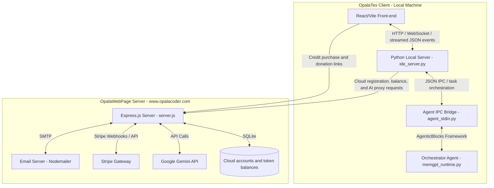
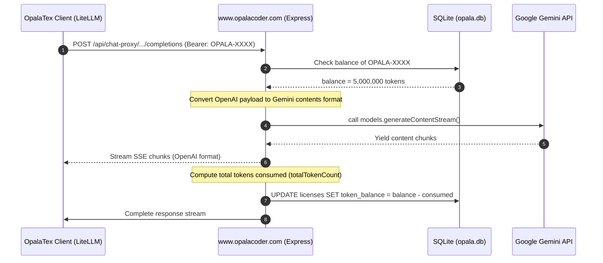

# OpalaTex & OpalaWebPage Project Design

This document describes the software architecture and project-level design decisions of **OpalaTex** (the MIT-licensed open-source client desktop application) and its connection to the optional **OpalaWebPage** service (hosted at `https://www.opalacoder.com`), which handles Cloud accounts, AI credits, proxy requests, OTP recovery, Stripe billing, and project donations.

---

## 1. High-Level Architectural Diagram

The diagram below outlines the communication between the OpalaTex React/Vite front-end, its local Python backend, and the remote Express.js server hosted on `opalacoder.com`.

---

## 2. OpalaTex Client Architecture (Desktop Application)

The client desktop application is a project-centric, AI-integrated LaTeX editor distributed under the MIT License. All local editor features remain available without registration, payment, or a Cloud account.

### 2.1 Backend / Core Components (`opalatex/` package)
- **Local HTTP/WS GUI Server (`opalatex/ide_server.py`)**: Runs an asynchronous HTTP server (default port `3000`). It serves the compiled React/Vite front-end and exposes local REST endpoints (`/api/*`) for workspace, IDE configuration, attachments, project chat storage, checkpoints, and agent execution.
- **Agent Orchestrator (`opalatex/memgpt_runtime.py`)**: Built on the vendored **AgenticBlocks** source package (`agenticblocks/`), which ships with OpalaTex rather than being installed as an external distribution. It implements a MemGPT-like memory architecture where the primary agent manages short-term and long-term memory, dispatches actions to modular "skills" (`opalatex/skills.py`), and exposes editor/file/document tools to the model.
- **JSON IPC Bridge (`opalatex/agent_stdin.py`)**: Owns the streamed agent run lifecycle for the IDE. It receives `/api/opalatex/run` payloads, persists user-visible chat history, normalizes attachments, coordinates pending GUI input requests, records agent activity for interruption/resume, and emits structured events back to the front-end.
- **LiteLLM / Tool-Call Compatibility Layer (`opalatex/litellm_compat.py`)**: Wraps AgenticBlocks LLM calls at the OpalaTex boundary. It sanitizes provider kwargs, repairs transport/history issues such as orphan tool messages and concatenated JSON tool calls, and adds bounded loop breakers for repeated schema validation failures. It must not silently convert an invalid tool call into a different semantic action.
- **Plugin and Extension System (`opalatex/extensions.py`)**: Defines `CloudExtensionInterface` and the `ExtensionManager` singleton. In Community mode, OpalaTex runs completely offline without any cloud dependencies. Optional extensions (such as `OpalaTexCloud`) dynamically register cloud models, custom licensing, and cloud proxy endpoints at build/runtime.
- **Project Store and Attachments**:
  - `opalatex/project.py`: Persists project metadata, chat history, chat branches, message attachments, core memory snapshots, and diagnostic agent activity.
  - Diagnostic activity (`thought`, `reflection`, and `stream_chunk`) is stored in `project_activity`, scoped by project and chat. It is loaded by `/api/chat/history` to rehydrate the Thinking/Stream panel. `thought` activity is also associated back to the matching assistant turn in the chat UI as a collapsed "AI Thoughts" details block, while assistant chat message content remains limited to the visible final response.
  - `opalatex/attachments.py`: Converts uploaded images and supported documents into normalized descriptors, extracts document text when possible, preserves originals for supported formats, and avoids forwarding unsupported binary payloads to text-only models.
- **VCS & Compilation Managers**:
  - `opalatex/vcs.py`: Implements user-facing Git features and internal shadow checkpoints around agent turns. Mutating file tools do not create their own checkpoints; each participating agent run, including ephemeral `run_skill` workers, creates labeled start/end checkpoints only when needed.
  - `opalatex/latex_compiler.py`: Handles compiling LaTeX using Tectonic (`tectonic` CLI), supporting full, partial (chapter/file), and fast single-pass draft compilation (`tectonic -X compile` with `-r 0`).
  - `synctex_parser.py`: Maps PDF rendering view back to the corresponding LaTeX lines.
- **Document Export Tools**:
  - `create_docx_file` and `create_pptx_file` are exposed through the agent tool registry for generated Word and PowerPoint artifacts. They should be used instead of asking an agent to write raw binary office files.

### 2.2 Community Edition & Optional Cloud Extension
- **100% Offline & Open-Source (MIT)**: The core OpalaTex Community Edition repository contains no proprietary cloud proxy calls, no cloud account tracking, and no hardcoded credit meter logic. All editing and AI features function via Ollama and user-configured providers.
- **Pluggable Architecture**: The private `OpalaTexCloud` project builds upon OpalaTex Community via an automated overlay script in CI that injects the `opalatex_cloud` extension package and enables cloud UI feature flags (`gui_src/src/config/features.js`).

### 2.3 Open-Source Support and Donations
- **License**: The repository includes the standard MIT License in `LICENSE`, matching `pyproject.toml` metadata.
- **Desktop donation UI**: Settings > About displays a PayPal donation button and the QR Code from `gui_src/public/qr-code.png`.
- **Compiled asset**: Vite copies the QR Code to `opalatex/gui/qr-code.png` for packaged desktop builds.
- **Separation from credits**: Donations support project maintenance and do not create Cloud accounts or add AI tokens.

### 2.4 Rich Text Editor & Math Rendering (`gui_src/src/components/RichTextEditor.jsx`)
- **Overleaf-style Rich Text mode**: Parses LaTeX source into structured blocks; editable prose blocks (headings, paragraphs, lists, quotes) are rendered as `contentEditable` elements. Non-editable blocks (math, figures, tables, code, environments) are rendered as read-only previews with "jump to source" on click.
- **KaTeX rendering**: Inline and display math use KaTeX's MathML output consistently across Markdown chat content, confirmation dialogs, and the rich-text editor. The rich-text editor renders through a **persistent Worker pool** (`katexRenderWorker.js`), whose workers are reused across equations to avoid per-equation module re-initialization cost.
- **Uniform math output**: Every mathematical surface uses the same MathML representation. No expression-specific HTML/MathML routing is performed, and fenced `latex` or `tex` blocks are promoted to display math only after KaTeX validates them.
- **Lazy block rendering**: An `IntersectionObserver`-based `LazyBlock` wrapper mounts block content only when near the viewport (`rootMargin: 800px`), preventing all equations from rendering simultaneously on mount.
- **Throttled scroll**: `handleScroll` uses `requestAnimationFrame` to batch scroll-driven layout reads.
- **Precomputed line offsets**: Line-start offsets are cached via `useMemo` and `sourceLineFromOffset` uses binary search (O(log n)) instead of string slicing (O(n)) per block.
- **KB article**: See `docs/kb/katex_equations_longtime.md` for the full diagnosis and resolution of the equation rendering freeze issue.

### 2.5 Agent Run, Streaming, and Human Approval Flow
- **Run entrypoint**: The React front-end posts to `/api/opalatex/run`. The local server streams structured JSON events back to the UI so chat messages, thoughts, tool calls, problems, cancellation, and final responses can update incrementally.
- **Live-output rendering contract**: While an agent is running, visible response chunks are appended immediately as raw, pre-wrapped text in the chat and Output panels. Markdown and KaTeX are never parsed on partial output. When the final `agent_response` arrives, the temporary raw stream is replaced by the completed assistant message and only then rendered as Markdown/KaTeX, including bounded LaTeX-delimiter normalization for provider-specific final output. Model streaming defaults to enabled unless a project explicitly opts out.
- **Final-response and tool-call contract**: Only provider-native `tool_calls` execute actions. A non-empty assistant `content` ends the agent turn and is preserved verbatim as the final response, including JSON and Markdown examples. `send_message` remains supported for legacy heartbeat-controlled handoffs but is not required for final responses; plain-text JSON is never recovered or executed as a tool call.
- **Agent turn checkpoint contract**: Every participating agent run creates a shadow-git start checkpoint before execution and finalizes an end checkpoint in `finally`-style cleanup, regardless of normal completion, failure, or thrown error. If the start and end checkpoints have no net diff, both checkpoints are discarded. If there is a net diff, the Review UI groups the matching `Agent turn start checkpoint[: label]` and `Agent turn end checkpoint[: label]` commits as one agent checkpoint row, using matching labels such as `worker:command-line` for worker turns, and the row diff compares start-to-end.
- **Common event types**: Agent runs may emit `agent_started`, `thought`, `reflection`, `tool_call`, `tool_result`, `problem`, `input_request`, `agent_response`, `cancelled`, and `agent_finished`. The front-end treats these as UI state transitions rather than opaque text.
- **Activity panel contract**: `thought`, `reflection`, and `stream_chunk` are user-facing diagnostic events, not raw transport logs. They must contain useful execution/prose signals only. `reflection` is reserved for assistant prose/reasoning messages; tool-result payloads, user/system retry alerts, and plain JSON tool-call text must not be emitted as reflections. `stream_chunk` must not display raw tool-call JSON emitted as text by local models; suppressing that visible stream is allowed only as a display filter and must not execute, repair, or reinterpret the tool call.
- **Human input requests**: When an agent tool needs confirmation or user input, the backend emits `input_request` and stores a pending future keyed by request id. The confirmation modal answers through `/api/opalatex/input_response`; backend rejection must be surfaced in the UI and must not leave the modal pretending the request was accepted.
- **Plan approval**: In planning mode, `create_plan` asks the front-end for confirmation before execution. Approval switches the project run path toward execution; rejection or interruption should resolve the waiting future cleanly.
- **Interruption**: `/api/opalatex/interrupt` cancels the active agent task. Captured agent activity is retained as resume context, but internal resume prompts should not be shown to end users as raw JSON.
- **Resume display contract**: The front-end may send an internal resume prompt containing captured activity and attachments, plus a separate `display_prompt`. `agent_stdin.py` persists the display prompt in chat history while using the internal prompt only as model context.

### 2.6 Tool Calling Reliability and Error Recovery
- **Strict tool contracts**: Agent tools are backed by Pydantic schemas derived from the exposed tool signatures. Missing required fields, wrong field names, or wrong argument shapes are treated as model/tool-call errors.
- **No semantic fallback hacks**: OpalaTex should not make an invalid tool call "work" by silently converting it into a different action. For example, an incomplete range replacement must not be converted into a read operation. The correct behavior is a clear diagnostic, a bounded retry/loop-break strategy, or an explicit user-approved compatibility layer.
- **LiteLLM transport fields are not model parameters**: `tools`, `tool_choice`, `parallel_tool_calls`, and `stream` are transport/runtime fields. Provider/model-parameter sanitization must preserve them unless a provider contract explicitly says the field is unsupported and the caller intentionally disables the feature. Tool-calling regressions must not be worked around by silently disabling streaming for Ollama or any other provider.
- **Native tool-message protocol**: Tool results always retain the `tool` role and their matching `tool_call_id` when sent to every provider, including Ollama. OpalaTex does not rewrite tool results as `user` or `assistant` messages and exposes no project setting for that behavior.
- **No raw LLM debug events in the app UI**: Temporary transport diagnostics must not be emitted through the structured agent event stream, persisted in `project_activity`, or shown in the Output/Thinking panels. If transport debugging is needed again, keep it outside the app event protocol or gate it behind an explicit developer-only mechanism that cannot affect normal panel rendering.
- **Repeated validation failures**: If the same tool validation failure repeats, the compatibility layer disables further tool calls for that turn and asks the model for a concise normal-text explanation instead of allowing the agent to spin indefinitely.
- **Worker delegation loop breakers**: `run_skill` tracks consecutive failed runs of the same skill. After repeated worker crashes or no-tool completions, it returns a system alert instructing the orchestrator to stop redelegating the same task, use direct tools when possible, or report a clear blocker.
- **Surgical edit tools on the orchestrator**: The chat-orchestrator directly exposes `search_code`, `read_content_pos`, `replace_content_range`, and `write_content_pos` for precise text inspection and line-based edits. `search_code` is implemented in Python so section, label, and marker lookup remains portable across operating systems before line-based reads. This avoids spawning a tool-fragile worker for simple one-line changes and lets the orchestrator verify worker edits before reporting success.
- **Sanitized worker attempt history**: Previous worker attempts are compacted before being injected into a new worker prompt. Raw crash payloads and malformed JSON snippets are not replayed verbatim, preventing failure history from poisoning local tool-call generation.
- **Runtime correction role isolation**: Framework/runtime retry prompts for malformed native tool arguments and empty assistant responses are internal system feedback, not user messages. Plain-text JSON is preserved as content and never produces a retry prompt. AgenticBlocks injects the remaining diagnostics with the `system` role so local models do not treat them as user-authored content.
- **Provider compatibility boundary**: Provider-specific cleanup belongs in `litellm_compat.py` or the AgenticBlocks integration boundary. Direct LiteLLM calls should not be introduced in feature code when AgenticBlocks already owns the model runtime path.

### 2.7 Project Configuration Decisions
- **Global model store as the source of truth**: Model catalog entries, API credentials, API base URLs, and model capabilities such as `supports_thinking` are persisted in the application SQLite database in the `global_models` table. The legacy `~/.opalatex/models.json` file is treated only as an import source when the database table is empty. Projects store selected model ids and per-role runtime parameters (`model_params` and `worker_model_params`); project property dialogs must not duplicate global model credentials or capabilities.
- **Thinking default — gated by model capability and asymmetric by agent role**: `think=True` is the role-level default **only** for the `memgpt` (chat-orchestrator) and `orchestrator` agents. All worker sub-agents (`worker`, `landscape_planner`, `refinement_agent`) default to `think=False`. Before any LiteLLM call, OpalaTex checks the selected model's global model-store entry. `think` is sent only when that model explicitly has `supports_thinking=true`; the capability defaults to `false` for all models and should be enabled only when the model documentation confirms support for thinking/reasoning parameters.
  - **Rationale**: Local reasoning models (Ollama) can enter unbounded cognitive loops when given complex inputs with `think=True`. The orchestrator is user-facing and its reasoning traces are valuable; sub-agents run inside tool calls and must terminate promptly. An incident in July 2026 where a worker got stuck for >50 minutes processing a long document confirmed this policy.
  - **User override is still respected**: If a project's `agents.yaml` or the UI explicitly sets `think=true` for a worker agent, that setting prevails. The default only applies when the setting is absent.
- **Provider sanitization**: `sanitize_litellm_kwargs_for_model` may drop `think` for providers that do not accept the parameter. This is provider compatibility cleanup, not a project decision to disable reasoning.
- **Ollama thinking route**: When `think=true`, `supports_thinking=true`, and the selected model uses the `ollama/` prefix, `resolve_model_for_thinking` remaps it to `ollama_chat/` so LiteLLM can expose native streaming reasoning via `reasoning_content`. If the capability is not enabled, `think` is removed and the model id is not remapped. This prevents models such as Ollama Cloud models without documented thinking support from failing behind misleading connection errors.
- **Degenerate thinking streams**: `_record_turn_thought` in `agent_stdin.py` stops **logging** a thought stream once it exceeds `MAX_THOUGHT_CHARS_PER_TURN` (24 000 chars) or is detected as repetitive. This bounds UI/resume-context poisoning but does **not** cancel the model's generation — it is a logging safeguard, not a circuit breaker. For actual cancellation, the user must interrupt the run explicitly.
- **Thinking Isolation From Chat History**: For user-facing orchestrator turns (`orchestrator`, `chat_orchestrator`), persisted assistant chat messages must contain only the visible final response. Thinking streams, auxiliary tool traces, reflections, and `<think>` snapshots are diagnostic activity events, not chat-message content. The chat UI may rehydrate persisted `thought` activity as a collapsed details block attached to the corresponding assistant response, but it must not mix that content into the assistant response text itself. This prevents internal execution traces such as tool decisions or retry context from leaking into the user-visible final answer on live updates or chat reload.

### 2.8 Front-End Agent UI and Editor Panels
- **Chat surface (`gui_src/src/components/ChatPanel.jsx`)**: Renders user/assistant messages, attachment previews, pending upload state, retry/edit flows, interruption controls, and confirmation modals. It hides internal resume scaffolding behind user-friendly continuation labels.
- **Main app coordinator (`gui_src/src/App.jsx`)**: Coordinates project state, chat streaming, active agent status, checkpoints, compile/PDF state, document panels, and i18n strings.
- **Activity and problem reporting**: Thinking streams and captured problems are UI-level diagnostics for the user. Raw transport records should be hidden or summarized when they are only useful for debugging.
- **Document panels & File Routing**:
  - Text and source code files (`.tex`, `.py`, `.js`, `.json`, `.md`, `.txt`, etc.) open in the Monaco editor / RichText / Markdown preview.
  - Native document formats (`.pdf`, `.docx`, `.pptx`) open in dedicated viewer/editor panels (`PdfPreview`, `DocxEditorPanel`, `PptxEditorPanel`).
  - Unsupported binary/media formats (`.png`, `.jpg`, `.mp4`, `.zip`, `.xlsx`, `.exe`, etc.) automatically open in the operating system's default application via `/api/file/open-explorer` rather than attempting to open as raw text in the editor.

### 2.9 UI Consistency, Dialogs, and Internationalization
- **Forbid Native Browser Dialogs**: Agents must never call native browser dialogs (`window.alert`, `window.confirm`, `window.prompt`, or their shorthand equivalents) anywhere in the frontend codebase. Doing so in webview environments exposes unsightly headers (like IP addresses or "JavaScript") and breaks visual styling.
- **Use Custom Dialog Provider**: Standard user notification and input interactions must be handled asynchronously via the `useCustomDialog` hook from [CustomDialogProvider.jsx](file:///c:/Users/gilza/projetos/OpalaTex/gui_src/src/components/modals/CustomDialogProvider.jsx).
- **Theme and Visual Contrast Consistency**: All components, overlays, and custom dialogs must utilize standard VSCode theme CSS variables (such as `--vscode-bg`, `--vscode-border`, `--vscode-text-fg`, and `--vscode-accent`) and custom diff variables (such as `--diff-text-added`, `--diff-text-removed`). Do not hardcode hex/rgba values for text or background colors as it degrades contrast in light mode.
- **Mandatory Internationalization (i18n)**: Every user-facing label, prompt, placeholder, or error message must support localization using the i18n framework (`t('key')`). Never hardcode Brazilian Portuguese or English text directly in HTML or JSX properties.

---

## 3. Remote Server Architecture (OpalaWebPage)

The server-side component is an Express.js backend that handles Stripe credit purchases, manages Cloud registration keys and token balances, and proxies LLM requests to the Gemini API to safeguard provider keys and monitor consumption. The public website presents OpalaTex as free/open-source, offers optional Cloud credits, and links to PayPal donations.

### 3.1 Database Schema (`opala.db` - SQLite)

The database maintains two tables:

1. **`licenses`** (legacy table name; represents Cloud accounts):
   - `key` (TEXT, Primary Key): Unique Cloud registration key (prefixed with `OPALA-`).
   - `token_balance` (INTEGER): Remainder of AI credits (number of available tokens).
   - `email` (TEXT): E-mail of the purchaser.
   - `created_at` (DATETIME): Cloud account creation timestamp.

2. **`otps`**:
   - `email` (TEXT, Primary Key): Email associated with the Cloud account.
   - `otp` (TEXT): A random 6-digit verification code.
   - `expires_at` (DATETIME): Code expiration timestamp (valid for 10 minutes).

### 3.2 Key Server Endpoints

| Method | Endpoint | Description | Auth Requirement |
| :--- | :--- | :--- | :--- |
| `POST` | `/api/webhook` | Handles completed Stripe credit purchases and increases token balances. | Stripe signature check |
| `POST` | `/api/create-checkout-session` | Initiates a Stripe payment session for a credit purchase. | None |
| `GET` | `/api/get-license` | Retrieves the account registration key associated with a completed purchase. | None |
| `GET` | `/api/get-balance` | Retrieves the remaining token balance for a Cloud account. | `Authorization: Bearer <registration_key>` |
| `POST` | `/api/create-recharge-session` | Initiates a temporary recharge token valid for 15 minutes. | None |
| `POST` | `/api/otp/request` | Requests a 6-digit OTP code for the registered account email. | None |
| `POST` | `/api/otp/verify` | Verifies the OTP code to recover the Cloud registration key. | None |
| `POST` | `/api/chat-proxy/chat/completions` | Proxies client LLM queries to the Gemini API while tracking token usage. | `Authorization: Bearer <license_key>` |

---

## 4. Client-to-Server Integration Flow

### 4.1 Cloud AI Proxy Flow (`POST /api/chat-proxy/chat/completions`)

When the user selects **OpalaTex Cloud** as their AI Provider:
1. **Request Interception**: `opalatex/config.py` overrides the standard LiteLLM config:
   - Sets `api_base = "https://opalacoder.com/api/chat-proxy"`
   - Sets `api_key = license_key`
   - Sets `custom_llm_provider = "openai"` (to trick LiteLLM into formatting requests as standard OpenAI payloads).
2. **Account & Balance Verification**: The server extracts the registration key from the `Bearer` token header, checks `opala.db`, and verifies that `token_balance > 0`. Expiration/trial status is not used.
3. **Format Mapping**: The server translates the OpenAI schema payload (`messages` format) into the Google GenAI Contents format (handling `systemInstruction`, nested `contents` with user/model roles, and parsing tool definitions/calls).
4. **Google Gemini Call**: The server fires the converted payload to the Gemini API using the `@google/genai` SDK. Opala Cloud model catalog is dynamically loaded from environment variables (`.env`). In UI, models are presented as **OpalaTex Live** (standard credit use) and **OpalaTex Flash** (4x credit use).
5. **Streaming / Response Processing**: The response is piped back to the client as standard OpenAI-compatible chunks (`text/event-stream`).
6. **Token Deduction**: The server calculates the consumed tokens (using Gemini's `usageMetadata` or input/output text estimation), applies the server-side credit multiplier for the selected model (`OpalaTex Flash` bills 4x the live model), and updates `token_balance` in `opala.db`.

### 4.2 Stripe Credit Purchase Flow

OpalaTex is open-source and does not require a paid license. The commercial offer is an optional package of 5,000,000 Opala Cloud tokens for BRL 60.00 or USD 11.99.

When a user purchases Cloud credits:
1. Client requests a credit checkout session from `/api/create-checkout-session`.
2. Server calls Stripe API and returns the checkout session URL.
3. User completes the payment on Stripe's hosted gateway.
4. Stripe fires `checkout.session.completed` hook to `/api/webhook`.
5. The server creates an account registration key when needed, or locates the existing account, and adds `+5,000,000` tokens to `token_balance`.

### 4.3 Donation Flow

Donations are independent from Stripe credit purchases:
1. The website and Settings > About expose the official PayPal donation URL.
2. Both interfaces display the same QR Code asset supplied by the project owner.
3. PayPal processes the donation externally in BRL.
4. No Cloud key or token balance is created or changed by a donation.

---

## 5. Current Product and Licensing Decisions

- OpalaTex is free and open-source under the MIT License.
- There is no trial, paid editor license, subscription, or local feature lock.
- Local models and user-provided API keys do not require an Opala Cloud account.
- The only paid application service is an optional package of 5,000,000 Cloud tokens for BRL 60.00 or USD 11.99.
- Donations fund open-source maintenance and are not purchases of tokens or application features.
- The OpalaWebPage server and its commercial rules remain separate from the public desktop client.
