# Diagrama de Testes de Regressão

Este documento ilustra a cobertura necessária de testes de regressão para garantir a estabilidade e integridade dos módulos e comunicações entre o **OpalaTex** (cliente) e o **OpalaWebPage** (servidor).

> [!NOTE]
> O diagrama foi expandido e atualizado a partir da análise da base de código atual, englobando não só a documentação inicial, mas todos os módulos presentes no projeto (VCS, Indexação, Ollama, Terminal, Plugins, etc). Ele serve como guia sobre quais fluxos validar após realizar modificações no código.

## Diagrama Completo de Fluxos e Módulos

```mermaid
graph TD
    classDef e2e fill:#f9d0c4,stroke:#333,stroke-width:2px,color:black;
    classDef client fill:#c4e3f3,stroke:#333,stroke-width:2px,color:black;
    classDef server fill:#d4f3c4,stroke:#333,stroke-width:2px,color:black;

    subgraph OpalaTex [OpalaTex Client - Testes Locais]
        %% Core e UX
        C1[Servidor HTTP/WS, IDE & Onboarding]:::client
        C4[Motor LaTeX, Synctex e Gráficos]:::client
        C5[Anti-Tamper, Trial e Licença]:::client
        C6[VCS Git, Terminal & I18N]:::client
        
        %% IA e Agentes
        C2[AgenticBlocks, MemGPT, Skills & Web Search]:::client
        C3[Proxy Local Ollama & LiteLLM Bridge]:::client
        C7[Vector Index & Code Indexing]:::client
        C8[Hardware Detect & Plugins]:::client
    end

    subgraph OpalaWebPage [OpalaWebPage Server - Testes Remotos]
        S1[Proxy GenAI e Dedução de Tokens]:::server
        S2[Geração de Sessão e Webhooks Stripe]:::server
        S3[Validação OTP e Nodemailer]:::server
        S4[CRUD SQLite de Licenças e Saldo]:::server
    end

    subgraph E2E [Fluxos End-to-End Críticos]
        F1((Fluxo: IA via Nuvem ou Local Ollama)):::e2e
        F2((Fluxo: Compra e Ativação via Stripe)):::e2e
        F3((Fluxo: Autenticação via OTP)):::e2e
        F4((Fluxo: Operações Locais IDE e Agente)):::e2e
    end

    %% IA Flows (Local e Nuvem)
    C3 -->|LLM Nuvem: request OpenAI| F1
    S1 -.->|Nuvem: Converte Gemini, Deduz Saldo| F1
    C3 -->|LLM Local: Bypass para Ollama| F1
    C7 -.->|Enriquece Contexto IA| F1
    C2 -->|Agente e Skills operam na Resposta| F1

    %% Operações Locais e IDE
    C1 -->|Gestão de Projetos e UX| F4
    C4 -->|Compilação e View| F4
    C6 -->|Controle de Versão e Comandos| F4
    C8 -->|Carrega Plugins e Hardware| F4

    %% Pagamentos e Ativação
    S2 -->|Stripe checkout.session.completed| F2
    S4 -->|Cria OPALA-KEY ou adiciona tokens| F2
    C5 -->|Registra chave no client e desativa trial| F2

    %% Autenticação OTP
    C5 -->|Solicita recuperação de chave| F3
    S3 -->|Gera OTP, envia Email, valida| F3
    S4 -->|Retorna OPALA-KEY associada| F3
```

## Detalhamento por Área para Regressão

### 1. OpalaTex Client (Desktop)
* **Core, UI e Projetos (`C1`, `C4`)**: Testar inicialização do servidor HTTP, endpoints da API, fluxos de onboarding. Garantir a estabilidade da compilação LaTeX, limpeza de arquivos gerados e sync entre editor/PDF.
* **Agentes, Skills e Indexação (`C2`, `C7`)**: Verificar despachos de eventos no `AgenticBlocks.IO`, bridge de IPC, execução de skills (inclusive `web_search_config.py`). Validar consistência do `vector_index` e `code_index` ao modificar ou buscar código e arquivos.
* **Modelos LLM e Hardware (`C3`, `C8`)**: Testar regressões no fluxo de IA, tanto apontando para o proxy na nuvem (LiteLLM) quanto o gerenciamento de modelos abertos localmente (`ollama_manager.py`). O `hardware_detect` deve instanciar perfis corretamente para não travar máquinas limitadas.
* **Ferramentas de Desenvolvimento (`C6`)**: O `vcs.py` e o terminal (`terminal_manager.py`) requerem regressões focadas na estabilidade do gerenciamento de processos subprocessos e logs, além de certificar que o idioma (`i18n.py`) seja aplicado sem falhas de string.
* **Licenciamento (`C5`)**: O arquivo `license.dat` continua demandando cobertura para evitar bypasses (anti-tamper) com datas de criação do SQLite.

### 2. OpalaWebPage Server
* **IA Proxy (`S1`)**: Assegurar conversão fluida de formato OpenAI (mandado pelo litellm) -> Gemini (via `@google/genai`) incluindo Tool Calls, SSE stream, e dedução de Tokens a cada requisição.
* **Stripe e Licenças (`S2`, `S4`)**: Enviar cargas mock via Stripe CLI e conferir incrementos de licenças/tokens, assegurando que checkouts duplos ou inválidos sejam descartados.
* **Módulo OTP (`S3`)**: Garantir o ciclo de vida e tempo de expiração do código enviado via e-mail e tratar tentativas de força-bruta (rate limiting).

### 3. Fluxos de Integração End-to-End (E2E)
* **`F1` (IA Proxy & Local)**: Testes que acionam o pipeline inteiro: desde o agente local, passagem pelo modelo de nuvem (com debitamento contábil no DB Node.js) OU uso direto do Ollama (gratuito) dependendo do provedor configurado pelo cliente.
* **`F2` (Ciclo de Pagamento)**: Checkout na web -> webhook dispara -> usuário ganha acesso a ferramentas pro no desktop após consultar.
* **`F3` (OTP)**: Simulação de "Esqueci a Chave", resgatando OTP do e-mail mockado, validando e ativando a IDE automaticamente.
* **`F4` (Workflow do Desenvolvedor LaTeX)**: O teste máximo da IDE: Usuário cria projeto -> digita -> Agente usa vector index e skills para sugerir alterações -> compilação PDF -> commit das mudanças (VCS Git).
